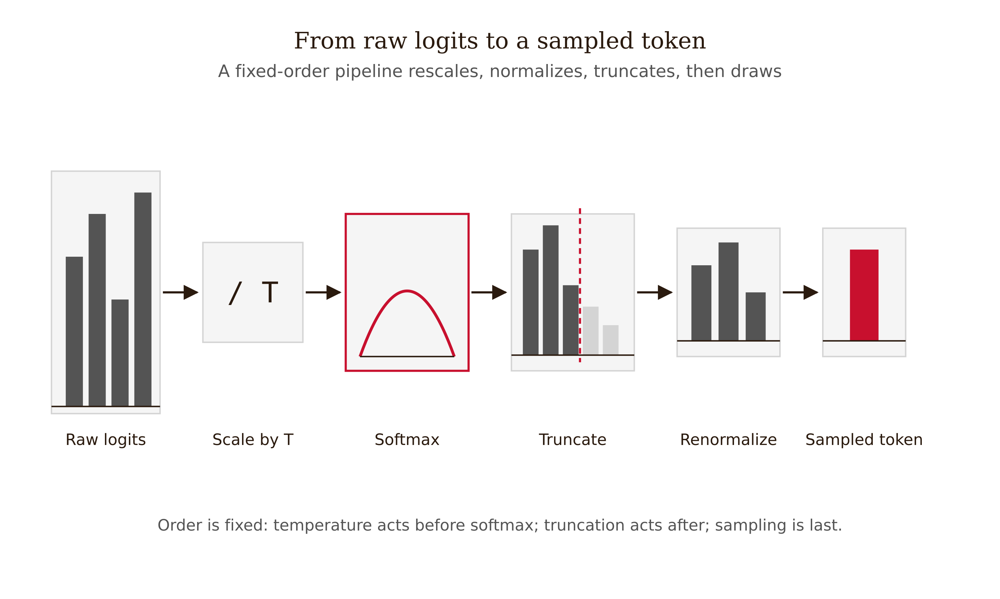
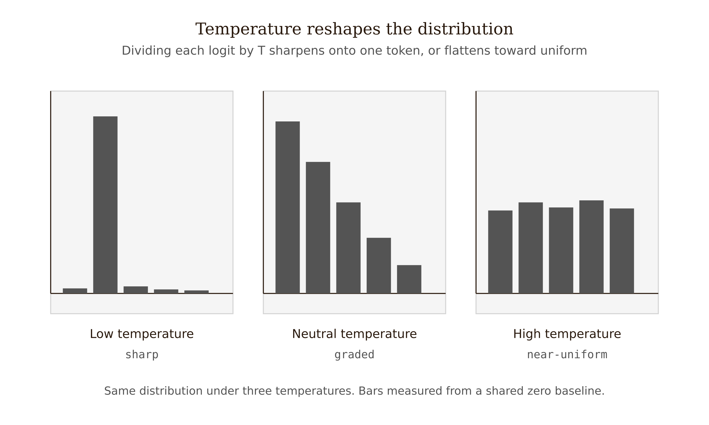
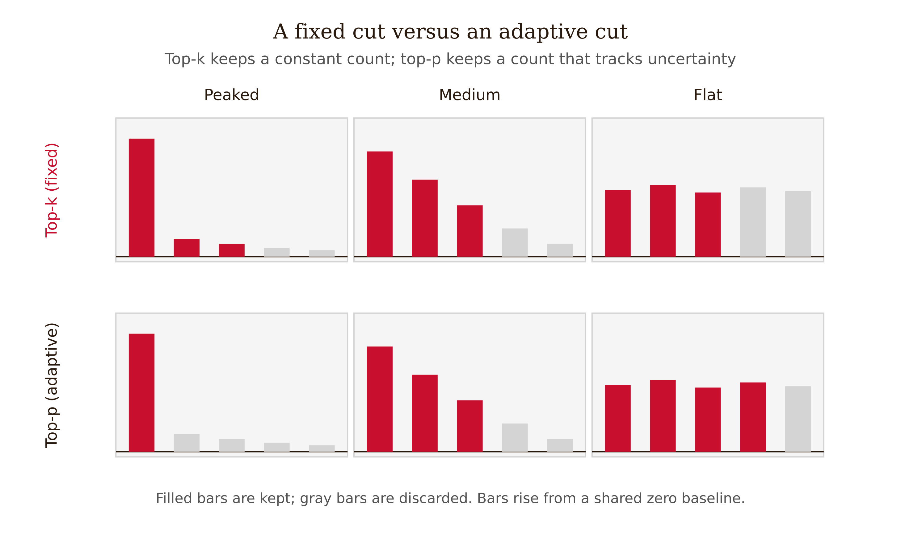
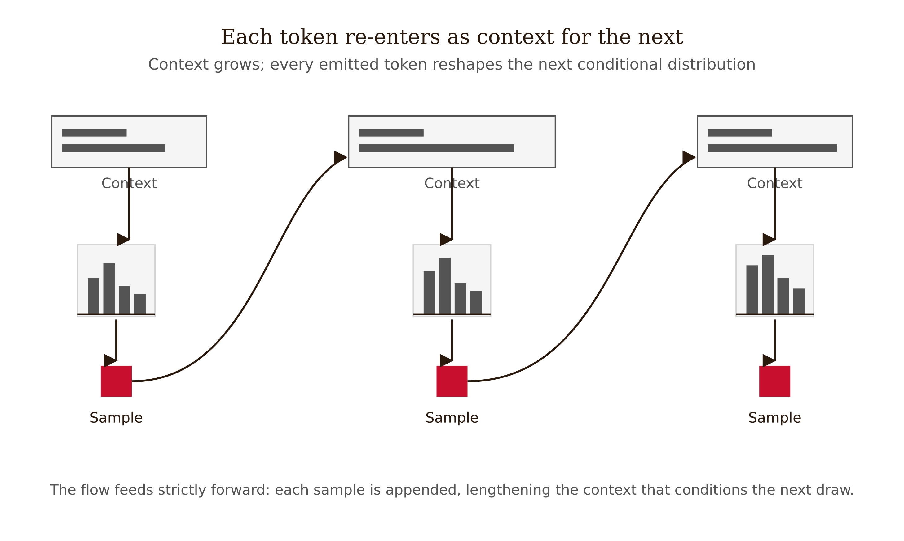

# Chapter 0 — Foundations: Sampling, Logits, and the Shape of a Distribution
*The number behind the word — what a language model is actually doing before it says anything.*

---

Start with a question that looks like it should be simple. You type *"The capital of France is"* into a chat model, and it says *"Paris."* Every person who has done this assumes the model looked something up — that somewhere inside is a table, and the row for France has "Paris" in the capital column, and the model read it. This is the wrong picture entirely. Understanding why it is wrong, and what the right picture actually is, is the whole foundation for everything else in this book.

What actually happened is this. The model read your words, ran them through its layers, and at the final step produced a list of numbers — one number for every token in its vocabulary. Modern vocabularies run to roughly 100,000 entries (GPT-4's tokenizer sits near there; Llama 3 uses 128,256; GPT-4o's tokenizer reaches about 200,000), so this list is a vector with tens of thousands of components. The entry for ` Paris` was high. The entry for ` Lyon` was lower but not zero. The entry for ` Tokyo` was lower still. The entry for ` banana` was very low — but, and this is the load-bearing fact, *not zero*. Every token in the vocabulary received a score. The model then converted those scores into probabilities and drew a sample. It happened to draw ` Paris` because ` Paris` held most of the probability mass. On a different draw, with the dial set differently, it might have drawn ` Lyon`.

The model did not retrieve "Paris." It sampled it. The answer felt certain because the distribution was sharply peaked — nearly all the probability mass sat on one token — but the machinery underneath was probabilistic the whole time. Change the shape of that distribution and the same prompt yields different text. That is the mechanism this chapter makes precise.


*Figure 0.1 — From raw logits to a sampled token*

---

## The number is called a logit

The raw score vector has a name: **logits**. One logit per vocabulary token. These are arbitrary real numbers — they can be negative, large, small, and they do not sum to anything in particular. They are the model's last word before it becomes a probability, and they are not yet a probability.

To draw a token we need a genuine probability distribution: every entry non-negative, all of them summing to one. The function that does this is called the **softmax**. It is worth doing the arithmetic once so the function is not a mystery.

$$
p_i = \frac{e^{z_i}}{\sum_{j=1}^{V} e^{z_j}}
$$

Read it step by step. Exponentiate each logit: $e^{z_i}$. This forces every term positive, since $e^x > 0$ for all real $x$. And it stretches the gaps — a logit that is larger by a fixed amount becomes *multiplicatively* larger after exponentiation. Then divide each exponentiated score by the sum of all of them. Dividing by the total guarantees the results sum to one. The result, $p_i$, is non-negative and $\sum_i p_i = 1$: a valid probability distribution.

Do it by hand on three tokens so the arithmetic is not abstract. Suppose three candidate tokens have logits $z = (2.0,\ 1.0,\ 0.1)$.

- Exponentiate: $e^{2.0} \approx 7.389$, $e^{1.0} \approx 2.718$, $e^{0.1} \approx 1.105$.
- Sum: $7.389 + 2.718 + 1.105 = 11.212$.
- Divide: $p \approx (0.659,\ 0.242,\ 0.099)$.

Check: $0.659 + 0.242 + 0.099 = 1.000$. A small logit gap — the difference between $2.0$ and $1.0$ is one unit — became a substantial probability gap: 66% versus 24%. That amplification is the exponential doing its job. This is why softmax is called "soft" rather than "hard": it concentrates mass on the leaders without giving everything to the winner outright, the way a simple `argmax` would. But the concentration is real, and it is the exponential that makes it so.

There is a misconception worth clearing up immediately: logits are not "probabilities that just need to be normalized." They live on an additive scale; probabilities live on a multiplicative one, after the exponential. Adding the same constant $c$ to every logit changes nothing about the resulting distribution — the constant factors out of numerator and denominator identically and cancels. But *multiplying* every logit by a constant changes everything, because multiplication inside the exponential becomes an exponent change outside it. This distinction matters because one of our three controls acts exactly on that multiplication.

| Token | Logit $z_i$ | $e^{z_i}$ | Probability $p_i$ |
|---|---|---|---|
| A | 2.0 | 7.389 | 0.659 |
| B | 1.0 | 2.718 | 0.242 |
| C | 0.1 | 1.105 | 0.099 |
| **Sum** | — | **11.212** | **1.000** |

---

## Three knobs, one mechanism

Between the logit vector and the drawn token there are three controls. One reshapes the distribution; two truncate its tail. They compose in a fixed order — reshape first, truncate second, sample last — and understanding them is the whole mechanical foundation for this book.

### Temperature

**Temperature** is a single positive number $T$ that we divide every logit by *before* applying softmax:

$$
p_i = \frac{e^{z_i / T}}{\sum_{j=1}^{V} e^{z_j / T}}
$$

That is the complete definition. The name is borrowed from statistical physics: the Boltzmann distribution that governs which states a physical system occupies at thermal equilibrium has exactly this form, and $T$ is the system's temperature. High physical temperature spreads the system across many states; low temperature pins it to the lowest-energy configuration. The borrowed intuition is exact here, so the name earns itself. But you do not need the physics. You need the algebra of "divide before exponentiating."

Watch what the division does to our three-token example, $z = (2.0,\ 1.0,\ 0.1)$.

**At $T = 1$** (dividing by one changes nothing) we recover the distribution from above: $p \approx (0.659,\ 0.242,\ 0.099)$.

**At $T = 0.5$** (low temperature), we divide by $0.5$, which is the same as multiplying by two: $z/T = (4.0,\ 2.0,\ 0.2)$.
- Exponentiate: $e^{4.0} \approx 54.60$, $e^{2.0} \approx 7.389$, $e^{0.2} \approx 1.221$. Sum $\approx 63.21$.
- Divide: $p \approx (0.864,\ 0.117,\ 0.019)$.

The leader's share jumped from 66% to 86%. The distribution got sharper — mass concentrated toward the top token.

**At $T = 2$** (high temperature), we divide by two: $z/T = (1.0,\ 0.5,\ 0.05)$.
- Exponentiate: $e^{1.0} \approx 2.718$, $e^{0.5} \approx 1.649$, $e^{0.05} \approx 1.051$. Sum $\approx 5.418$.
- Divide: $p \approx (0.502,\ 0.304,\ 0.194)$.

The leader fell from 66% to 50%; the long-shot climbed from 10% to 19%. The distribution flattened — mass spread toward the tail.

The two limits make the behavior precise:

As $T \to 0$, dividing by a vanishing number blows up all the gaps without bound. In the limit, the top token's probability goes to one and everything else to zero. This is **greedy decoding**: always take the single highest-scoring token. It is not a separate mechanism — it is the limiting case of temperature, and it is deterministic in the sense that the same logits always yield the same token. (The same logits — floating-point nondeterminism, request batching, and silent model updates mean "temperature zero" does not guarantee bit-identical output across production runs. This book returns to that.)

As $T \to \infty$, every $z_i / T \to 0$, every $e^{z_i/T} \to 1$, and the distribution flattens to uniform: every token equally likely, the prompt's influence washed out entirely. Pure noise.

```
 T → 0            T = 1            T → ∞
 ┌──────────┐     ┌──────────┐     ┌──────────┐
 │ █        │     │ █        │     │ ▃ ▃ ▃ ▃ ▃│
 │ █        │     │ █ ▃      │     │ ▃ ▃ ▃ ▃ ▃│
 │ █        │     │ █ ▃ ▂    │     │ ▃ ▃ ▃ ▃ ▃│
 └──────────┘     └──────────┘     └──────────┘
  greedy /          neutral          uniform /
  argmax            (default)        pure noise
```


*Figure 0.2 — Temperature reshapes the distribution*

There is a folk rule in practitioner culture that says "set temperature to zero for reliability — it removes randomness." The rule is not wrong about the mechanism: it does remove sampling randomness. But removing sampling randomness is not the same as removing error. Greedy decoding always picks the locally highest-probability token, which can trap the model in a globally worse continuation. On some models it triggers pathological **looping** — the model selects a high-probability token that re-licenses itself as high-probability in the next step, and repeats indefinitely. Google's developer guidance for Gemini 3 explicitly recommends keeping temperature at the default 1.0 on complex reasoning tasks because lowering it can induce exactly this degradation. "Temperature zero" is a tunable parameter that reaches its extreme; it is not a safety setting.

### Top-k sampling

Temperature reshapes the distribution but leaves every token in the running. Even at low $T$, the ` banana` token from our opening example retains a microscopic but nonzero probability, and across thousands of sampled tokens, microscopic tails sum to a meaningful chance of something absurd. The next two controls address this differently: instead of reshaping the curve, they cut off its tail before sampling.

**Top-k** is the blunter method. Mechanism: sort the vocabulary by probability. Keep the $k$ highest. Zero out everything else. Renormalize the survivors so they sum to one again. Then sample from those $k$.

A five-token example with probabilities $p = (0.40,\ 0.25,\ 0.20,\ 0.10,\ 0.05)$. With top-k at $k = 3$: keep the three largest, discard the bottom two. The survivors sum to $0.85$. Renormalize: $p' = (0.471,\ 0.294,\ 0.235,\ 0,\ 0)$. The model now samples among three candidates with the rescaled probabilities.

The weakness of top-k is that $k$ is *fixed* regardless of how the probability mass is actually distributed. When the model is genuinely uncertain — mass spread across fifteen reasonable tokens — a $k$ of 3 amputates twelve good candidates. When the model is nearly certain — one token at 0.97 — a $k$ of 3 drags two near-zero tokens into contention anyway. The cut is always the same size, whether the distribution is a needle or a plateau. This is the mismatch the next method fixes.

### Top-p (nucleus) sampling

**Top-p** sampling, also called nucleus sampling, was introduced by Holtzman et al. in their 2020 paper "The Curious Case of Neural Text Degeneration" (arXiv:1904.09751). It makes the cut *adaptive*. Mechanism: sort tokens by probability, then walk down the sorted list accumulating probability mass until the running total first reaches or exceeds the threshold $p$. Keep exactly that set — the "nucleus." Discard the rest. Renormalize. Sample.

Same five-token example, $p = (0.40,\ 0.25,\ 0.20,\ 0.10,\ 0.05)$, with top-p at $p = 0.80$. Accumulate: $A$ alone is $0.40$. $A + B = 0.65$. $A + B + C = 0.85$ — first time we reach or exceed $0.80$. Stop. Nucleus is $\{A, B, C\}$. Here top-p with $p = 0.80$ selected the same three tokens as top-k with $k = 3$. They diverge the moment the distribution changes shape.

Consider a flat distribution: $q = (0.22,\ 0.21,\ 0.20,\ 0.19,\ 0.18)$. Top-k at $k = 3$ still keeps exactly three tokens, discarding two perfectly reasonable candidates. Top-p at $p = 0.80$ accumulates $0.22 + 0.21 + 0.20 + 0.19 = 0.82 \ge 0.80$ and keeps *four* — because the model was less certain, the nucleus grew.

On a peaked distribution: $r = (0.95,\ 0.02,\ 0.01,\ 0.01,\ 0.01)$. Top-k at $k = 3$ keeps three tokens including two near-zero candidates. Top-p at $p = 0.80$ keeps *one* token — $0.95 \ge 0.80$ on the first step — correctly collapsing to near-greedy behavior when the model is highly confident.

That is the design of top-p: the size of the candidate set tracks the model's uncertainty. Wide when the model is unsure; narrow when it is confident. This is the behavior you want from a truncation rule, and it is why top-p is usually preferred over top-k in practice.

One misconception to clear up. "Top-p of 0.9 means I keep 90% of the tokens." No — it means you keep the smallest *set of tokens* whose combined *probability mass* sums to at least 0.9. On a peaked distribution that can be a single token; on a flat one it can be hundreds. The threshold is on cumulative probability, not on token count. Token count is what top-k controls. Conflating the two is the most common decoding bug in practitioner code.


*Figure 0.3 — A fixed cut versus an adaptive cut*

| Distribution shape | Top-k (k = 3) | Top-p (p = 0.80) | More sensible nucleus |
|---|---|---|---|
| Needle (one token ≈ 0.95) | keeps 3 — drags in two near-zero tokens | keeps 1 — collapses to near-greedy | Top-p |
| Plateau (≈ uniform) | keeps exactly 3 — cuts two reasonable tokens | keeps 4 — nucleus grows with the uncertainty | Top-p |
| Bimodal (two clusters) | keeps 3 — may sever a cluster | accumulates to 0.80 — may span the dead zone | Neither (both walk the sorted tail; no mode awareness) |

---

## The order of operations

Temperature and truncation compose, and the convention is: apply temperature to the logits first, then softmax to get probabilities, then truncate (top-k and/or top-p), renormalize, and sample. In a typical API call with `temperature=0.7, top_p=0.9` the model first sharpens the curve (T < 1), then keeps the nucleus, then draws. Setting `temperature=0` short-circuits the rest: there is nothing to truncate when one token holds essentially all the mass.

Knowing the order lets you reason about configurations that look similar but behave differently — a skill the next chapter leans on throughout.

---

## What the distribution is conditioned on

One precision remains, and it is the bridge to everything that follows.

At every step the model does not produce *a* distribution — it produces a distribution *conditioned on the entire sequence so far*. If $x_1, \ldots, x_{t-1}$ are the tokens generated up to this point (your prompt plus whatever the model has already emitted), the model defines

$$
P(x_t \mid x_1, \ldots, x_{t-1})
$$

and samples $x_t$ from it. Then it appends $x_t$ and computes $P(x_{t+1} \mid x_1, \ldots, x_t)$, and so on. The probability of a complete output is the product of these conditional steps — the **chain rule** of probability:

$$
P(x_1, \ldots, x_n) = \prod_{t=1}^{n} P(x_t \mid x_{<t})
$$

This single equation is why prompt engineering is engineering. The prompt is the conditioning context $x_{<t}$ at the first generated step. Changing the prompt changes every conditional distribution downstream. You are not asking the model a question; you are setting the conditions under which a sequence of samples is drawn. And because each output token feeds back in as conditioning for the next token — $x_t$ becomes part of the context for $x_{t+1}$ — a single early sampling accident reshapes every distribution that follows. One low-probability token drawn at step three can push the model into a region of its distribution from which the "intended" answer is now unlikely. This is why two runs of identical prompts can diverge into entirely different answers, a phenomenon the next chapter opens on.


*Figure 0.4 — Each token re-enters as context for the next*

It is also why fluent text carries no guarantee of truth. The chain rule measures the probability of *plausible-looking sequences* — sequences that resemble the training distribution — not true ones. Plausibility and truth are produced by exactly the same machinery. Nothing in $\prod_t P(x_t \mid x_{<t})$ references a fact; it references a learned conditional distribution over tokens. When the distribution peaks sharply on the correct token (capital of France), sampling reliably lands right and looks like knowledge. When the distribution peaks on a plausible-but-wrong token, the same machinery produces a confident error. The mechanism cannot distinguish the two cases from the inside. This is the uncomfortable foundation the rest of the book builds on.

---

## What would change my mind

The central claim of this chapter is mechanical and largely settled. An autoregressive language model emits a sample from a softmax-normalized, temperature-scaled, optionally truncated distribution over its vocabulary, conditioned on the running sequence. What would force a substantive revision is a documented, reproducible class of production models whose token selection cannot be described as sampling from such a distribution — for instance, a decoding architecture that selects tokens by a non-probabilistic search over full sequences and that is empirically shown to make the per-step softmax framing predictively wrong for its outputs. If a widely deployed model's observed output statistics could not be reproduced by any setting of temperature, top-k, or top-p over its logits, the "read the output as a sample from this distribution" framing — and everything in the next chapter that rests on it — would need rebuilding rather than refinement.

---

## Still puzzling

Why these particular defaults? Vendors converge on temperatures near 0.7–1.0 and top-p near 0.9–1.0, but the choice is largely empirical, tuned to perceived output quality. Is there a principled, task-independent argument for a default, or is it irreducibly model- and task-specific?

What is the right truncation when the distribution is genuinely bimodal — two sharply separated good answers with a dead zone between? Neither top-k nor top-p has a notion of modes; both just walk the sorted tail. Whether mode-aware decoders would matter in practice is an open question.

How much of "temperature zero is deterministic" survives real infrastructure? Floating-point non-associativity, request batching, and silent model updates all perturb logits in ways that are hard to characterize. Chapter 1 raises this; it is not resolved here.

---

## LLM Exercises

**Exercise 1 — Generate and examine.** Set temperature to 0.1, then to 1.5, and submit the prompt *"List three words that mean 'happy'."* Run each setting three times. Paste the six outputs side by side. What changes? What surprises you? Write two sentences describing the distribution behavior you think produced the difference.

**Exercise 2 — Apply to known context.** You are building a model that extracts structured fields (date, amount, vendor name) from invoice text. A colleague suggests `temperature=0.9, top_p=0.95`. Using the mechanics of this chapter, explain in plain English whether you agree or disagree with that configuration, and propose an alternative with a mechanical justification.

**Exercise 3 — Stress-test a claim.** The chapter claims that temperature zero can cause looping on some models. Design a test: what prompt would you use, what model, what temperature settings, and what would you measure to confirm looping is the failure mode rather than a bad prompt?

**Exercise 4 — Draft a professional deliverable.** Write a 150–250 word "Decoding Configuration Note" suitable for a project README. It must name a specific task, specify temperature and top-p values, justify each mechanically in terms of distribution shape, and name one failure mode the configuration is chosen to avoid. Do not use folk rules ("lower is more reliable"); use the mechanics.

---

## References

- Holtzman, A., Buys, J., Du, L., Forbes, M., & Choi, Y. (2020). The Curious Case of Neural Text Degeneration. *ICLR 2020*. arXiv:1904.09751 — origin of nucleus (top-p) sampling.
- Vaswani, A., et al. (2017). Attention Is All You Need. *NeurIPS 2017*. arXiv:1706.03762 — the transformer; the softmax output layer over vocabulary is standard here.
- Goodfellow, I., Bengio, Y., & Courville, A. (2016). *Deep Learning*. MIT Press. Ch. 6 §6.2.2.3 — softmax function and properties.
- Ackley, D. H., Hinton, G. E., & Sejnowski, T. J. (1985). A Learning Algorithm for Boltzmann Machines. *Cognitive Science*, 9(1), 147–169 — statistical-physics origin of the temperature parameter.
- Fan, A., Lewis, M., & Dauphin, Y. (2018). Hierarchical Neural Story Generation. *ACL 2018*. arXiv:1805.04833 — early top-k sampling.
- Google. Gemini 3 Developer Guide (generateContent API). https://ai.google.dev/gemini-api/docs/gemini-3 — temperature and looping guidance cited in the temperature section.

---

## Prompts

Use these prompts with Claude to generate interactive D3 v7 versions of the figures in this chapter. Each produces a standalone HTML file you can open in a browser and modify freely.

**Prerequisites:** Load `NEU/CLAUDE.md` and `NEU/DESIGN.md` into your Claude project context before using these prompts. They define the stack, naming conventions, color system, and typography the figures use.

---

### Figure 0.1 — From raw logits to a sampled token

Build a left-to-right pipeline diagram, single HTML file, inline CSS, D3 v7 from the CDN. Three stages connected by arrows: (1) a vertical list of vocabulary tokens with raw logit values (arbitrary reals, some negative); (2) a softmax block; (3) a bar chart of the resulting probabilities over the same tokens, summing to 1, zero baseline, mass concentrated on one token with small nonzero tails. Use Northeastern red for the winning token's bar, ink for the rest. Label the stages "logits," "softmax," "probabilities." Caption: retrieval reads a row; a model draws a sample.

> Reference implementation: `d3/00-foundations-sampling-and-logits-fig-01.html`

---

### Figure 0.2 — Temperature reshapes the distribution

Three small multiples side by side, single HTML file, D3 v7 CDN. Each is a bar chart of probability over the same ~6-token vocabulary, zero baseline, computed from one fixed logit vector at three temperatures: low (T≈0.5, sharply peaked), neutral (T=1), high (T≈2, near-uniform). Red encodes the modal token in each panel; ink for the rest. Panel titles show the temperature. Caption: same logits, only T changes.

> Reference implementation: `d3/00-foundations-sampling-and-logits-fig-02.html`

---

### Figure 0.3 — A fixed cut versus an adaptive cut

Two stacked rows, single HTML file, D3 v7 CDN. Each row shows the same three sorted probability distributions (a needle, a plateau, a bimodal pair) as horizontal bar groups. Top row marks the top-k (k=3) selection; bottom row marks the top-p (p=0.80) nucleus. Use red fill for kept tokens, light gray for discarded; annotate how many tokens each method keeps per shape. Zero baseline. Caption: top-p's nucleus grows and shrinks with uncertainty; top-k's does not.

> Reference implementation: `d3/00-foundations-sampling-and-logits-fig-03.html`

---

### Figure 0.4 — Each token re-enters as context for the next

Horizontal autoregressive chain, single HTML file, D3 v7 CDN. Prompt tokens on the left feed a distribution block that emits x₁; x₁ feeds the next block emitting x₂, and so on for ~4 steps. Draw a curved feedback arrow from each emitted token back into the conditioning context of the next block. Ink for structure and arrows, red for the most recent emitted token. Caption: every token drawn becomes conditioning for every token after it.

> Reference implementation: `d3/00-foundations-sampling-and-logits-fig-04.html`
