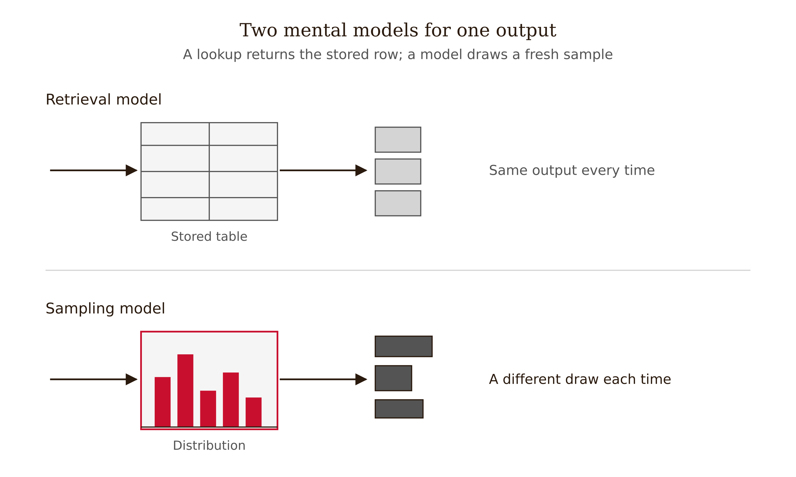
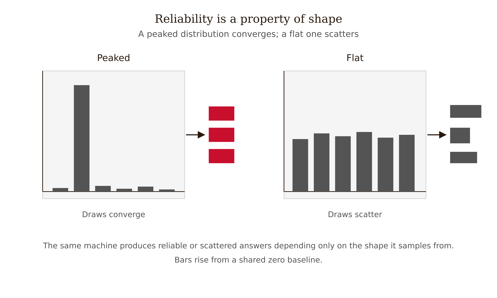
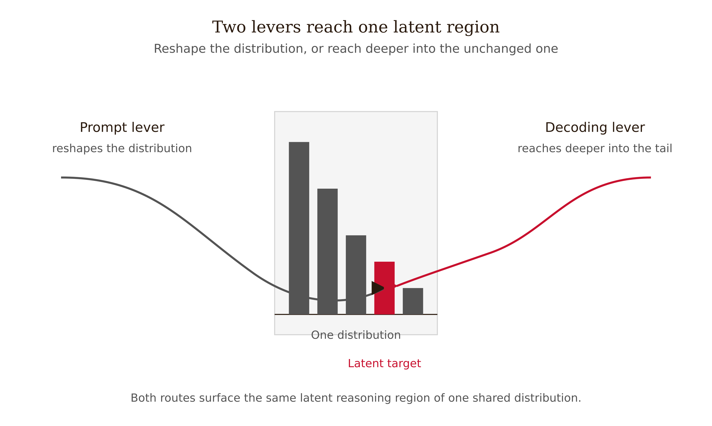
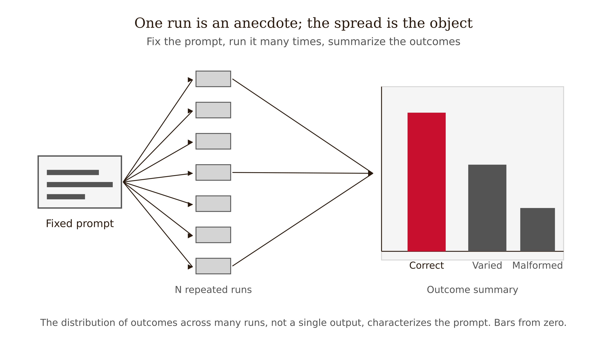

# Chapter 1 — The Stochastic Machine: Why Output Is Sampled, Not Retrieved
*Same prompt, twice, two answers — and the reason is the entire foundation of the discipline.*

---

Run this experiment. Set a chat model's temperature to roughly 0.9 and send the same prompt five times, in five fresh sessions so no history carries over:

> *"Give me a name for a coffee shop that specializes in single-origin Ethiopian beans. Just the name, nothing else."*

You will get something like: *Yirgacheffe & Co.* — *The Origin Room* — *Abyssinia Roasters* — *Single Hill Coffee* — *Harrar House*. Five sends, five names. No setting changed. No typo. The model did not "change its mind." Nothing went wrong.

Now do the uncomfortable version. Lower the temperature toward zero and send the identical prompt five times. Now you will very likely get the *same* name five times — say, *Yirgacheffe & Co.* every single time. Same machine, same prompt, same five sends. One parameter changed.

Two observations are now sitting on the table:

First, the variability at high temperature was real and prompt-independent. You did not rephrase the question five different ways. The divergence came from the machine.

Second, the variability is controllable. A single parameter turned a scatter of five distinct answers into one repeated answer. Whatever is producing the divergence responds predictably to a dial.

If the model were a database — if "the answer" were stored somewhere and retrieved — neither observation makes sense. A database returns the same row every time. It does not have a dial that controls how often it returns a *different* row. The behavior you just observed is not retrieval. It is sampling. And what you need to understand, before anything else in this book, is what that difference actually means.

*Figure 1.1 — Two mental models for one output*

---

## Why the retrieval picture fails

The intuition that a language model "looks things up" is seductive because so much of its behavior mimics retrieval. Ask for the capital of France and it reliably returns "Paris." Ask for the boiling point of water at sea level and it returns "100°C." It feels like a lookup table with very good coverage.

Here is what the retrieval picture gets wrong. From Chapter 0: at each step the model computes a probability distribution over its entire vocabulary and draws a sample from it, then uses that sample as part of the context for the next draw. There is no row labeled "capital of France → Paris" anywhere in the system. There is a distribution that, *given the context "The capital of France is,"* places almost all its mass on the token `Paris`. The reliability you observe is the reliability of a sharply peaked distribution — not the reliability of a stored fact.

This is testable. Temperature is the test. A retrieval system has no notion of temperature; you cannot make a database return a different row "more often" by turning a knob. A sampling system does exactly that. The fact that temperature *works at all* is direct evidence that the underlying operation is a draw from a distribution. You ran the experiment at the top of this chapter. The knob worked. That is the proof.

Two consequences fall out of this immediately, and both matter for engineering.

**Reliability is a property of distribution shape, not of stored truth.** "Capital of France" is reliable because training made that conditional extremely peaked. A genuinely ambiguous or sparsely-attested query produces a flat distribution — many tokens sharing mass — and produces high run-to-run variability even at modest temperature. The same machine is "reliable" on one query and "scattered" on another, with no change to the machine whatsoever. That is impossible to explain with retrieval and immediate to explain with sampling.

**There is no "the answer" to be returned.** When you ask a question, the model is not retrieving an answer and deciding how to word it. The wording *is* the answer. It is generated token by token, by sampling. This is why two correct answers can be phrased completely differently, and why a single unlucky early sample can derail an entire response — because each sampled token re-conditions every distribution that follows it.

There is a misconception worth addressing directly: *"Okay, but at temperature zero it's deterministic, so then it really is a lookup."* At temperature zero the model takes the highest-probability token at each step, which is deterministic given identical logits. But it is still not retrieval — it is greedy sampling from the same distribution, with the randomness removed by always taking the peak. And in practice, even temperature zero is not bit-identical across production runs: floating-point non-associativity, request batching on the server, and silent model updates all perturb the logits enough to occasionally flip a token. "Deterministic at temperature zero" is an idealization of the math, not a property you can lean on in a real system. Determinism is a *limit* of the sampling process, not an escape from it.

---

## "Random" is also wrong

Having argued the model samples, we now have to defend it from the opposite error. When people learn that output is sampled, the next thought is often: *"So it's just random — it makes things up at random."* That is as wrong as the retrieval picture, only in the other direction.

The distribution the model samples from is not uniform and not arbitrary. It is *learned* — shaped by training on a vast corpus so that $P(x_t \mid x_{<t})$ assigns high probability to continuations that resemble the training data and low probability to continuations that do not. "The capital of France is ___" yields a distribution with a spike on `Paris` precisely because, across training, that continuation was overwhelmingly the one that occurred. The sampling is random. What it is sampling *from* is a highly structured, data-shaped object.

The precise statement is: **the model draws a random sample from a non-random, learned distribution.** Both halves matter.

The *learned, structured* half is why prompt engineering is possible at all. If outputs were uniform noise, no prompt could steer them. Because the distribution is conditioned on your context, changing the context changes the distribution's shape — and that is the lever you pull.

The *random sample* half is why prompt engineering is empirical. A single run tells you what the model did on that draw, not what the distribution looks like. To characterize a prompt's behavior you must sample it repeatedly. This is not pedantry; it is the direct consequence of output being a probabilistic event. The minimal honest experiment: fix the prompt, fix the parameters, run many times, and characterize the *distribution* of outputs. One run is an anecdote. The distribution is the engineering object.

*Figure 1.2 — Reliability is a property of distribution shape*

---

## The parameters as behavioral controls

If output is a sample from a distribution, and temperature reshapes that distribution while top-k and top-p truncate its tail (Chapter 0), then those parameters are *behavioral controls* and you should be able to predict their effects without running the model.

Raise the temperature: the distribution flattens, mass spreads toward unlikely tokens, outputs become more varied and eventually incoherent. Lower it: the distribution sharpens, mass concentrates on the leaders, outputs become repetitive and, on some models, start looping. Lower top-p or shrink top-k: fewer tail tokens survive, outputs are tighter and less likely to surprise. Raise them: more of the tail stays in play, more variety, more risk of an odd draw.

Two predictions worth stating as falsifiable claims:

On a task with many good answers — naming, brainstorming, phrasing — raising temperature increases run-to-run variety. Such tasks have broad distributions, and flattening a broad distribution spreads draws further. Falsifiable: if you found a task where raising temperature did not increase output diversity despite a measurably non-peaked distribution, the framing would be in trouble.

On a task with one strongly-favored answer — factual recall on well-attested facts — temperature has little effect until it is high enough to overcome a large logit gap. A peaked distribution stays peaked under mild flattening. The arithmetic from Chapter 0 showed an 86% leader at temperature 0.5 still leading at 50% at temperature 2. So "capital of France" survives temperature changes that scatter "name a coffee shop." Same knob, different effect, because the distributions differ in shape — which is the unifying prediction.

| Parameter change | Effect on distribution shape | Effect on observed behavior | Typical use case |
|---|---|---|---|
| Raise temperature | Flattens; mass spreads toward the tail | More varied, eventually incoherent | Brainstorming, naming, ideation |
| Lower temperature | Sharpens; mass concentrates on the leaders | More repetitive; may loop on some models | Extraction, classification, factual recall |
| Lower top-p / top-k | Fewer tail tokens survive | Tighter, less likely to surprise | Reliable structured output |
| Raise top-p / top-k | More of the tail stays in play | More variety, more risk of an odd draw | Creative range with coherence |

This is what it means to say the parameters are controls rather than magic. Their effects are deducible from distribution shape plus the breadth of the task's answer space. An engineer who internalizes this stops asking "what temperature should I use?" as if there were a universal answer, and starts asking "how broad is the space of acceptable outputs for *this* task, and do I want to sample widely or narrowly across it?"

There is one misconception to defuse here. Higher temperature does not add creativity; it widens the sample. Past a certain point, widening the sample on a coherence-demanding task just reaches tokens that are *possible* but *bad*. The tail of the distribution is not a reservoir of good ideas — it is a reservoir of low-probability continuations, which includes both unusual-but-apt and simply-wrong. "Creativity" that survives high temperature was already in the plausible region of the distribution; temperature only governs how far into the tail you reach. There is a task-specific sweet spot, found empirically, not a monotonic "more is better."

---

## The reasoning is in the distribution, not the prompt

Here is the finding that most sharply proves output is a property of the distribution rather than of the prompt string — and it is the bridge from "sampling explains variability" to "sampling explains *capability*."

The standard story about getting a model to reason is prompting: append "Let's think step by step" and accuracy on multi-step problems jumps substantially. Kojima et al. (2022) showed this with a single appended phrase lifting performance on mathematical reasoning benchmarks by large margins. The intuitive reading is that the *words* unlock reasoning.

Wang and Zhou (2024), in "Chain-of-Thought Reasoning Without Prompting," falsify the strong version of that reading. They show that chain-of-thought reasoning paths can be elicited by changing the *decoding* alone — with no change to the prompt at all. The mechanism: instead of greedily taking the top token at the first step, inspect the top-k alternative first tokens and continue decoding from each. Some of those alternative branches are reasoning trajectories — step-by-step paths — that were already present in the model's output distribution, just not at the very peak. The reasoning was *latent in the distribution*; greedy decoding simply was not surfacing it. Accessing it is a sampling and decoding choice, and it yields large accuracy gains across reasoning benchmarks.

Sit with what this means. If you can extract a reasoning chain by changing which part of the distribution you sample from, with the prompt held fixed, then the reasoning capability is not a property of the prompt string. It is a property of the *shape of the output distribution*, accessible through decoding. The prompt "Let's think step by step" and the decoding trick are two different ways of reaching the same latent region of the distribution: the prompt reshapes the distribution so reasoning paths rise to the top; the decoding trick leaves the distribution alone and reaches deeper into it. Same destination, two levers on the same object.

*Figure 1.3 — Two levers reach one latent region*

This generalizes into a working principle: **a prompt change and a decoding change are often substitutable, because both are operations on the same underlying distribution.** When you cannot edit the decoding — most consumer APIs expose only temperature and top-p, not branch inspection — you reach the latent region by prompting. When you control the decoding loop, you have a second lever. Knowing they are levers on the same object is what lets you reason about which to use, rather than treating one as the real tool and the other as a curiosity.

A second result from the same literature keeps us honest about what the reasoning actually *is*. Wang et al. (2023) showed that prompting with *invalid* reasoning steps still recovers 80 to 90 percent of valid chain-of-thought performance, and that the relevance of steps to the query and their ordering matter far more than their factual correctness. The chain-of-thought is not, in the main, the model executing valid logic and reading off the result. It is the model being conditioned into a step-shaped trajectory through the distribution — a trajectory that *lands on correct answers more often* without necessarily *being* correct reasoning. This is the cleanest possible demonstration of the chapter's thesis: the output is a sampled trajectory through a learned distribution, and "reasoning" is the *shape* of that trajectory, not a guarantee about its content.

---

## What sampling forces on the engineer

Pull the consequences together, because they reshape the job.

You cannot validate a prompt from one run. A single output is one sample. It tells you the prompt *can* produce that output, not that it *typically* does. To make a defensible claim about a prompt's behavior — "this extraction prompt returns valid JSON 98% of the time" — you must sample it repeatedly and count. This is the direct consequence of output being a probabilistic event.

"It worked for me" is a statement about one draw. When a colleague says a prompt works and you cannot reproduce it, neither of you is necessarily wrong — you may have drawn different samples from a broad distribution. The fix is to narrow the distribution until the behavior you want is the *typical* draw, not a lucky one. Reliability engineering for language models is, mechanically, distribution-narrowing.

The parameters are part of the prompt. Temperature and top-p co-determine the output distribution along with the prompt text. A prompt that is excellent at temperature 0.2 may be unusable at temperature 1.2. Reporting a prompt's behavior without reporting its decoding parameters is like reporting a measurement without units.

Consider the Mycroft case — an investment-intelligence system that summarizes regulatory filings. An analyst asks Mycroft to summarize a filing and gets a clean, confident summary. Satisfied, they ship it. The summary was one draw from a distribution that, on this particular filing, was not sharply peaked: several plausible but conflicting summaries shared mass. A second draw would have read differently, and the difference would have flagged that the model was uncertain here. By treating the single confident output as "the answer," the analyst discarded exactly the signal that sampling makes available for free. Output variability, across a handful of runs on the same prompt, is an uncertainty estimator. Treating the model as a retrieval system throws that estimator away.

*Figure 1.4 — One run is an anecdote; the spread is the engineering object*

---

## The bridge: confident, and invisibly wrong

Everything above is, in a sense, good news. Output is sampled, sampling is controllable, and the controls are deducible from distribution shape. But the same mechanism carries a threat that the next chapter exists to confront.

The distribution the model samples from maximizes the probability of *plausible* continuations — sequences that resemble the training data. Nothing in $\prod_t P(x_t \mid x_{<t})$ references truth. So the machine is exactly as fluent when it is right as when it is wrong. A sharply peaked distribution produces a confident-sounding answer whether the peak sits on a true token or a false-but-plausible one. The sampling machinery cannot tell the difference from the inside. Neither, from the surface, can you.

This is the failure that sampling makes possible and *invisible*: the model can be confidently, fluently wrong, with the same texture it has when it is confidently right. Run-to-run variability gives you a partial tell — a wobbling answer signals a flat distribution, hence uncertainty — but a *peaked distribution on a wrong token* gives you a stable, confident error with no surface signal at all.

If every output is sampled, when is it confidently wrong — and how would you ever know?

That is Chapter 2.

---

## LLM Exercises

**Exercise 1 — Generate and examine.** Send the same factual prompt ("What is the capital of Australia?") and the same open-ended prompt ("Suggest a name for a plant-based restaurant") each five times at temperature 0.2 and five times at temperature 1.0. Record distinct output counts. Write two sentences explaining why the two prompts responded differently to the same temperature change, in terms of distribution shape.

**Exercise 2 — Apply to known context.** You are building Wordsville, a content system that generates short town-newsletter blurbs from event data. Your team wants "consistent house voice." Translate this requirement into a decoding-parameter prescription — state which parameter(s) you would change, in which direction, and why the change addresses the consistency problem mechanically rather than just hoping for it.

**Exercise 3 — Stress-test a claim.** The chapter claims that output variability across runs is an "uncertainty estimator" — that a spread of answers signals a flat distribution, hence model uncertainty. Design an experiment to test whether this claim holds: what prompt types would you use, how many runs, and what would falsify the claim? (Hint: consider a case where the distribution is flat for stylistic, not epistemic, reasons.)

**Exercise 4 — Draft a professional deliverable.** A teammate proposes: "Set temperature to zero for our summarizer — then it's deterministic and reliable." Write a 150–250 word technical note responding to this proposal. Identify the sense in which it is true, two senses in which it is false or risky, and what you would measure instead to make a defensible reliability claim.

---

## References

- Wang, X., & Zhou, D. (2024). Chain-of-Thought Reasoning Without Prompting. *NeurIPS 2024* (Google DeepMind). arXiv:2402.10200 — reasoning paths elicited by decoding alone, prompt fixed.
- Kojima, T., Gu, S. S., Reid, M., Matsuo, Y., & Iwasawa, Y. (2022). Large Language Models are Zero-Shot Reasoners. *NeurIPS 2022*. arXiv:2205.11916 — "Let's think step by step."
- Wei, J., et al. (2022). Chain-of-Thought Prompting Elicits Reasoning in Large Language Models. *NeurIPS 2022*. arXiv:2201.11903 — few-shot CoT; emergence with scale.
- Wang, B., et al. (2023). Towards Understanding Chain-of-Thought Prompting: An Empirical Study of What Matters. *ACL 2023*. arXiv:2212.10001 — invalid rationales recover 80–90% of valid-CoT performance.
- Meincke, L., Mollick, E. R., Mollick, L., & Shapiro, D. (2025). Prompting Science Report 2: The Decreasing Value of Chain of Thought in Prompting. Wharton Generative AI Labs. arXiv:2506.07142 — CoT scope conditions on reasoning-tuned models.
- Brown, T., et al. (2020). Language Models are Few-Shot Learners (GPT-3). *NeurIPS 2020*. arXiv:2005.14165 — in-context learning; background for the sampling-conditioned-on-context view.

---

## Prompts

Use these prompts with Claude to generate interactive D3 v7 versions of the figures in this chapter. Each produces a standalone HTML file you can open in a browser and modify freely.

**Prerequisites:** Load `NEU/CLAUDE.md` and `NEU/DESIGN.md` into your Claude project context before using these prompts. They define the stack, naming conventions, color system, and typography the figures use.

---

### Figure 1.1 — Two mental models for one output

Two side-by-side panels, single HTML file, inline CSS, D3 v7 from the CDN. Left panel "retrieval": a small lookup table with one highlighted row returning the identical output on five repeated queries. Right panel "sampling": a probability distribution (bar chart, zero baseline) over candidate outputs, with five draws producing different tokens. Red encodes the drawn/returned token; ink for structure. Caption: a lookup returns the stored row; a model draws a fresh sample each time.

> Reference implementation: `d3/01-the-stochastic-machine-fig-01.html`

---

### Figure 1.2 — Reliability is a property of distribution shape

Two bar charts side by side, single HTML file, D3 v7 CDN, shared zero baseline. Left "peaked": one dominant bar; overlay five draw-markers clustering on it ("draws converge"). Right "flat": roughly uniform bars; overlay five draw-markers scattered across them ("draws scatter"). Red for the modal bar, ink for the rest. Caption: the same machine is reliable or scattered depending only on the shape it samples from.

> Reference implementation: `d3/01-the-stochastic-machine-fig-02.html`

---

### Figure 1.3 — Two levers reach one latent region

A distribution landscape with one highlighted latent region, single HTML file, D3 v7 CDN. Show two labeled paths arriving at the same region: Path 1 "prompt change" reshapes the curve so the region rises to the peak; Path 2 "decoding change" leaves the curve and reaches deeper into it via top-k branch inspection. Red marks the shared destination region; ink for the two paths. Caption: prompt and decoding are two levers on the same object.

> Reference implementation: `d3/01-the-stochastic-machine-fig-03.html`

---

### Figure 1.4 — One run is an anecdote; the spread is the engineering object

A single-run callout beside a distribution of outcomes, single HTML file, D3 v7 CDN. Left: one isolated output marker labeled "one run." Right: a histogram of outputs over many runs of the same prompt and parameters, zero baseline, with median and spread annotated. Red for the distribution's mode, ink for the lone single-run marker. Caption: one sample is what the model did once; the distribution is what you can characterize.

> Reference implementation: `d3/01-the-stochastic-machine-fig-04.html`
