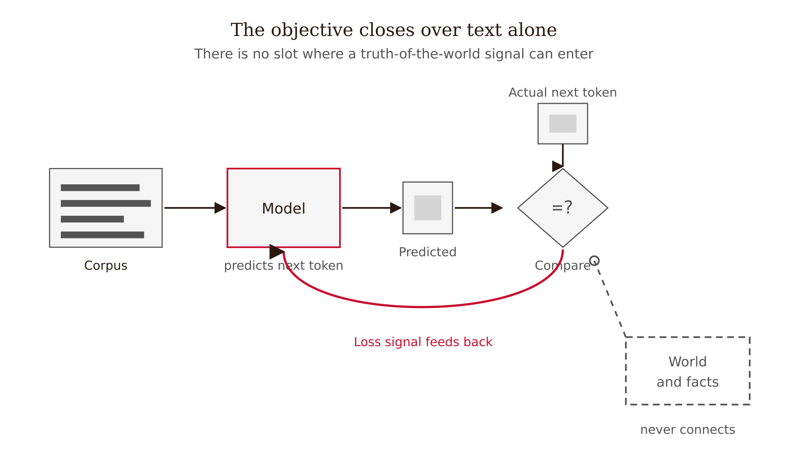
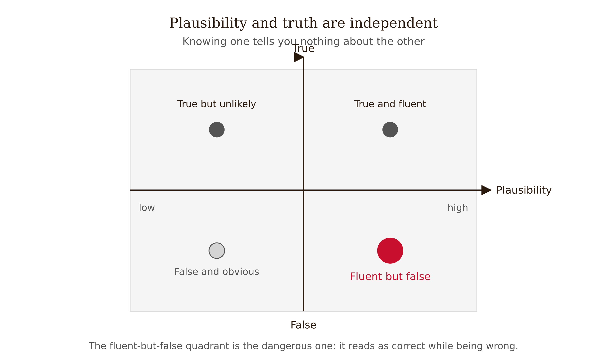
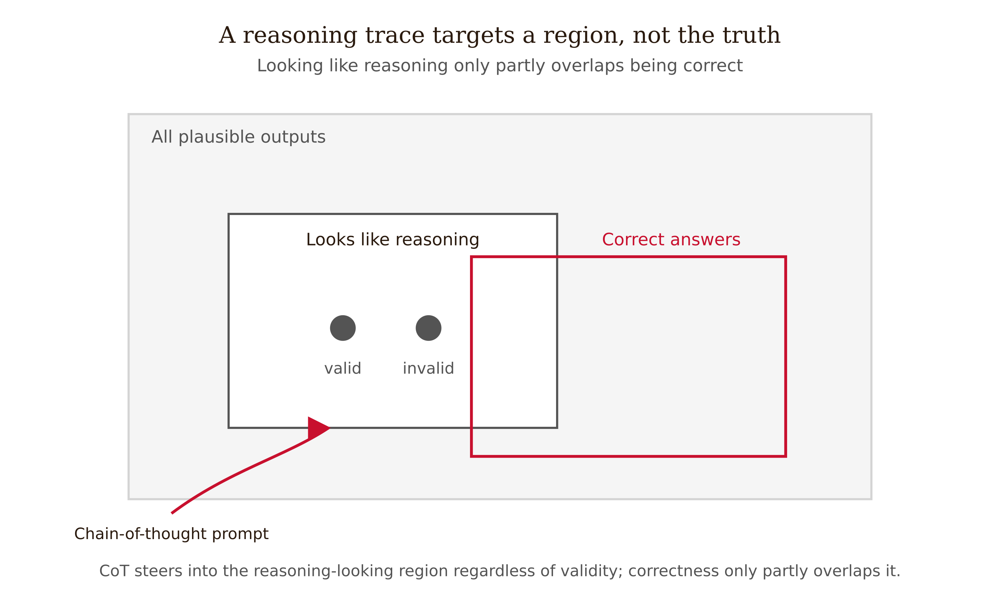

# Chapter 2 — Hallucination and the Plausibility–Truth Gap
*Why a model optimized to sound right is not optimized to be right.*

---

In late 2025, an analyst on the Mycroft investment-intelligence team asked the system a routine question: summarize the regulatory exposure in a company's most recent 10-K, and cite the relevant risk-factor language. The system prompt was the kind that ships everywhere: *"You are a meticulous, knowledgeable financial research assistant. Always give the user a complete, well-sourced answer."*

The assistant returned three clean paragraphs. It named a specific risk factor, quoted two sentences of disclosure language in quotation marks, and gave a page reference — Item 1A, page 27. The prose was fluent. The structure was exactly what an analyst expects. The quoted language sounded precisely like SEC risk-factor boilerplate: hedged, defensive, lawyerly. The analyst, on deadline, pasted the quote and the page citation into a client-facing brief.

The quote did not exist. There was a risk factor on the general topic, but the two "quoted" sentences were not in the filing. They were a fluent reconstruction of what such a disclosure *typically* says. The page number was plausible — 10-Ks do have an Item 1A around there — and wrong. The tell, in hindsight, was that the quote was too clean. It said exactly what the analyst's question implied it would say.

Nothing in the output's surface separated its load-bearing factual commitments — *this language appears in this filing, on this page* — from its connective prose. To catch the error, the analyst would have had to reverse-engineer which sentences were even falsifiable, then check each against the actual document. The format actively discouraged that. The paragraph was, as written, nearly unfalsifiable at a glance.

This chapter is about why that happens — not as a bug in one model, but as a structural consequence of what the machine is optimized to do.

<!-- → [IMAGE: Two versions of the Mycroft brief side by side — left: the fluent ungoverned paragraph with the fabricated quote embedded invisibly in the prose; right: the same answer with the Fact-Check List appended, claims extracted as numbered items. Visual makes the "invisible commitment" problem legible before the mechanism is explained.] -->

---

## The two axes nobody told you to separate

Start with the misconception, because it is the one almost every new prompt engineer carries in unexamined.

A fluent, confident, well-structured answer feels more likely to be correct than a halting, hedged one. In conversation with humans, this heuristic is mostly sound. A person who explains a topic clearly, in the right register, with the right vocabulary, usually understands it — because in humans, fluency on a topic is *produced by* understanding it. The clear explanation is causal evidence of the competence behind it. You have spent your whole life calibrating on that correlation, and it is a good correlation. For humans.

For a language model it is not merely a weaker correlation. It is, on the relevant axis, no correlation at all — and worse, the two properties are generated by the very same machinery, so the surface cannot tell them apart.

Call the two axes **plausibility** and **truth**.

Plausibility is how probable a continuation is given the patterns in training data. This is what the model computes and optimizes at every step.

Truth is whether the continuation corresponds to the world. This is what you want. It is what the model does not compute.

These are orthogonal. Knowing where an output sits on one axis tells you nothing about where it sits on the other. A true claim can be highly plausible — the model has seen it stated many times — or implausible, because the truth is awkward, rare, or counterintuitive. A false claim can be highly plausible — it fits the pattern of what such answers usually say, which is the Mycroft quote — or implausible, in which case it reads like gibberish. Fluency is a measure of plausibility. It is silent about truth.

The core claim of this chapter is this: a language model trained by next-token prediction optimizes the plausibility of its output under the training distribution. It contains no objective term for truth. Hallucination is not a malfunction of this process. It is the process working exactly as specified, on an input where plausibility and truth happen to point in different directions.

Hold the word "hallucination" at arm's length for a moment. It is a misleading name — it suggests a perceptual glitch, a rare misfire, something a healthy model would not do. What actually happens is that the model samples the most probable continuation, and sometimes the most probable continuation is false. There is no separate hallucination mode. The same forward pass that produces a true citation produces a fabricated one.

---

## Inside the objective: where truth would have to live, and doesn't

You do not need transformer internals to see this. You need the loss function — the single equation that defines what "good" means during training.

A language model is trained on a corpus of token sequences. For a sequence $x_1, x_2, \ldots, x_T$, the model factorizes the probability of the whole sequence using the chain rule:

$$P_\theta(x_1, \ldots, x_T) = \prod_{t=1}^{T} P_\theta\!\left(x_t \mid x_1, \ldots, x_{t-1}\right)$$

Each factor is the model's predicted probability for the next token given everything before it, with $\theta$ the model's parameters. Training adjusts $\theta$ to make the observed training sequences as probable as possible — **maximum-likelihood estimation**. Equivalently, it minimizes the average negative log-likelihood, called the cross-entropy loss:

$$\mathcal{L}(\theta) = -\frac{1}{T}\sum_{t=1}^{T} \log P_\theta\!\left(x_t \mid x_{<t}\right)$$

Read this equation slowly and ask what it references. Every quantity in it is about the training text: the tokens that actually occurred, and the probability the model assigns them. There is a term for "did the model predict the token that came next in the corpus." There is no term anywhere for "is the statement the model is generating true of the world."

*Figure 2.2 — The training objective closes over text alone*

Truth does not appear in the loss because truth is not in the data in a form the loss can see. The corpus contains strings. It does not contain a labeled column marking which strings correspond to facts. The model is optimized to reproduce the statistical regularities of the strings — including the regularity that risk factors are phrased a certain way, that citations have a certain shape, that confident answers follow confident questions.

This is worth stating starkly: a true sentence and a false-but-stylistically-identical sentence are, to the loss function, the same kind of object. If false-but-plausible continuations were common in the training data in a given pattern, the model learned to produce them. Even where the training data is overwhelmingly true, the model interpolates and extrapolates — it generates continuations it never saw, and nothing constrains those continuations to be true, only to be probable-looking. The Mycroft quote is exactly this: a continuation no filing contained, assembled from the statistical shape of filings the model had seen.

*Figure 2.1 — Plausibility and truth are independent axes*

A second-order effect compounds it. Post-training alignment — the stage where the model is tuned on human feedback — optimizes for human approval of responses, and humans approve of fluent, confident, complete answers. So the alignment objective, if anything, rewards plausibility further and can penalize the honest "I don't have that." Pretraining optimizes likelihood; alignment optimizes approval. Neither optimizes correspondence to fact. Nothing in either training stage installs a truth term.

Why does fluent-implies-correct work for humans and fail for models? In humans, fluency is *caused by* competence. You cannot fluently explain thermodynamics without knowing thermodynamics. In a language model, fluency is caused by exposure to fluent text, which is entirely decoupled from whether any particular generated statement is true. The model can produce the rhythm of expertise without the substance. You inherited a heuristic calibrated on a machine — the human brain — where the two axes are bolted together. You are now operating a machine where they are not.

---

## The fix that isn't: why a reasoning trace doesn't add a truth term

A careful reader should push back here. *Fine — a bare answer optimizes plausibility. But what if I make the model show its work? Chain-of-thought prompting forces the model to lay out intermediate reasoning before answering. If I can see the reasoning, surely I can trust the conclusion?*

This is the most important misconception in the chapter, because the fix is real for some tasks and seductive for the wrong reasons.

Chain-of-thought reasoning genuinely raises accuracy on multi-step problems for large models. Wei et al. (2022) showed eight reasoning exemplars taking a large model to then-state-of-the-art on grade-school mathematics, with the benefit emergent with scale — small models gained little or got worse. Kojima et al. (2022) showed the bare phrase "Let's think step by step" lifting one model on a multi-step arithmetic benchmark from 17.7% to 78.7%. So chain-of-thought works. The question is *why*, and whether the why involves the model reasoning toward truth.

The decisive evidence is an ablation. Wang et al. (2023), "Towards Understanding Chain-of-Thought Prompting," fed models reasoning exemplars whose steps were *invalid* — logically wrong, but still relevant to the problem and correctly ordered. If chain-of-thought worked by getting the model to follow valid logic, invalid exemplars should wreck performance. They did not. Prompting with invalid reasoning steps recovered 80 to 90 percent of valid chain-of-thought performance. What mattered was not the correctness of the rationale but its relevance to the query and the correct ordering of steps.

Read that result for what it says about our two axes. A reasoning trace is itself a token sequence, generated by the same maximum-likelihood machinery as everything else. Chain-of-thought does not install a truth term. It conditions the decoding trajectory into a plausible step-shaped manifold — the region of the output space where text *looks like* reasoning. Landing in that region correlates with correct answers on problems whose correct solution has a step-shaped structure the model has seen many variants of — arithmetic, symbolic manipulation. It is still optimizing the shape of the output, not its validity. The trace is plausibility wearing the costume of logic.

*Figure 2.4 — A reasoning trace targets a region, not the truth*

Two consequences for the prompt engineer:

A reasoning trace is not a verification. A fluent, well-ordered, confident chain of steps can lead to a wrong answer, and those steps will look just as reasoning-shaped as a correct chain. Do not read the visible trace as evidence the conclusion is true. It is evidence the conclusion is step-shaped.

Chain-of-thought is conditional, not universal. On reasoning-tuned models, Meincke and Mollick et al. (2025) report that explicit "think step by step" sometimes adds answer-to-answer variance and can flip otherwise-correct answers. Chain-of-thought earns its place by mechanism — conditioning toward a useful trajectory shape under stated conditions — not as a truth charm.

Showing the work does not close the plausibility–truth gap. It often improves the answer on structured problems, and it is worth using for that reason. But it leaves the gap exactly where it was on the surface: a wrong chain looks like a right one. We need something that does not live inside the model's own distribution.

---

## The Fact-Check List Pattern: making commitments enumerable

The architectural response to the plausibility–truth gap is the **Fact-Check List Pattern**, from the White et al. (2023) catalog of prompt patterns. The mechanism, before the name: the pattern instructs the model to emit, alongside its answer, an explicit enumeration of its load-bearing factual claims — the propositions on which the answer's correctness depends — so they can be verified.

Under this pattern, the Mycroft assistant would produce its prose and then:

> *Claims this answer depends on:*
> *1. The 10-K contains a risk factor on regulatory exposure — check: keyword search of Item 1A.*
> *2. The quoted sentences appear verbatim in the filing — check: verbatim string search.*
> *3. The language is located at page 27 — check: page lookup.*

Now look at what changed. The fluent paragraph is unchanged; it is still optimized for plausibility. But its factual commitments have been separated from the connective prose and rendered as discrete, checkable items. An unfalsifiable paragraph becomes a falsifiable list. Item 1 is a topic lookup. Item 2 is a string search. Item 3 is a page check. The analyst's job shifts from "reverse-engineer which sentences are even claims and then verify each" to "run down these three items." The pattern converts diffuse plausibility into enumerated commitments a verifier — human or tool — can attack one at a time.

There is a secondary effect worth naming honestly: forcing the model to name a claim sometimes surfaces its own uncertainty. A claim asserted confidently inside flowing prose can look shakier isolated as a numbered line item, and models somewhat more often hedge an isolated claim than a buried one. This is a mild bonus, not a mechanism to rely on.

### The honest limit

Here is the structural limit, and it must be stated before you trust the pattern: **the model generates the checklist too.** The same distribution that fabricated the Mycroft quote will, asked to list its load-bearing facts, certify "the quoted sentences appear verbatim" as item 2 with full confidence. The Fact-Check List does not detect its own fabrications. A model confident enough to invent a citation is confident enough to certify it. Asking the model "is your answer correct?" routes the question back through the very distribution that produced the error — same blind spots, same confident register.

The honest description is: **the Fact-Check List is a surfacing aid, not a verification.** Its value is that it produces an artifact something else can check cheaply, lowering the cost of external verification. That is genuine engineering value. It is not, by itself, reliability.

*Figure 2.3 — Split the answer into claims, verify each outside the model*

Reliability arrives only when an external check consumes the list — a check the model cannot talk its way past. A retrieval tool grounds each claim against a source outside the model's distribution. A verbatim search of the actual filing returns "string not found" — a result the model cannot wish into existence. For the highest-stakes decisions, a human review node is the irreducible external check.

A fact-check list with no external verifier is a confession nobody reads. The pattern is the handle. The external check is the door.

---

## A worked separation: the same answer, governed

A user asks: *"Which of the company's risk factors mention foreign-currency exposure, and how many basis points of margin did management attribute to it last year?"*

**Ungoverned output:**

> *The company discloses foreign-currency exposure as a principal risk factor, noting that "fluctuations in exchange rates may materially affect our results of operations." Management attributed approximately 120 basis points of margin compression to currency effects in the prior fiscal year.*

Fluent. Confident. The quote sounds real; "120 basis points" sounds like a real figure. Both could be fabricated. You cannot tell from the surface.

**Governed output, with Fact-Check List:**

> *Claims this answer depends on:*
> *1. The filing lists foreign-currency exposure as a risk factor — check: keyword search of Item 1A.*
> *2. The quoted sentence appears verbatim in the filing — check: verbatim string search.*
> *3. Management attributed approximately 120 bps of margin compression to currency in the MD&A — check: search MD&A. Highest-risk claim: specific quantities are where fabrication is most likely and most consequential.*

The verifier runs three cheap checks. Item 3 is flagged as highest-risk because specific numbers are where the model interpolates most freely — "120 bps" is a plausible number of the right magnitude, not necessarily the one in the document. If the retrieval tool returns "80 bps, not 120," the model's plausible guess is caught by an observation it cannot override. The answer did not get more truthful. The *system* got verifiable. That distinction is the chapter.

| Claim type | What the model says | What external verification returns | Error catchable? |
|---|---|---|---|
| Risk-factor existence | "Foreign-currency exposure is a listed risk factor" | Keyword search of Item 1A — found / not found | Yes — a topic lookup |
| Verbatim quote | "'fluctuations in exchange rates may materially affect our results…'" | Verbatim string search of the filing — found / not found | Yes — an exact string match |
| Specific figure | "≈ 120 basis points of margin compression" | Search the MD&A — returns the actual figure (e.g., 80 bps) | Yes — and the highest-risk claim, where fabrication is most likely |

---

## Back to the citation that shipped

The Mycroft brief went out with a fabricated quote not because the model malfunctioned but because it functioned exactly as specified. It sampled the most probable continuation of a prompt that asked, in effect, for a complete, well-sourced answer. "Well-sourced" was satisfied, at the level of plausibility, by output that *had the form* of being well-sourced. The instruction to "always give a complete answer" made it worse, because it treated "I can't find that language" as an unhelpful answer to avoid.

The fix is not a better model and not a friendlier instruction. It is a governance layer in three parts, each defined by where it sits relative to the model's distribution.

A Fact-Check List forces the assistant to enumerate its load-bearing claims. Self-applied. A handle, not a guarantee.

An external verifier consumes the list — a document-retrieval tool that grounds each quote against the actual filing and returns "not found" for the fabrication. External. The actual governance.

A bounded instruction that breaks the sycophantic collapse: *if the language is not in the filing, say so plainly.* Backed, for client-facing work, by a human review node.

The same model, wrapped in a layer that surfaces commitments and grounds them externally, ships a verifiable brief instead of a confident fabrication. The plausibility–truth gap is not closed inside the model. It cannot be — the loss function has no truth term. It is spanned from outside, by a check the model cannot argue with. Architecture is the leverage point, not the model.

---

## LLM Exercises

**Exercise 1 — Generate and examine.** Ask a model to answer a factual question you can verify — a specific figure, a quotation, a date. Get the ungoverned answer. Then re-prompt: "List the load-bearing factual claims your answer depends on, as a numbered list." Verify each claim against an external source. Record how many the model certified that your check found false.

**Exercise 2 — Apply to known context.** You are building the Mycroft brief assistant. For three claim types — a named risk-factor topic, a verbatim quotation, a specific basis-point figure — decide for each whether a self-applied Fact-Check List alone is sufficient, whether you need an automated retrieval check, or whether you need a human node. Justify each choice by the cost asymmetry of an undetected error versus the cost of the check.

**Exercise 3 — Stress-test a claim.** The chapter claims a model will certify its own fabricated claims with the same confidence it certifies true ones. Design an experiment to test this: what prompts, what domain, how many trials, and what result would falsify the claim? Then run it if you have model access and report what you find.

**Exercise 4 — Draft a professional deliverable.** Write a one-page governance specification for the Mycroft brief assistant. It must name the three governance layers (Fact-Check List, external verifier, bounded instruction), specify what each layer does and does not guarantee, and identify which claim type requires a human node and why. Do not describe the model's behavior; describe the *system's* behavior.

---

## References

- Wei, J., et al. (2022). Chain-of-Thought Prompting Elicits Reasoning in Large Language Models. *NeurIPS 2022*. arXiv:2201.11903.
- Kojima, T., et al. (2022). Large Language Models are Zero-Shot Reasoners. *NeurIPS 2022*. arXiv:2205.11916.
- Wang, B., et al. (2023). Towards Understanding Chain-of-Thought Prompting: An Empirical Study of What Matters. *ACL 2023*. arXiv:2212.10001.
- Meincke, L., Mollick, E. R., Mollick, L., & Shapiro, D. (2025). Prompting Science Report 2: The Decreasing Value of Chain of Thought in Prompting. arXiv:2506.07142.
- White, J., et al. (2023). A Prompt Pattern Catalog to Enhance Prompt Engineering with ChatGPT. arXiv:2302.11382. *(Source of the Fact-Check List Pattern.)*

---

## Prompts

Use these prompts with Claude to generate interactive D3 v7 versions of the figures in this chapter. Each produces a standalone HTML file you can open in a browser and modify freely.

**Prerequisites:** Load `NEU/CLAUDE.md` and `NEU/DESIGN.md` into your Claude project context before using these prompts. They define the stack, naming conventions, color system, and typography the figures use.

---

### Figure 2.1 — Plausibility and truth are independent axes

A 2×2 quadrant chart, single HTML file, inline CSS, D3 v7 from the CDN. X-axis "plausibility (low → high)," y-axis "truth (low → high)." Populate all four quadrants with a labeled example: high-plausibility/high-truth (capital of a major country), high-plausibility/low-truth (a fabricated-but-fluent citation, marked in red), low-plausibility/high-truth (a counterintuitive correct fact), low-plausibility/low-truth (incoherent nonsense). Red highlights the dangerous high-plausibility/low-truth cell; ink for axes and labels. Caption: the two axes are independent.

> Reference implementation: `d3/02-hallucination-and-the-plausibility-truth-gap-fig-01.html`

---

### Figure 2.2 — The training objective closes over text alone

An annotated equation figure, single HTML file, D3 v7 CDN. Render the cross-entropy loss over training tokens, then draw labeled callouts pointing to each term: "tokens that occurred," "probability the model assigned." Add one struck-through callout for a missing "is it true of the world?" term, marked in red. Ink for the equation and the present terms. Caption: every quantity refers to the text; none references the world.

> Reference implementation: `d3/02-hallucination-and-the-plausibility-truth-gap-fig-02.html`

---

### Figure 2.3 — Split the answer into claims, verify each outside the model

A three-stage left-to-right pipeline, single HTML file, D3 v7 CDN. Stage 1 (one color block, "inside the distribution"): model emits answer + numbered Fact-Check List. Stage 2 (a contrasting color, "outside the distribution"): an external verifier — retrieval tool or human node — checks each numbered claim. Stage 3: a "found / not found" result returns as an observation arrow the model cannot override. Red marks the external check; ink for the generation stage and arrows. Caption: the list is the handle; the external check is the governance.

> Reference implementation: `d3/02-hallucination-and-the-plausibility-truth-gap-fig-03.html`

---

### Figure 2.4 — A reasoning trace targets a region, not the truth

A distribution figure with a highlighted step-shaped manifold, single HTML file, D3 v7 CDN. Show the output space with a region labeled "step-shaped trajectories"; mark that chain-of-thought conditions decoding into that region, which correlates with — but does not guarantee — correct answers. Red marks the targeted region; ink for the surrounding space and a divergent "wrong but step-shaped" path. Caption: the trace targets a region, not the truth.

> Reference implementation: `d3/02-hallucination-and-the-plausibility-truth-gap-fig-04.html`
