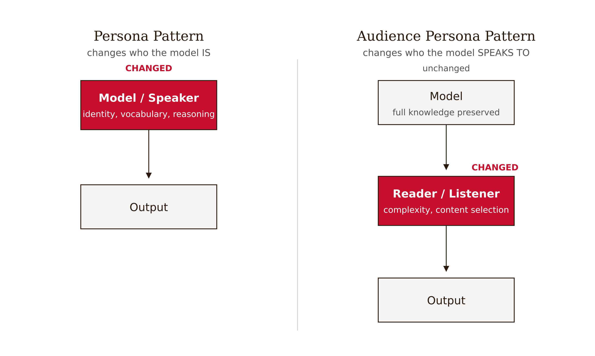
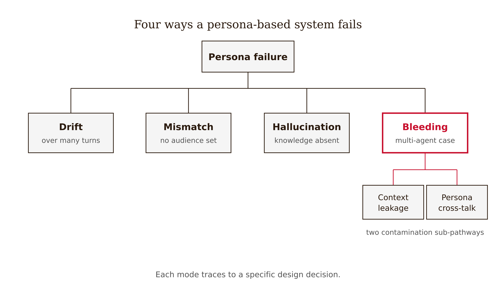
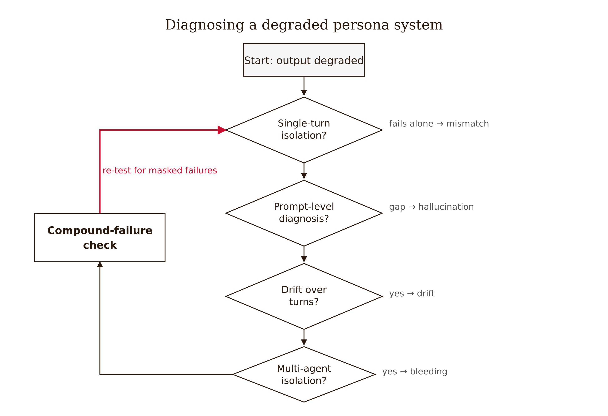

# Chapter 6 — Persona and Audience Patterns
*Two instructions that sound the same activate categorically different behaviors — and confusing them grounded an aircraft fleet inspection.*

---

In March 2024, a materials-characterization startup deployed an AI assistant to help junior engineers interpret scanning electron microscope images of fractured components. The prompt seemed reasonable:

> *"You are a metallurgist. Explain the fracture surface to the user."*

Within three weeks, the tool had misclassified two fatigue failures as overload fractures. One of those errors nearly resulted in a fleet-wide inspection being cancelled for a regional aircraft operator. A junior engineer had asked for an explanation suitable for a maintenance supervisor with no metallurgy background. The AI, steadfastly performing its metallurgist persona, delivered technically accurate observations — beach marks, striation spacing, crack propagation direction — in language the supervisor could not parse. The supervisor, unwilling to appear ignorant, signed off on a recommendation he did not understand.

The prompt engineers had made a mistake so common it barely registers: they had confused who the AI should *be* with who the AI should *speak to*. These are not the same instruction. They activate different behaviors in the model. And when you conflate them — or neglect one entirely — systems fail in ways whose forensic trace runs directly back to the prompt architecture, not to the model's capability.

The fractured turbine blade does not care whether the AI sounded like an expert. It cares whether the maintenance supervisor understood the warning.

---

## Two patterns, pulled apart

The distinction was formalized by White et al. (2023) in a catalog of prompt patterns modeled on software design patterns. Two of those patterns govern identity and audience. Their mechanisms are different enough that a practitioner who treats them as synonyms will build systems that fail in the shape of the scenario above.

### The Persona Pattern

*"Act as persona X."* The model is given an identity. When you write *"You are a senior corrosion engineer with twenty years of experience in marine environments,"* you are changing the model's output in specific, documented ways.

What we observe, reliably, across model scales and research groups: vocabulary and register shift, domain focus changes, and structured-reasoning performance improves. Kong et al. (2023) tested role-play prompting across models of different sizes on mathematics and symbolic tasks. Accuracy on one algebra benchmark rose from 53.5% to 63.8%; on a letter-concatenation task it jumped from 23.8% to 84.2%. The improvement held across scales — evidence of a real phenomenon, not prompt-specific noise.

What we do not observe reliably: improvement on factual recall. Zheng et al. (2024) tested 162 personas across four model families on over two thousand knowledge questions and found that persona assignment produced no improvement on factual questions. More troubling, detailed expert personas were documented to *reduce* accuracy — one study found MMLU performance dropping from 71.6% to 66.3% when a specific expert persona was applied. The model, activated into confident expert performance, prioritized sounding authoritative over being correct.

Why this happens, in mechanistic terms, is a hypothesis rather than a confirmed finding. The working explanation is statistical co-occurrence during pretraining: documents written by metallurgists share vocabulary patterns and reasoning chains, and persona assignment makes those patterns more probable in next-token predictions. Conditioning the context on persona-associated tokens shifts the probability mass of every subsequent token toward the region of the distribution those documents occupy. This fits the observed effects. It is not confirmed by interpretability research. Treat the behavioral evidence as reliable; treat the mechanistic story as useful intuition.

The practical upshot: the Persona Pattern is a behavioral steering tool, not a knowledge amplification tool. It shifts vocabulary, style, and domain focus reliably. It does not transfer to factual recall, and in narrow domains with confident communication styles, it can actively degrade accuracy by activating fluency without activating knowledge.

*Figure 6.1 — The Persona Pattern steers behavior, not knowledge*

### The Audience Persona Pattern

*"Assume I am Persona Y."* The user is given an identity. The model retains its full knowledge base but filters and adapts its output for the specified reader.

Effects are distinct from the Persona Pattern. Vocabulary difficulty shifts. Sentence length shifts. Assumed background knowledge shifts. But there is an underappreciated risk in this adaptation: audience specification is not only stylistic filtering — it is **information filtering**. The model, inferring the audience cannot handle complexity, suppresses details that might matter. The simplest version of the prompt ("explain this to a child") often produces only a subset of the relevant information. This information-loss effect is reported consistently in practitioner accounts. Keep it in mind when specifying non-expert audiences for high-stakes content: you may need to explicitly instruct the model to flag suppressed details rather than silently omit them.

One historical note. The Audience Persona Pattern appears in the expanded conference version of White et al.'s paper and on the Vanderbilt companion website, but not in the original arXiv preprint — the version most cited in academic literature. Many engineers working from the original paper encounter only the Persona Pattern and assume it covers all identity-related prompting. It does not.

### The swap test

The clearest way to see the distinction is to swap the patterns on the same topic.

**Prompt A — Persona Pattern:** *"You are a first-year undergraduate. Explain the difference between elastic and plastic deformation."*

**Prompt B — Audience Persona Pattern:** *"Explain the difference between elastic and plastic deformation. Assume I am a first-year undergraduate."*

These prompts sound nearly identical. Their outputs are radically different. Prompt A instructs the model to adopt the identity of an undergraduate — to generate text *as if* a first-year student were writing it. The result is often superficial, uncertain, and possibly incorrect, because the model is simulating a limited-knowledge writer. Prompt B instructs the model to maintain expert knowledge while adapting for an undergraduate audience. The result is accurate information presented accessibly.

Swapping one for the other — through ignorance of the distinction or through carelessness — can render a system useless or dangerous. The fracture analysis tool in the opening scenario made exactly this error. The model performed its metallurgist persona faithfully, producing expert-level output. The audience was never specified, so the model inferred it: metallurgists typically communicate with other metallurgists. The maintenance supervisor was outside the inferred audience entirely.

The common misconception is that *"You are an expert X"* and *"explain this to an expert X"* are interchangeable ways of getting expert-grade output. They are not. The first changes the speaker. The second changes the listener. The first borrows an undergraduate's limitations when you address it at a novice. The second keeps the model's full competence and re-aims its delivery. The whole chapter turns on refusing to treat these as synonyms.

| Dimension | Persona Pattern ("You are X") | Audience Persona Pattern ("Assume I am Y") |
|---|---|---|
| What changes | The model's identity — the speaker | The model's inferred reader — the listener |
| Effect on vocabulary | Activates the speaker's domain register | Simplifies toward the reader's level |
| Effect on knowledge | May reduce factual accuracy | Retains the model's full knowledge base |
| Risk | Hallucination + jargon wall | Information filtering — silent omission of detail |
| When to use | Steering reasoning style | Adapting delivery to a real reader |

---

## Constructing prompts that actually work

Understanding the mechanism enables principled design. Three construction rules.

**Strong Persona beats weak Persona.** Research on detailed expert prompting demonstrates that specific, elaborated expert descriptions improve output quality over generic role assignments — on instruction-following and structured reasoning tasks, not on factual recall.

- Weak: *"You are a materials scientist."*
- Strong: *"You are a senior materials scientist specializing in high-temperature oxidation of nickel-based superalloys, with fifteen years of experience in aerospace turbine blade failure analysis. Your approach emphasizes thermodynamic calculations before microstructural interpretation."*

The strong version activates more specific behavioral patterns. The methodological note — *emphasizes thermodynamic calculations before microstructural interpretation* — implicitly sequences the reasoning, which matters when the order of analysis changes the conclusion.

**Strong Audience Persona beats weak Audience Persona.** The goal is not merely simplification but *relevant* simplification — filtering toward what the audience needs for the decision they face.

- Weak: *"Explain this simply."*
- Strong: *"Assume I am a quality control manager at an aluminum extrusion plant. I have a bachelor's degree in mechanical engineering but no graduate training in metallurgy. I need to understand this enough to decide whether to halt production and recall the last two weeks of output."*

The strong version specifies knowledge level *and* decision context. The model selects information relevant to the decision rather than producing generic simplification. Without the decision context, the model cannot know whether you need enough to understand or enough to act.

**Combined pattern beats either alone.** The general structure:

> *"Act as [Persona with specific expertise, experience, and methodological orientation]. Explain [topic] to [Audience with knowledge level, professional role, and decision context]."*

The fix for the fracture analysis tool is this: *"You are a metallurgist explaining findings to a maintenance supervisor who must decide whether to ground an aircraft fleet."* Same model. One additional phrase. Different output. That one phrase is the chapter's master argument in miniature.

### The Audience Persona as protective constraint

Here is the architectural insight worth making explicit. Expert personas, left unconstrained, tend toward overconfidence, jargon-heavy prose, and assumptions of reader sophistication — these are the behaviors the Persona Pattern activates as a side effect of activating expert-associated language patterns. Pairing an expert persona with a non-expert audience persona forces the model to retain expertise while adapting communication. The audience clause does architectural work beyond its obvious role: it constrains the expert persona's excesses.

Mechanically, the audience clause adds a second conditioning signal that competes with the jargon-dense region the persona alone steers toward. The expert persona raises the probability of beach-marks-and-striation-spacing vocabulary; the audience clause lowers the probability of any token the specified non-expert reader could not parse. The output is sampled from the intersection — expert content, non-expert register. This is why the combined pattern is not merely two instructions stapled together; the second instruction is a bound on the first.

This is the same architect's-eye move Chapter 5 made for negative constraints: a prompt is a set of composable constraints, and the leverage comes from adding the right constraint, not from rewording the wish.

*Figure 6.2 — Two conditioning signals bound one output*

---

## Four failure modes

The empirical literature documents four distinct failure modes. Each traces to a specific design decision and manifests through predictable symptoms.

*Figure 6.3 — Four ways a persona-based system fails*

**Persona drift.** The model progressively abandons its assigned persona over the course of a multi-turn conversation, reverting to generic assistant behavior. The mechanism is attention dilution: transformer self-attention allocates weights across all tokens in the context window. As conversation history grows, the system prompt — where persona is typically defined — receives proportionally less attention. The persona directive that dominated at turn two is competing with thousands of tokens of conversation history by turn twelve. Measured quantitatively using persona-consistency metrics, self-consistency degrades by more than 30% after eight to twelve dialogue turns, even with context intact.
<!-- FACT-CHECK FLAG: UNVERIFIED — see factchecks/06-persona-and-audience-patterns-assertions.md (source paper arXiv:2511.00222 is real and on-topic, but the exact ">30% / 8–12 turns" figure is not in its abstract; verify against the paper body) -->

Drift manifests in two forms. The easy case is explicit frame-breaking — the model says "As an AI language model, I don't actually have personal experiences." The harder case is semantic drift without syntactic signals: the model never announces its AI-ness, but its responses become increasingly generic. Specific vocabulary drains out; the voice converges toward default helpful-assistant register wearing a thin persona costume.

**Persona-audience mismatch.** A technical expert persona generates output incomprehensible to the actual audience because no audience persona was specified. The mechanism is inference: without explicit audience specification, the model infers audience from the persona. An expert metallurgist persona defaults to assuming expert-level readers. This is not a bug — metallurgists typically communicate with other metallurgists. The fracture analysis tool exhibited exactly this failure.

**Persona hallucination.** The model, assigned a specific expert persona, fabricates expertise, citations, and domain knowledge it does not possess. The mechanism is the same as Chapter 2's plausibility-truth gap, now amplified: the persona activates confident, citation-heavy, domain-vocabulary prose without activating the underlying knowledge. The model produces text that sounds like expert output without factual grounding. Particularly dangerous in narrow or rapidly evolving domains where training data is sparse — confident communication style plus absent knowledge is worse than either alone.

**Persona bleeding.** In multi-agent systems, personas contaminate each other through inter-agent communication, or agents abandon their assigned personas under conversational pressure from other agents. Three contamination pathways: *conformity* — an agent abandons its persona under pressure from another agent's confident assertions; *confabulation* — an agent presents opinions invented through cross-agent dynamics, neither in its persona definition nor in conversation history; *impersonation* — an agent explicitly claims a different identity than assigned. This connects directly to Chapter 4's context-isolation argument: the same pressure that drives sycophantic capitulation in a single-agent system drives persona abandonment in a multi-agent one.

| Failure mode | Mechanism | Symptom | Mitigation |
|---|---|---|---|
| Persona drift | Attention dilution — system-prompt tokens lose salience as history grows | Voice reverts to the generic assistant over long conversations | Restate the persona each turn; shorten history; compact |
| Persona-audience mismatch | No audience specified — the model infers it from the persona | Expert output unreadable to the actual reader | Specify the audience and the decision context |
| Persona hallucination | The persona activates confident expert prose without the knowledge | Fabricated expertise, citations, and domain claims | External verification; caution in narrow/sparse domains |
| Persona bleeding | Cross-agent pressure in multi-agent systems | Agents abandon or swap personas; invent opinions | Context isolation between agents |

---

## Diagnostic protocol

When a persona-based system produces degraded output, five steps in order.

*Figure 6.4 — Diagnosing a degraded persona system*

**Step 1 — Single-turn isolation test.** Run the exact input that is producing bad output as a fresh single-turn query with no history. If single-turn output is also bad, drift is ruled out — drift requires accumulated conversation. If single-turn is good but multi-turn is bad, drift is the primary suspect.

**Step 2 — Prompt-level diagnosis.** Does the prompt specify audience? If no, mismatch is structurally possible — verify by having a representative of the actual audience evaluate the output. Does the prompt assign expertise in a narrow domain? If yes, hallucination risk is elevated — verify factual claims in confident outputs.

**Step 3 — Drift characterization.** Compare outputs at different conversation depths. Explicit frame breaks ("As an AI...") indicate overt drift. Surface persona maintained but details contradicted indicate semantic drift — requires baseline comparison to a known-good turn. Vocabulary echoing another agent's distinctive phrasing indicates bleeding; proceed to step four.

**Step 4 — Agent isolation test (multi-agent only).** Run the suspect agent alone on the same task. If it performs correctly alone but fails in the full system, bleeding is the suspect. If it fails alone, the problem is its own prompt; return to step two.

**Step 5 — Compound failure check.** Production failures are often multicausal. After fixing the first identified cause, re-test. Common compounds: mismatch plus drift — suboptimal from turn one, worse by turn twelve; hallucination plus mismatch — the model confabulates, and the audience cannot catch it; bleeding plus handoff loss — looks like contamination, actually incomplete context transfer.

The protocol identifies candidate failure modes, not confirmed root causes. Fix the most likely cause, re-test, and check for failures that were masked by the first problem.

---

## Back to the maintenance supervisor

The fracture analysis tool was not broken. It did what its prompt told it to do. The prompt told the model to be a metallurgist, and the model was a metallurgist. Nothing in the prompt told the model who the metallurgist was addressing. The model, reasonably, defaulted to the audience it would infer from the persona. The maintenance supervisor was outside that inferred audience. The output was technically correct and operationally useless.

The fix is not a better model. The fix is not a more detailed persona. The fix is to specify the audience. One clause: *"You are a metallurgist explaining findings to a maintenance supervisor who must decide whether to ground an aircraft fleet."* Different output. Decision-appropriate.

Persona is not a stylistic convenience. It is an architectural primitive with documented failure modes, predictable symptoms, and specific mitigations. The engineer who treats persona as cosmetic encounters the four failure modes above. The engineer who treats persona as architecture — who specifies both speaker identity and audience adaptation, who designs for persistence, who protects against contamination, who builds detection protocols — builds systems that stay coherent at scale.

One honest caveat. The behavioral patterns documented in this chapter are empirical and reproducible. The mechanisms are hypothetical. We have observations and a plausible story; we do not have interpretability research showing "here is the metallurgist circuit." Treat the behavioral evidence as reliable. Treat the mechanistic explanation as a useful intuition-builder, not as ground truth. When a new domain presents itself, persona effects are partially an experiment until you verify.

Architecture is the leverage point. Two prompts, differing by a single clause of audience specification, produce categorically different system behaviors from the identical model. The model does not change. The architecture does.

---

## LLM Exercises

**Exercise 1 — Generate and examine.** Pick any topic you know well. Write Prompt A (Persona Pattern: *"You are a [novice]. Explain X."*) and Prompt B (Audience Persona Pattern: *"Explain X. Assume I am a [novice]."*). Run both. In one paragraph, characterize the difference in accuracy and register, and state which instruction changed the speaker and which changed the listener.

**Exercise 2 — Apply to known context.** Write a combined-pattern prompt for a task in your domain — one that assigns a strong expert persona with a methodological orientation, specifies an audience with a knowledge level and a decision context, and includes a deliberate instruction for the model to flag where it suppressed detail for the audience. Identify which clause is acting as the protective constraint on the persona, and explain why you placed it there.

**Exercise 3 — Stress-test a claim.** The chapter claims persona assignment improves structured reasoning but does not improve factual recall, and may degrade it. Design an experiment to test this on a current model: what tasks, what persona conditions, and what metrics would you use? Run it if you have model access and report whether your results match the chapter's prediction. If they do not, propose one explanation in terms of the co-occurrence hypothesis.

**Exercise 4 — Draft a professional deliverable.** Take the fracture analysis tool scenario. Write a post-mortem memo — one page — that identifies the specific failure mode exhibited, traces it to the specific design decision in the original prompt, specifies the architectural fix, and names one validation step that would have caught the failure in testing before deployment.

---

## References

- White, J., et al. (2023). A Prompt Pattern Catalog to Enhance Prompt Engineering with ChatGPT. arXiv:2302.11382.
- Kong, A., et al. (2023). Better Zero-Shot Reasoning with Role-Play Prompting. arXiv:2308.07702.
- Zheng, M., et al. (2024). When "A Helpful Assistant" Is Not Really Helpful: Personas in System Prompts Do Not Improve Performances of Large Language Models. *Findings of EMNLP 2024*. arXiv:2311.10054.
- Xu, B., et al. (2023). ExpertPrompting: Instructing Large Language Models to be Distinguished Experts. arXiv:2305.14688.
- PRISM (2026). Expert Personas Improve LLM Alignment but Damage Accuracy. arXiv:2603.18507.
- Consistently Simulating Human Personas with Multi-Turn Reinforcement Learning (2025). arXiv:2511.00222. *(Source of the >30% persona-consistency degradation over 8–12 turns.)*

---

## Prompts

Use these prompts with Claude to generate interactive D3 v7 versions of the figures in this chapter. Each produces a standalone HTML file you can open in a browser and modify freely.

**Prerequisites:** Load `NEU/CLAUDE.md` and `NEU/DESIGN.md` into your Claude project context before using these prompts. They define the stack, naming conventions, color system, and typography the figures use.

---

### Figure 6.1 — The Persona Pattern steers behavior, not knowledge

A two-axis effect chart, single HTML file, inline CSS, D3 v7 from the CDN. Show what assigning a persona reliably changes (vocabulary, register, domain focus, structured-reasoning accuracy) versus what it does not (factual recall — flat or negative). Use bars from a zero baseline; red marks the structured-reasoning gain, ink for the flat/negative factual bar. Caption: a behavioral steering tool, not a knowledge amplifier.

> Reference implementation: `d3/06-persona-and-audience-patterns-fig-01.html`

---

### Figure 6.2 — Two conditioning signals bound one output

A two-overlapping-regions (Venn-style) diagram, single HTML file, D3 v7 CDN. Left region "expert persona activates" (high-probability jargon); right region "audience clause constrains" (low-probability for un-parseable tokens); the intersection, in red, is where output is sampled — expert content, accessible register. Ink for the two regions. Caption: the audience clause is a bound on the persona, not a separate instruction.

> Reference implementation: `d3/06-persona-and-audience-patterns-fig-02.html`

---

### Figure 6.3 — Four ways a persona-based system fails

A 2×2 reference grid, single HTML file, D3 v7 CDN. Four cells — persona drift, persona-audience mismatch, persona hallucination, persona bleeding — each with a one-line mechanism and symptom. Red marks the most production-dangerous cell (hallucination). Ink for the grid. Caption: each failure traces to a specific design decision.

> Reference implementation: `d3/06-persona-and-audience-patterns-fig-03.html`

---

### Figure 6.4 — Diagnosing a degraded persona system

A five-step decision flow, single HTML file, D3 v7 CDN. Nodes: single-turn isolation test → prompt-level diagnosis → drift characterization → agent-isolation test (multi-agent) → compound-failure check. Branches route a symptom to its likely cause. Red marks the first routing test ("does it work in a fresh single turn?"). Caption: identify the candidate failure mode, fix, re-test.

> Reference implementation: `d3/06-persona-and-audience-patterns-fig-04.html`
