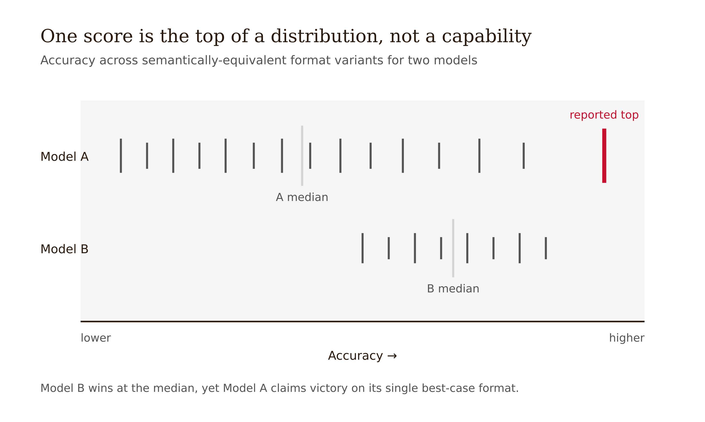
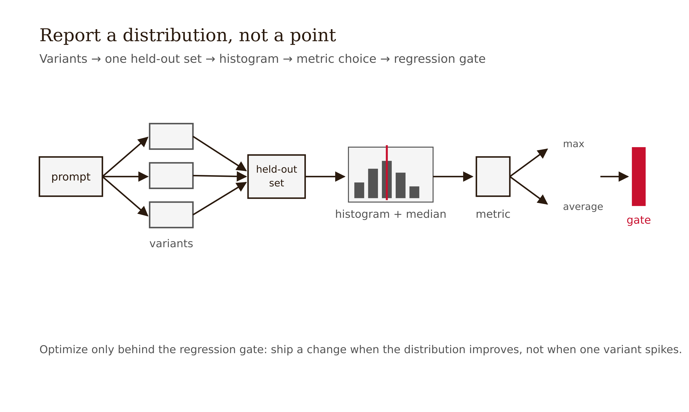

# Chapter 9 — Prompt Brittleness and the Discipline of Evaluation
*A single-prompt number is not a capability claim — it is the top of a distribution you have not yet measured.*

---

A platform team was choosing between two models for a classification feature. They wrote one careful prompt — a clean instruction, four few-shot exemplars, a `Question:` / `Answer:` scaffold — and ran it against a held-out set of 500 labeled cases. Model A scored 0.86. Model B scored 0.79. The decision wrote itself: ship Model A. The number went into the procurement deck. The team felt they had done the empirical thing. They had a held-out set. They had a number.

Two weeks after launch, production accuracy sat closer to 0.71. The held-out set had not drifted. The model had not changed. What had changed was nothing anyone thought of as substantive: a downstream refactor had reformatted the prompt — swapped the `Question:` / `Answer:` scaffold for a markdown bullet layout, and because someone alphabetized a config, reordered the four few-shot exemplars. Semantically identical. Behaviorally, a different prompt.

When the team finally ran the experiment they should have done first — the same task across a sweep of plausible formatting variants — the histogram told the whole story. Model A's accuracy ranged from 0.69 to 0.88 across formats. Model B's ranged from 0.74 to 0.83. The single number 0.86 was not Model A's capability. It was the top of Model A's distribution, and the team had reported it as a point. Worse: at the median format, Model B was the better model. The original comparison had not measured which model was better. It had measured which model happened to like that one prompt format — and then made a six-figure decision on the artifact.

The team made no knowledge error and no reasoning error. They made an evaluation error. And it is the most common one in the field: they treated a single prompt's score as a property of the model. This chapter is about why that is ill-posed, what the defensible claim looks like instead, and how to produce it.

---

## Why a neutral edit moves the output

Why should a colon-for-dash swap move anything?

Because of exactly the Chapter 1 picture, taken seriously. The model assigns a probability to the next token conditioned on the entire preceding token sequence — and the surface form is part of that sequence. `Q:` and `Question -` are not the same tokens. They occupy different positions in the model's learned distribution over how prompts of this shape are continued, because during pretraining different surface forms co-occurred with different continuations. The model never learned a clean separation between "the meaning of the instruction" and "the punctuation, casing, spacing, and ordering it arrived in." It learned a conditional distribution over token sequences, and the surface is in the conditioning set.

A semantically neutral edit is not behaviorally neutral because semantic neutrality is a fact about human reading and behavioral output is a fact about token-conditioned sampling. There is no theorem connecting the two. This is the single misconception the chapter exists to break: **semantically equivalent does not imply behaviorally equivalent.**

*Figure 9.2 — Two prompts a human reads as identical are two points in token space*

Demonstrate it to yourself immediately. Take one task, flip a colon to a dash, watch a discrete output change. The model is not being stupid. It is doing exactly what it was trained to do — condition on the full token sequence — and the token sequence changed.

The deep mechanism — why surface-feature shortcut learning or tokenization artifacts or decision-boundary geometry or training-distribution format priors produces this behavior — is not settled. The papers cited below measure brittleness far more than they explain it. That is stated honestly. You do not need the deep cause to do the engineering. You need to accept that surface form is a high-dimensional nuisance factor — a variable that affects your measurement without being the thing you care about — and the response to a nuisance factor is always the same: vary it on purpose and report the variance.

---

## How big, and how it corrupts comparison

### The magnitude

The anchor result is Sclar et al. (2024, ICLR), "Quantifying Language Models' Sensitivity to Spurious Features in Prompt Design." They built an algorithm called FormatSpread that samples plausible semantically-equivalent format variants — separators, casing, spacing, item formatting, `Q:`/`A:` versus `Question -`/`Answer -` and so on — and reports a performance interval instead of a point. The headline: up to **76 accuracy points** of spread on a single task for LLaMA-2-13B, from formatting alone.

Not noise. Not a weak model only. The sensitivity persists with larger models, with more few-shot examples, and with instruction tuning. Scale attenuates brittleness; it does not remove it.

There is a misconception worth defusing here: "it only affects small or weak models, so frontier models are fine." False. Sclar et al. and Lu et al. both show the effect survives scale and instruction tuning. A bigger model is a smaller spread, not a zero spread — and "smaller" can still be tens of points.

A semantically deeper layer: brittleness is not confined to punctuation. Leidinger et al. (2023) extend it to linguistic properties of semantically-equivalent prompts — mood, tense, register, syntactic structure — across model sizes. The sensitive surface is broader than formatting. Rewording in ways that preserve meaning also moves outputs. This matters when we get to the claim that specificity helps.

And the ordering effect is its own dramatic demonstration. Lu et al. (2022, ACL), "Fantastically Ordered Prompts," showed that the same few-shot examples, merely reordered, can move a prompt between near-state-of-the-art and near-random — and the effect does not vanish with scale. The examples are identical. Only their sequence changed. This is the same few-shot material Chapter 8 named as format conditioning: the shape the model learns from its examples includes the order those examples arrived in.

*Figure 9.1 — One score is the top of a distribution, not a capability*

### How it corrupts comparison

The accuracy hit to your prompt is the smaller problem. The larger one is that brittleness corrupts comparison, because nothing guarantees that the format favoring Model A also favors Model B. Sclar et al. found format performance correlates only weakly across models — so a fixed shared format does not give a fair fight. It gives whichever model happens to like that format a hidden advantage.

Two documented cases make this concrete. On MMLU and similar multiple-choice benchmarks, minor non-semantic perturbations — reordering the answer choices, changing the answer-extraction method, changing the choice symbol — shift leaderboard rankings by up to 8 positions (Alzahrani et al. 2024, ACL). A published, real case where brittleness corrupted a public model comparison.

*Figure 9.3 — Reformat the prompt and the rankings shuffle* Separately, three implementations of the same MMLU benchmark — original Berkeley, Stanford HELM, EleutherAI lm-eval-harness — produced materially different scores for the same models, driven by prompt-template differences: a `Question:` prefix, how choices were labeled, whether the harness scored the answer letter or the answer text. Brittleness leaks into official numbers.

Mizrahi et al. (2024, TACL) put a number on the comparison problem at scale: across roughly 6.5 million instances, 20 language models, and 39 tasks, template choice changes both absolute and relative performance — it reorders models. This is the opening scenario's real-world backbone.

| Failure mode | What it is | What it costs |
|---|---|---|
| Single-format optimism | Reporting one format's score as the model's capability | Overstates reliability — the production gap in the opening scenario |
| Format-confounded comparison | Declaring A > B on one shared, fixed format | Picks the wrong model — the procurement error in the opening scenario |

---

## The discipline: report a distribution, not a point

The fix is not a better format. There is no universally best format to find. Which format wins is task- and model-specific and does not generalize, so memorizing "use XML, not markdown" reinstalls exactly the brittle, non-transferable folk knowledge this chapter is built to kill. The fix is a change in what you measure and report.

Reframe the claim. "Prompt P performs at accuracy *a*" is ill-posed. The defensible claim is:

> Prompt family P has a performance distribution with median *m* and spread *s* over plausible semantically-equivalent variants.

This treats format as the nuisance factor it is and reports the variance attributable to it — which is exactly the move classical experimental design makes for any nuisance factor. Vary it on purpose; report the variance.

*Figure 9.4 — Report a distribution, not a point*

**The procedure:**

**Step 1 — Enumerate plausible variants.** Take your prompt and generate a sweep of semantically-equivalent forms: separator style, casing, spacing, item and list formatting, the `Q:`/`A:`-versus-`Question -`/`Answer -` axis, and if few-shot, exemplar order. The FormatSpread codebase (github.com/msclar/formatspread) gives ready scaffolding. For a hand-rolled sweep, vary one factor family at a time so you can attribute spread to a cause rather than to the sweep as a whole.

**Step 2 — Run all variants on the same held-out set.** Same data, same model; only the format changes. This is a small factorial design: variants times items.

**Step 3 — Plot the histogram.** Accuracy across N variants. The histogram is the lesson. Annotate the median and a 95% interval. The histogram alone already tells you whether you have a brittle prompt — a wide spread means the model is keying heavily on surface features you did not intend to be meaningful.

**Step 4 — Pick the metric to your use case.** Max-over-formats answers "can the model do this at all?" — a capability ceiling. Average or a quantile answers "what will a typical user who did not tune the format actually see?" — usually the production-relevant number. Reporting only the max is single-format optimism wearing a histogram.

**Step 5 — Gate cosmetic edits.** Once you know the distribution, treat the prompt template as a versioned artifact under regression testing. Before shipping any edit that looks cosmetic, re-run it across the variant sweep. The opening scenario is proof that cosmetic edits are not cosmetic. PromptEval (Polo et al. 2024) estimates the distribution at roughly one to four times the cost of a single-prompt evaluation, which makes distributional gating affordable rather than aspirational.

"My one good prompt proves the model can do X" conflates the max of the distribution with the distribution. Whether your users see X depends on the median and spread, not the max you found by hunting.

This is, in miniature, the construct validity problem from research methodology. A single-format score is a construct-invalid proxy for capability. The factorial framing — format variants times tasks times models, estimate the variance attributable to the nuisance factor format — is the experimental-design move applied to prompts. Brittleness is a validity problem. The response is a measurement discipline.

---

## Specificity as a robustness hedge — and its limit

A reasonable reaction to all this is: write richer, more specific prompts. Pin down format, give detailed instructions, leave less to surface chance. That reaction is partly right and instructively incomplete, and getting the nuance correct is what separates an engineer from a tip-collector.

Specificity is partly a robustness hedge. The more of the output you constrain explicitly, the less is left to be decided by surface features the model is keying on incidentally. A prompt that fixes the output schema, the label space, and the format leaves fewer degrees of freedom for a colon-versus-dash to swing. This is a real reason the structured-prompt and constraint-engineering moves of Chapters 5 and 7 buy reliability — part of what they buy is lower variance under format perturbation.

But specificity is a hedge, not a cure. Leidinger et al. (2023) show that linguistic properties of semantically-equivalent prompts — mood, tense, register, syntax — move outputs too. When you pin down the formatting, you may simply relocate the sensitivity into the wording of your now-longer instruction. The nuisance factor has moved; it has not been removed.

Targeted mitigations exist and should be held at the same honest level. Mixture-of-Formats (Ngweta et al. 2025, NAACL SRW) diversifies the formatting style across the few-shot examples within a single prompt — reducing style-induced brittleness while modestly raising mean performance across format variants. It is a robustness hedge, not a fix. The underlying sensitivity remains, and this is a small-scale study whose generalization across model families and task types is not yet established.

More detail helps. Tricks mitigate. Neither eliminates conditioning on surface form. The only robust claim you can make is still distributional, which returns you to the procedure above. Specificity reduces the spread you must report; it does not let you go back to reporting a point.

---

## Back to the procurement decision

The team that reported 0.86 did not refuse to verify. They verified at the cheapest level — one held-out run — and mistook it for the expensive level — a distribution. The PromptEval one-to-four-times figure is what makes the real verification affordable rather than aspirational, which is exactly why the cheap version is no longer an excuse.

Had they run the format-variant sweep before shipping, they would have seen that Model A's spread was large and top-heavy, that Model B's spread was tighter and higher at the median, and that the cosmetic refactor that happened in production was inside the variance they were already measuring. The six-figure model decision would have gone the other way. The production gap would not have existed.

The thesis of the whole book lands here with more force than anywhere else: prompt engineering is an empirical engineering discipline, not an art of clever phrasing. Brittleness is the empirical fact that makes "just ask better" not merely insufficient but unmeasurable without distributional evaluation. A prompt is not a clever sentence. It is a specification with a performance distribution. Measure the distribution. Report the distribution. Gate changes against the distribution. Everything else is folklore.

---

## LLM Exercises

**Exercise 1 — Generate and examine.** Take one classification or extraction task you can label. Write a single prompt and run it on a held-out set of at least 50 items. Then generate five semantically-equivalent format variants — change the separator, flip `Q:`/`A:` to `Question -`/`Answer -`, reorder the exemplars. Run all five on the same set. Report the accuracy spread, mark the median, and write two sentences explaining the spread in terms of the conditioning mechanism from Chapter 1.

**Exercise 2 — Apply to known context.** Take the evaluation report: *"We tested two models on our extraction task with a carefully designed prompt. Model A scored 91%, Model B scored 88%, so we selected Model A."* Name the two failure modes from this chapter it commits or risks. Rewrite the conclusion as a distributional claim, stating what information would be needed to support it.

**Exercise 3 — Stress-test a claim.** The chapter claims semantically-neutral ordering of few-shot exemplars moves accuracy measurably. Take one few-shot prompt with three to four examples. Run it five times with the examples in their original order, then five times with the examples reversed, then five times in a random order. Record the accuracy on each run against a labeled set. Report whether the ordering effect is visible in your results and what it implies about treating the original-order accuracy as a point estimate.

**Exercise 4 — Draft a professional deliverable.** Design a regression gate for prompt edits in a production pipeline. Specify: which format variants the gate runs, what statistic of the resulting distribution must not regress and by how much, and what evaluation budget in multiples of a single-prompt run you would allocate — defending the budget against the PromptEval one-to-four-times figure. Then state explicitly what cosmetic edit your gate would have caught in the opening scenario.

---

## References

- Sclar, M., Choi, Y., Tsvetkov, Y., & Suhr, A. (2024). Quantifying Language Models' Sensitivity to Spurious Features in Prompt Design, or: How I learned to start worrying about prompt formatting. *ICLR 2024*. arXiv:2310.11324. Code: github.com/msclar/formatspread.
- Lu, Y., Bartolo, M., Moore, A., Riedel, S., & Stenetorp, P. (2022). Fantastically Ordered Prompts and Where to Find Them: Overcoming Few-Shot Prompt Order Sensitivity. *ACL 2022*.
- Mizrahi, M., Kaplan, G., Malkin, D., Dror, R., Shahaf, D., & Stanovsky, G. (2024). State of What Art? A Call for Multi-Prompt LLM Evaluation. *TACL* 12. DOI:10.1162/tacl_a_00681.
- Alzahrani, N., et al. (2024). When Benchmarks are Targets: Revealing the Sensitivity of Large Language Model Leaderboards. *ACL 2024*. arXiv:2402.01781.
- Leidinger, A., van Rooij, R., & Shutova, E. (2023). The Language of Prompting: What Linguistic Properties Make a Prompt Successful? *Findings of EMNLP 2023*.
- Ngweta, L., et al. (2025). Towards LLMs Robustness to Changes in Prompt Format Styles. *NAACL 2025 Student Research Workshop*. arXiv:2504.06969.
- Polo, F. M., et al. (2024). Efficient multi-prompt evaluation of LLMs (PromptEval). *NeurIPS 2024*. arXiv:2405.17202.
- Min, S., et al. (2022). Rethinking the Role of Demonstrations: What Makes In-Context Learning Work? *EMNLP 2022*. arXiv:2202.12837.

---

## Prompts

Use these prompts with Claude to generate interactive D3 v7 versions of the figures in this chapter. Each produces a standalone HTML file you can open in a browser and modify freely.

**Prerequisites:** Load `NEU/CLAUDE.md` and `NEU/DESIGN.md` into your Claude project context before using these prompts. They define the stack, naming conventions, color system, and typography the figures use.

---

### Figure 9.1 — One score is the top of a distribution, not a capability

A histogram, single HTML file, inline CSS, D3 v7 from the CDN. Accuracy on x (≈0.65–0.90), count on y, zero baseline, ~20 bars from a format-variant sweep on one task. Mark the median, and mark the rightmost bar (≈0.86) in red labeled "the score that went in the deck." Ink for the rest. Caption: reporting the max as a point discards the distribution.

> Reference implementation: `d3/09-prompt-brittleness-and-evaluation-fig-01.html`

---

### Figure 9.2 — Two prompts a human reads as identical are two points in token space

A token-space sketch, single HTML file, D3 v7 CDN. Two prompt variants a human reads as identical (`Q:` vs `Question -`) plotted as two distinct points in a schematic distribution, leading to two different output regions. Red marks the divergence; ink for the shared "meaning." Caption: semantic neutrality is not behavioral neutrality.

> Reference implementation: `d3/09-prompt-brittleness-and-evaluation-fig-02.html`

---

### Figure 9.3 — Reformat the prompt and the rankings shuffle

A slope/bump chart, single HTML file, D3 v7 CDN. Several models ranked under "format A" on the left and "format B" on the right, with crossing lines showing rank changes of up to 8 positions. Red highlights the model that moves most; ink for the rest. Zero-free ranking axis. Caption: a fixed shared format gives whichever model likes it a hidden advantage.

> Reference implementation: `d3/09-prompt-brittleness-and-evaluation-fig-03.html`

---

### Figure 9.4 — Report a distribution, not a point

A before/after reporting figure, single HTML file, D3 v7 CDN. Left: a single point estimate labeled "ill-posed." Right: a distribution with median and a 95% interval over format variants, labeled "defensible claim," in red. Ink for the point. Caption: the claim is the median and spread, not the max you found by hunting.

> Reference implementation: `d3/09-prompt-brittleness-and-evaluation-fig-04.html`
