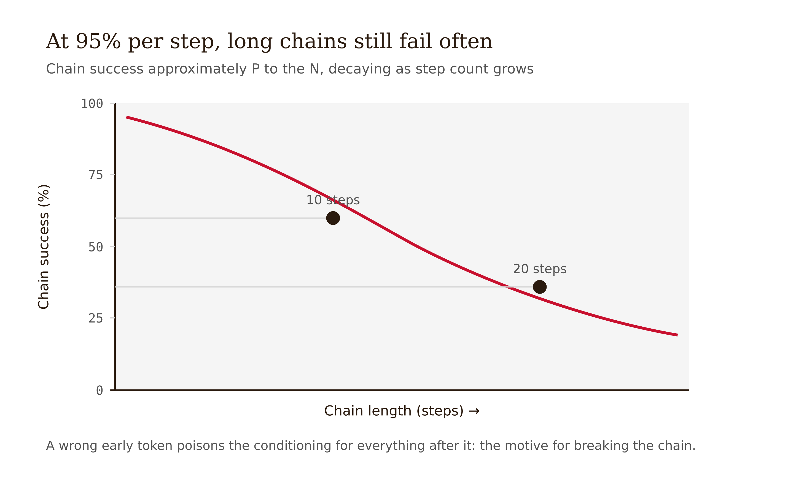
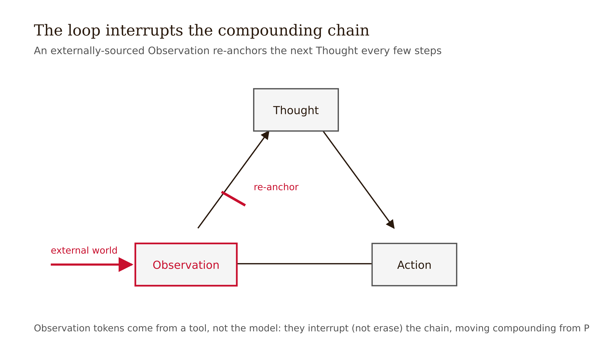
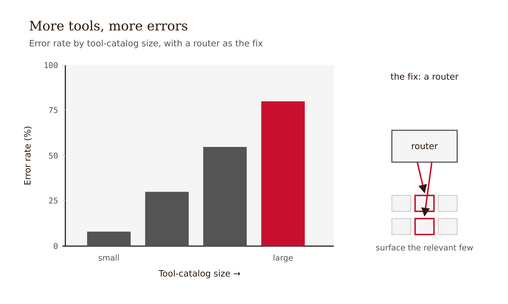
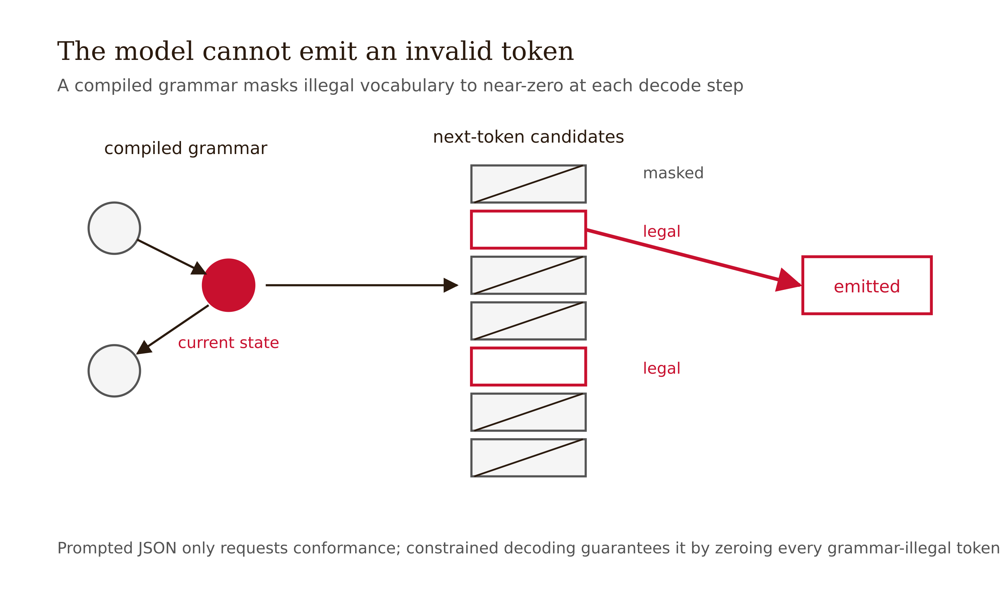

# Chapter 11 — Agentic and Multi-Turn Systems
*The loop is the architectural response to single-shot limits — and it introduces three new problems, each with a measurable mechanism.*

---

Meet the Humanitarians AI volunteer-onboarding agent. Its job sounds simple: walk a new volunteer through intake — collect their skills, match them to an open project, file the paperwork, schedule an orientation. It has tools: a skills database, a project roster, a calendar API, a form-filler. It is meant to run across a multi-turn conversation, holding the thread while the volunteer asks questions, changes their mind, uploads a résumé.

In a fresh session it handles all of this cleanly. Twenty turns later, on a harder case — a volunteer with an unusual skill mix and a scheduling conflict — it falls apart. It re-asks for the skills it already collected. It calls `schedule_orientation` before the project match is confirmed. At one point it confidently invokes a `send_welcome_packet` tool that does not exist. Re-run the same hard case as turn one of a fresh session and it succeeds.

Three distinct failures are tangled in that transcript. The rest of this chapter is the untangling. The agent runs as a loop — read, reason, act, observe — and the loop is what lets it act in the world at all. It has too many tools, and as the catalog and history fill the context, it hallucinates a tool and mis-selects among the real ones. Its output is unstructured where it needs to be structured, so the form-filler gets prose where it needs typed fields. And it has no memory beyond the window, so by turn 20 the early intake has scrolled into the lost-in-the-middle trough of Chapter 10, and once it took a wrong turn it never recovered.

Each failure has a mechanism and a falsifiable fix. None of them is fixed by "use a better model."

---

## The loop, and why it helps

A language model generates each token by sampling from a distribution conditioned on the tokens before it:

$$t_i \sim P(t_i \mid t_0, \ldots, t_{i-1})$$

Chain a long reasoning trace and errors compound. If $P$ is the probability each step is correct and the steps were independent, the whole chain succeeds with probability roughly $P^N$. At $P = 0.95$ and $N = 10$, that is about 60 percent. At $N = 20$, about 36 percent. A wrong token early poisons the conditioning for every token after it.

*Figure 11.2 — At 95% per step, long chains still fail often* No prompt fixes this, because a prompt is just more tokens drawn from the same poisoned distribution.

**ReAct** (Yao et al., 2023, ICLR) breaks the chain architecturally. The loop has three kinds of tokens. **Thought** — model-generated reasoning about what to do next. **Action** — model-generated tokens specifying a tool call. **Observation** — tokens returned by the tool and injected into the context. These are not generated by the model.

The loop runs Thought → Action → Observation → Thought → … until a Thought declares the answer. The crucial property: Observation tokens were not sampled from any distribution conditioned on the model's prior Thoughts. The external world put them there. They carry no inherited reasoning error. The next Thought is conditioned on both the prior Thoughts — still possibly wrong — and the Observation, which is a high-reliability anchor. This interrupts, not erases, the dependency chain. If Observations anchor every $k$ steps, effective compounding is closer to $P^k$ than $P^N$.

Yao et al. evaluated ReAct on HotpotQA, FEVER, ALFWorld, and WebShop; it outperforms reason-only and act-only baselines and reduces fact hallucination. The underlying insight — that deciding which API to call, when, and with what arguments is itself token prediction — underlies modern function calling.

The error-interruption property breaks down under three conditions: the Observation token is buried deep enough in a long context to be under-attended (Chapter 10's U-curve, applied to tool responses); the tool returns garbage, so the Observation is unreliable; or the tool catalog is so large that selecting the right action becomes too ambiguous. The rest of this chapter takes those three conditions as the agenda.

*Figure 11.1 — The loop interrupts the compounding chain*

---

## Tool exposure: more tools, more errors

Here is the result that surprises people. You might expect that giving an agent more tools can only help — worst case, it ignores the ones it does not need. The data says the opposite: performance degrades as the tool catalog grows.

*Figure 11.3 — More tools, more errors*

LongFuncEval (2025) quantifies it directly: as the available-tool description grows from roughly 8K to 120K tokens — and as the correct tool's position in the catalog varies — function-calling performance drops by 7 to 85 percent, driven by formatting failures and tool hallucination. The same U-curve from Chapter 10 applies here: position of the correct tool description in the catalog predicts whether the model selects it. The phenomenon is reproduced across Gorilla/APIBench (Patil et al., 2023), ToolLLM over 16,464 real APIs, and the Berkeley Function Calling Leaderboard.

Why does adding tools hurt? Two mechanisms compound.

**Context consumption.** Every tool's name, description, and argument schema lives in the context window. A large catalog spends tokens — sometimes the majority of the window — on descriptions of tools the current task will never use. Those tokens crowd out reasoning, and they push the relevant tool's description toward the lost-in-the-middle trough.

**Selection ambiguity.** With 5 tools the model picks among 5 options. With 50, the option space is ten times larger, descriptions overlap, and the probability of selecting a near-miss or hallucinating a tool that "should" exist rises combinatorially. Tool hallucination — the model invoking a plausibly-named function that does not exist — is a named, first-class failure mode across the function-calling literature. The onboarding agent's `send_welcome_packet` is the textbook instance.

**The falsifiable rule.** Expose a small, scoped set of tools per task. If the full inventory is large, put a router in front that surfaces only the relevant subset — retrieve tool descriptions by similarity to the task, rather than registering all of them upfront. If more than roughly ten tools are plausibly relevant, route rather than register.

*Falsifiable test:* run the same agent on the same task set with 5 versus 50 tools available and measure the error and hallucination rate. If error does not rise with catalog size, the degradation is not biting your setup — measure it, do not assume it.

For the onboarding agent, the fix is to stop handing the model the entire platform API on every turn. Intake needs the skills DB and the form-filler; scheduling needs the calendar. A router that exposes the four or five tools relevant to the current sub-task removes both the context bloat and most of the selection ambiguity — and `send_welcome_packet` never gets hallucinated because there is no crowded, ambiguous catalog inviting the confabulation.

One deflationary note worth keeping: Anthropic's "Building Effective Agents" (December 2024) draws a sharp line between workflows — LLMs orchestrated by predefined code paths — and agents — LLMs directing their own process — and argues most production value comes from simple composable workflows, not maximal autonomy. The routing rule is in that spirit. The most reliable agent is often the one you have given the least to decide.

---

## Structured output: constraining shape without strangling reasoning

The onboarding agent's form-filler needs typed fields: `{name: str, skills: list[str], project_id: int, orientation_date: date}`. The model, left to itself, returns a friendly paragraph. Parsing prose into a typed record is exactly the brittleness Chapter 9 warns about. Structured output is the fix — and it is a control problem, not a phrasing problem.

**Prompted JSON requests; constrained decoding guarantees.** You can ask the model to "respond in JSON." That is a request: the model samples tokens that usually look like JSON and sometimes do not — a trailing comma, a missing brace, a stray apologetic sentence before the object. The reliable approach enforces the schema at the decoder. Willard and Louf (2023) reframed generation as transitions over a finite-state machine compiled from a regex or context-free grammar. At each step they precompute which vocabulary tokens are legal given the grammar state and mask the rest to near-zero probability. The model literally cannot emit an invalid token. Conformance is a guarantee, not a hope, and the masking adds near-zero overhead. OpenAI's Structured Outputs (August 2024) and similar provider features use the same constrained-decoding idea.

*Figure 11.4 — The model cannot emit an invalid token*

One precise caveat: constrained decoding guarantees shape, not truth. The fields will be the right type; the values can still be wrong. A schema-valid `project_id: 4` can be the wrong project. A deterministic layer catches the failures it is built to catch and silently passes the ones it is not.

**The counter-mechanism: format restriction can cost reasoning.** Tam et al. (2024), confirmed at EMNLP 2024, found that forcing format restrictions degrades reasoning by roughly 10 to 15 percent on math and symbolic tasks versus free-form generation. Two distinct causes, both relevant to the fix.

First, the format-requesting instruction itself costs accuracy — before any decoder constraint is applied, telling the model "answer only in JSON" already shifts its distribution away from good reasoning. Second, and more specifically: if the schema puts the answer field before the reasoning field, the model commits to an answer before it has reasoned. It fills `answer` first, then rationalizes in `reasoning`, which is backwards. The answer conditions the reasoning instead of the reasoning conditioning the answer.

**The falsifiable rule.** Constrain the shape, free the reasoning, order fields reasoning-first. Either let the model reason in free-form first and reformat into the schema in a second pass, or put the reasoning field before the answer field in the schema so the constrained decode still lets reasoning condition the answer.

*Falsifiable test:* run the same task in three modes — free-form, JSON-mode answer-first, JSON-mode reasoning-first — and measure reasoning accuracy. If reasoning-first does not recover most of the gap, your task is not in the regime Tam et al. describe.

| Mode | What it guarantees | What it risks | When to use |
|---|---|---|---|
| Prompted JSON ("respond in JSON") | Nothing — a request, not a contract | Trailing commas, stray prose, missing braces | Low-stakes, informal |
| Constrained decoding, answer-first | Schema conformance | Reasoning cost — the answer is committed before reasoning | Never — use reasoning-first instead |
| Constrained decoding, reasoning-first | Schema conformance + reasoning intact | None identified | Production default |

---

## Managing multi-turn context

Now the failure that took down the onboarding agent at turn 20.

**The hard constraint: there is no memory beyond the window.** A transformer has no persistent state between calls. Everything the agent "remembers" is whatever is in the context window right now. MemGPT (Packer et al., 2023) framed this with an operating-systems analogy: treat the context window like RAM and external storage like disk, and let the LLM issue function calls to page relevant history in and evict the rest. The framing establishes the right mental model — state must be resupplied each turn; the only questions are what to resupply and how compressed.

**Why it degrades.** Three strategies compete, with no consensus default. Resupply raw history is simple but the window fills; by turn 20 the intake data is buried in the middle and under-attended. Summarize before dropping compresses old turns but is lossy — whatever the summary omits is gone, and which functional context gets dropped is poorly mapped. Page or retrieve keeps history in an external store and retrieves the relevant slice each turn — but adds a retrieval step that can itself surface the wrong slice.

**The sharpest empirical finding.** Laban et al. (2025) tested top open and closed models across six generation tasks and found an average 39 percent performance drop from single-turn to multi-turn. They decompose it: a minor loss of raw aptitude and a large rise in unreliability. The named effects are exactly the onboarding transcript — "answer bloat," a "lost-in-middle-turns" effect, and the decisive one: when a model takes a wrong turn, it gets lost and does not recover. τ-bench (Yao et al., 2024) reinforces it: even strong models succeed on under 50 percent of multi-turn tool-agent tasks and are inconsistent across trials. The bottleneck is the consistency layer, not the capability layer.

*Figure 11.5 — A wrong turn does not recover; summarize-and-restart does*

**The falsifiable rule.** When a multi-turn thread goes wrong, summarize and restart clean — do not patch the derailed thread. The mechanism behind the rule: a wrong turn is now in the context, conditioning every subsequent turn (this is $P^N$ from the loop section re-entering through conversation history). Repairing in place reasons from the contamination. Restarting with a clean summary drops it.

*Falsifiable test:* on a set of derailed transcripts, compare continued-repair versus summarize-and-restart on task success. If repair matches restart, the non-recovery effect is not biting your domain.

Honest caveat: Laban et al.'s account — that attention concentrates on recent turns and the early correct framing decays — is a hypothesis, not settled mechanism. The 39 percent drop is measured. The why is partly inferred from the Chapter 10 position effects. Label it as such.

For the onboarding agent: scope each sub-task to its own short context with a clean summary handoff between them. When the hard case derails, the agent should detect the loop, summarize what is confirmed (skills collected, no project matched yet), and restart the match step fresh — not keep arguing with its own contaminated history.

---

## The four pieces as one design

The four mechanisms interlock. Read the onboarding agent as a single architecture.

The loop lets it act in the world and interrupts single-shot error compounding — but only as well as its Observations are salient, reliable, and attended to. Tool scoping keeps Observation selection clean: few scoped tools, routed, so the action step is not drowning in a 50-tool catalog. Structured output keeps Observation consumption clean: constrained decoding guarantees the form-filler gets typed fields, with reasoning ordered before the answer so the schema does not strangle the reasoning. Memory management keeps Observation salience alive across turns: summarize-and-restart so the early intake never rots in the middle of a 20-turn window, and a wrong turn never compounds.

This is the book's master argument in agentic form. The same model, in a loop with a scoped tool router, a reasoning-first schema, and a summarize-and-restart memory policy, is a different *system* from the same model handed forty tools, asked politely for JSON, and left to accumulate a 20-turn thread. The first ships. The second re-asks for skills it already has and invents a welcome-packet tool. The weights did not change. The architecture did.

One thing this chapter has held fixed is worth making explicit. Every mechanism above assumes a human is somewhere in the loop — reading the agent's output, catching the hallucinated `send_welcome_packet` before a packet ships. Three operating modes can be separated by exactly this variable: Augmentation (a human is at the keyboard and every output crosses human eyes before use), Automation (the system runs on a schedule or trigger with no human present, so errors accumulate quietly across runs), and Agency (the system can take actions in the world before any human reviews them). The architectural rules here are necessary in all three but not sufficient as you move toward Agency. A scoped tool set, a clean schema, and a summarize-and-restart memory policy keep the loop reliable; they do nothing about whether an irreversible action should have fired at all. That gap is filled by permissions, escalation rules, and a human decision node on consequential or irreversible steps — the same commitment Chapter 4 made load-bearing for sycophancy. Reliability and authority-to-act are different axes. This chapter is about the first.

---

## LLM Exercises

**Exercise 1 — Generate and examine.** Build a minimal three-step ReAct loop manually: write a Thought, write an Action (a tool call), write a simulated Observation (a tool response you supply), write the next Thought. Then delete the Observation and run the two Thoughts alone. Write two sentences explaining why the Observation changes the second Thought, in terms of the $P^N$ interruption mechanism.

**Exercise 2 — Apply to known context.** Your enterprise platform exposes 80 internal functions. A teammate registers all 80 with the agent "so it has everything it might need." State both mechanisms by which this degrades performance, and design the minimal experiment — inputs, conditions, and metric — that would measure the degradation.

**Exercise 3 — Stress-test a claim.** You are given a schema `{answer: str, reasoning: str}` and asked why the agent's math accuracy dropped after the team "added structured output." Identify the specific design error, rewrite the schema to fix it, and state which of Tam et al.'s two causes your rewrite addresses — and which it does not.

**Exercise 4 — Draft a professional deliverable.** Design the full Humanitarians AI onboarding agent as a one-page spec: the Thought → Action → Observation loop, the tool set per sub-task with the routing rule applied, the output schema with field ordering justified, and the multi-turn memory policy with the restart trigger defined. For each of the four choices, write the one-sentence mechanism that justifies it. Then name the single failure mode your design does not defend against.

---

## References

- Yao, S., Zhao, J., Yu, D., Du, N., Shafran, I., Narasimhan, K., & Cao, Y. (2023). ReAct: Synergizing Reasoning and Acting in Language Models. *ICLR 2023*. arXiv:2210.03629.
- Schick, T., et al. (2023). Toolformer: Language Models Can Teach Themselves to Use Tools. *NeurIPS 2023*. arXiv:2302.04761.
- Patil, S. G., et al. (2023). Gorilla: Large Language Model Connected with Massive APIs. *NeurIPS 2024*. arXiv:2305.15334.
- Qin, Y., et al. (2023). ToolLLM: Facilitating Large Language Models to Master 16000+ Real-world APIs. *ICLR 2024*. arXiv:2307.16789.
- Patil, S. G., et al. (2025). The Berkeley Function Calling Leaderboard (BFCL). *ICML 2025*.
- Willard, B. T., & Louf, R. (2023). Efficient Guided Generation for Large Language Models. arXiv:2307.09702.
- Tam, Z. R., et al. (2024). Let Me Speak Freely? A Study on the Impact of Format Restrictions on Performance of Large Language Models. *EMNLP 2024 Industry Track*. arXiv:2408.02442.
- Packer, C., et al. (2023). MemGPT: Towards LLMs as Operating Systems. arXiv:2310.08560.
- Laban, P., et al. (2025). LLMs Get Lost in Multi-Turn Conversation. arXiv:2505.06120.
- Yao, S., et al. (2024). τ-bench: A Benchmark for Tool-Agent-User Interaction in Real-World Domains. *ICLR 2025*. arXiv:2406.12045.
- Kate, K., et al. (2025). LongFuncEval: Measuring the effectiveness of long context models for function calling. arXiv:2505.10570.

---

## Prompts

Use these prompts with Claude to generate interactive D3 v7 versions of the figures in this chapter. Each produces a standalone HTML file you can open in a browser and modify freely.

**Prerequisites:** Load `NEU/CLAUDE.md` and `NEU/DESIGN.md` into your Claude project context before using these prompts. They define the stack, naming conventions, color system, and typography the figures use.

---

### Figure 11.1 — The loop interrupts the compounding chain

A cycle diagram, single HTML file, inline CSS, D3 v7 from the CDN. Three nodes — Thought → Action → Observation → (repeat). Into the Observation node, draw a separate arrow from outside labeled "external tool — not model-generated," in red. Caption: observation tokens enter from outside the distribution and break the P^N chain.

> Reference implementation: `d3/11-agentic-and-multi-turn-systems-fig-01.html`

---

### Figure 11.2 — At 95% per step, long chains still fail often

A line chart, single HTML file, D3 v7 CDN, zero baseline. X: number of independent steps N (1–20); y: chain success probability = 0.95^N. Mark N=10 (~60%) and N=20 (~36%) in red. Caption: even high per-step reliability compounds to frequent failure over long chains.

> Reference implementation: `d3/11-agentic-and-multi-turn-systems-fig-02.html`

---

### Figure 11.3 — More tools, more errors

A line/scatter chart, single HTML file, D3 v7 CDN, zero baseline. X: tool-description size (~8K → ~120K tokens); y: function-calling accuracy. Show a downward trend with a 7–85% degradation band; annotate "tool hallucination" and "selection ambiguity." Red marks the degraded region. Caption: more tools means more context bloat and more selection ambiguity.

> Reference implementation: `d3/11-agentic-and-multi-turn-systems-fig-03.html`

---

### Figure 11.4 — The model cannot emit an invalid token

A constrained-decoding schematic, single HTML file, D3 v7 CDN. Show a grammar/FSM state; at the current step, the vocabulary split into "legal" tokens (kept) and "illegal" tokens (masked to near-zero, struck out in red). Caption: conformance is a guarantee, not a hope.

> Reference implementation: `d3/11-agentic-and-multi-turn-systems-fig-04.html`

---

### Figure 11.5 — A wrong turn does not recover; summarize-and-restart does

A two-path diagram, single HTML file, D3 v7 CDN. Path A "repair in place": a derailed transcript continues to condition every later turn, success staying low. Path B "summarize-and-restart": drop the contaminated history, restart from a clean summary, success recovering (in red). Annotate the ~39% single→multi-turn drop. Caption: a wrong turn keeps conditioning; restarting drops it.

> Reference implementation: `d3/11-agentic-and-multi-turn-systems-fig-05.html`
