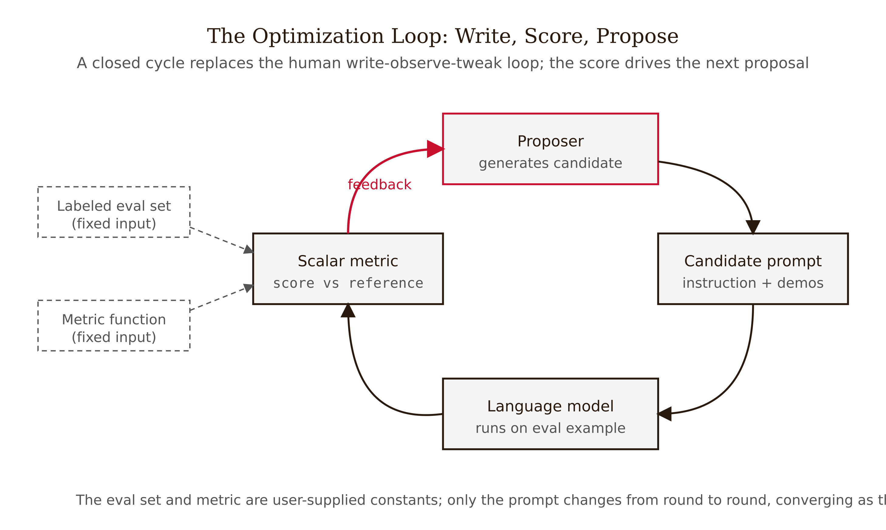
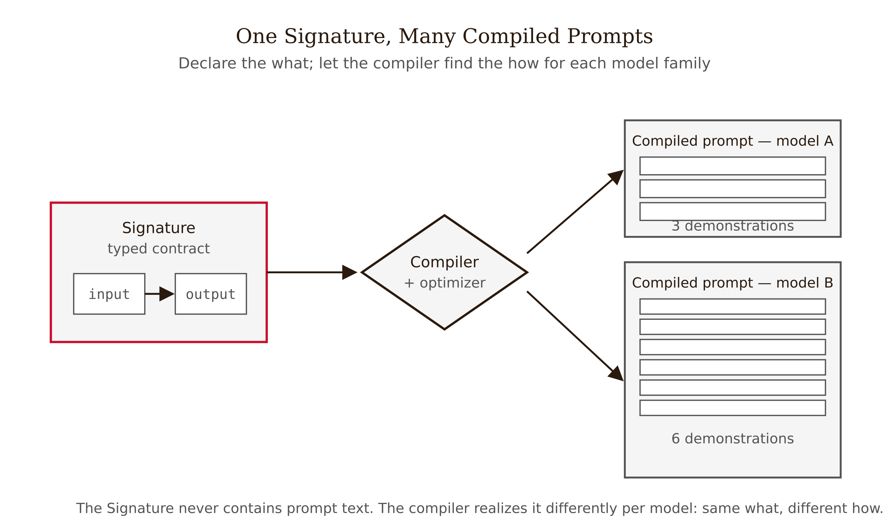
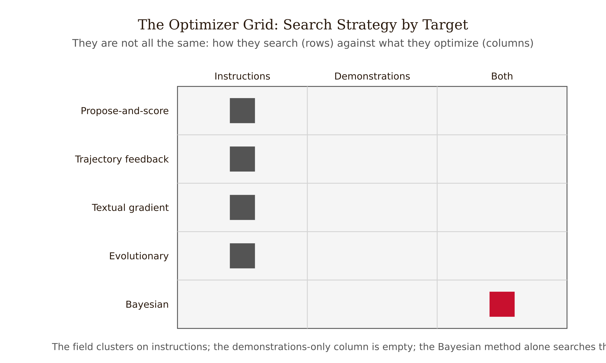
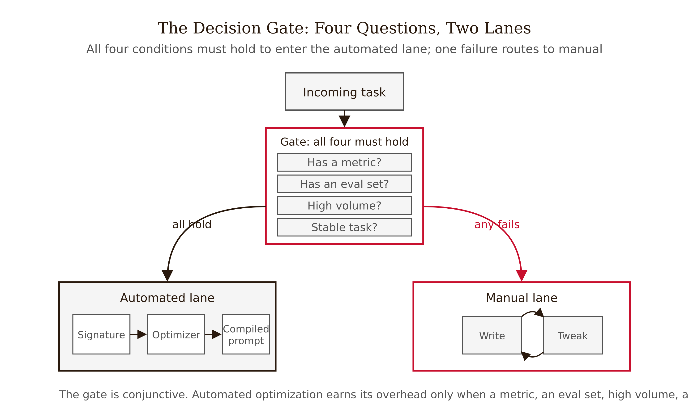

# Chapter 12 — Automated Prompt Optimization: The Post-Manual Era
*Once you can score an output, prompting becomes a search problem — and the machine will find prompts a human wouldn't have written.*

---

In September 2023, a team at Google DeepMind ran an optimization loop over the instruction text fed to a large language model on grade-school math problems. The loop was mechanical: propose a candidate instruction, score it on a held-out set of problems, feed the score back, propose again. After a number of rounds the loop converged on a sentence:

> *"Take a deep breath and work on this problem step by step."*

Prefixed to the model's reasoning, that instruction reached 80.2% on GSM8K — a grade-school math benchmark — with PaLM 2-L, versus 71.8% for the standard "Let's think step by step" and roughly 34% with no special instruction at all (Yang et al., 2023).

Stop and notice what is strange here. No human would have reasoned their way to "take a deep breath." A model does not have lungs. The phrase carries no logical content about arithmetic. And yet it beat the carefully designed human prompt by more than eight points on a hard benchmark. A year earlier, a different optimization loop had found another oddly-shaped winner — *"Let's work this out in a step by step way to be sure we have the right answer"* — which beat the human baseline on MultiArith (78.7 to 82.0) and GSM8K (40.7 to 43.0) (Zhou et al., 2023).

These prompts were found, not thought. They are points in a token-space landscape that a search procedure climbed to and a human intuition would have walked right past. That is the whole chapter in one observation: once you can score an output, prompting becomes an optimization problem, and an optimizer will sometimes beat you by going somewhere you would not have gone.

The rest of this chapter pulls that observation apart. What is the objective being optimized? What is the precondition that has to hold before any of this works — and what happens, predictably, when it does not? And the load-bearing decision: when is it worth handing the prompt to a machine, and when is hand-tuning still correctly the answer?

---

## The reframe: prompting as search

Consider what a human prompt engineer actually does. They write an instruction. They run it on a few examples. They eyeball the outputs. They notice a failure, edit a word, run it again. This is a loop — write, observe, tweak, repeat — and it is recognizably an optimization loop, just one driven by human intuition and judged by eyeball.

The reframe is to make the loop explicit and mechanical. Replace "eyeball the outputs" with a scalar metric: a function that takes an output and a reference and returns a number. Replace "a few examples" with a labeled eval set: input-output pairs you trust. Replace "edit a word" with a proposer: something that generates candidate prompts. Now the loop is:

$$\text{prompt}^* = \arg\max_{\text{prompt} \in \mathcal{P}} \; \frac{1}{|\mathcal{D}|}\sum_{(x,y)\in\mathcal{D}} \text{metric}\big(\text{LM}(\text{prompt}, x),\; y\big)$$

In words: over the space $\mathcal{P}$ of possible prompts, find the one that maximizes the average metric across your eval set $\mathcal{D}$. That is the entire mathematical content of automated prompt optimization. Everything else — Bayesian search, evolutionary mutation, textual gradients — is a strategy for searching $\mathcal{P}$ without evaluating every point, because $\mathcal{P}$ is astronomically large and each evaluation costs real LLM calls.


*Figure 12.1 — The optimization loop: write, score, propose*

Two things in that equation are not the optimizer's job. They are yours. You must supply $\mathcal{D}$ (the eval set) and you must supply the metric. This is the precondition, and it is the boundary of the whole enterprise. No metric, no $\arg\max$. We return to this in the decision gate because it is the named failure mode, not a footnote.

### The Signature: declare the what, let the compiler find the how

The clearest operationalization of the reframe is the **Signature**, the central abstraction in DSPy (Khattab et al., 2023, ICLR 2024). A Signature is a typed input-to-output contract — it states what the task consumes and produces, not how to phrase the request:

```
question -> answer
```

or, with field descriptions:

```
context, question -> answer
   context:  relevant passages retrieved for the question
   question: a natural-language question
   answer:   a short factual answer grounded in the context
```

Notice what the Signature does not contain: no instruction string, no few-shot examples, no "you are a helpful assistant," no "let's think step by step." Those are the how. The Signature is the what. You declare the contract; a compiler searches for the instruction text and the demonstrations that make some downstream metric as high as possible.

This is, almost exactly, Grace Hopper's 1952 argument for the compiler, transplanted onto language models: humans should state what they want and let the machine generate the low-level instructions. The original DSPy paper reports compositions of its modules raising GPT-3.5 quality from 33% to 82% on GSM8K and from 32% to 46% on HotPotQA multi-hop QA — and, strikingly, making a Llama2-13b-chat model "competitive with GPT-3.5 by simply compiling programs." The same Signature compiles to different prompt strings for different model families — a terse instruction with three demonstrations for one model, a verbose instruction with six for another. Same what, different how.


*Figure 12.2 — One Signature, many compiled prompts*

One misconception to name: "the optimizer writes a clever prompt; I could have written it myself." Tempting, and mostly wrong. "Take a deep breath" is not clever in any human sense — it is a model-specific token sequence that happens to nudge the next-token distribution toward more careful arithmetic for that model version. The optimizer is not being a better wordsmith. It is doing something you structurally cannot do by hand: evaluating hundreds of candidates against a metric and keeping the empirical winner, including winners that look like nonsense.

---

## The optimizer zoo, in one grid

Between 2022 and 2024 the field produced a cluster of optimizers. They differ along two axes: how they search $\mathcal{P}$, and what part of the prompt they optimize — the instruction text, the few-shot demonstrations, or both.


*Figure 12.3 — The optimizer grid: search strategy by what is optimized*

| Search strategy | What it optimizes | Method | Mechanism |
|---|---|---|---|
| Propose-and-score | Instructions | APE | An LLM proposes candidate instructions; the best task score survives |
| Trajectory-feedback | Instructions | OPRO | Prior candidates and their scores are placed in the meta-prompt |
| Textual gradient | Instructions | ProTeGi / TextGrad | A minibatch of failures yields a natural-language "gradient" that edits the prompt |
| Evolutionary | Instructions | Promptbreeder / EvoPrompt | Mutate a population of prompts, select the fittest |
| Bayesian | Instructions + demonstrations | MIPRO | Surrogate-model search over both, without module labels or gradients |

A few entries deserve a sentence each because their mechanisms are genuinely distinct.

**APE** (Automatic Prompt Engineer; Zhou et al., 2023, ICLR 2023) treats the instruction as a program to be synthesized: an LLM proposes candidate instructions, each is scored by task performance, the best survives. It matched or beat human-annotator instructions on 19 of 24 NLP tasks and produced the "let's work this out in a step by step way" prompt.

**OPRO** (Yang et al., 2023, ICLR 2024) puts the optimization trajectory — prior candidate solutions and their scores — directly into the meta-prompt, so the LLM proposing the next candidate can see what worked. It produced "take a deep breath," and reported optimized prompts beating human-designed ones by up to 8 percent on GSM8K and up to 50 percent on Big-Bench Hard.

**ProTeGi / APO** (Pryzant et al., 2023, EMNLP 2023) and its generalization **TextGrad** (Yuksekgonul et al., 2024; published in *Nature*, 2025) borrow the shape of gradient descent. A minibatch of failures produces a natural-language criticism — a "textual gradient" — and the prompt is edited "in the opposite semantic direction." TextGrad generalizes this to backpropagate textual feedback through an arbitrary compound system. Treat the autodiff analogy as illuminating, not literal — there is no chain rule, only an LLM reading a critique and editing.

**Promptbreeder** (Fernando et al., 2023) and **EvoPrompt** (Guo et al., 2023, ICLR 2024) are evolutionary: maintain a population of prompts, mutate, select the fittest. Promptbreeder's twist is self-referential — the mutation-prompts themselves evolve.

**MIPRO** (Opsahl-Ong et al., 2024, EMNLP 2024) is the one most readers will actually run, because it is DSPy's recommended optimizer. One attribution point worth getting right: the paper's algorithm is named MIPRO; MIPROv2 is the implementation shipped in the DSPy library as its default. It jointly optimizes instructions and demonstrations per module — without module-level labels or gradients — using Bayesian optimization over the search space. It beat baseline optimizers on 5 of 7 multi-stage programs with Llama-3-8B, by as much as 13 percent accuracy. The Bayesian engine inside MIPRO traces to the expected-improvement framework formalized by Jonas Mockus in the 1970s: find the best setting of a system you can only probe a few times, expensively. That is precisely the regime here — each probe is a batch of LLM calls that costs money, so you want a surrogate model that says where to probe next.

One misconception to defuse: "these are all basically the same; pick whichever." They are not. The axis that matters in practice is cost per useful step. Evolutionary methods evaluate many candidates and are sample-hungry. Bayesian methods spend modeling effort to evaluate fewer candidates. Textual-gradient methods get a directed edit from each failure, which is efficient when the metric exposes why an output failed, and useless when it only exposes that it failed. There is no apples-to-apples leaderboard across these methods. Treat the choice as a function of your eval budget and how informative your metric's failures are.

---

## A worked example: optimizing the "80 Days to Stay" extractor

The running SEC-data case needs to pull a single number from filings: given the text of a 10-K risk-factors section, what is the company's stated going-concern runway in days? Walking through why this is a good automation candidate makes the precondition concrete.

**The Signature** (the what):

```
filing_text -> runway_days
   filing_text: the risk-factors section of a 10-K
   runway_days: integer days of stated going-concern runway, or -1 if not stated
```

**The metric** (the part that is yours). The brittle version is exact match: 1 if predicted equals gold, else 0. A better version tolerates near-misses and penalizes confident wrong answers:

```python
def metric(pred, gold):
    if gold == -1:                      # filing states no runway
        return 1.0 if pred == -1 else 0.0
    if pred == -1:                      # model said "not stated" but it was
        return 0.0
    err = abs(pred - gold) / gold
    return max(0.0, 1.0 - err)          # 1.0 at exact, decaying with relative error
```

Writing this metric is the work. Notice what it forced us to decide: how to handle "not stated," whether a 5%-off answer is partially credited, whether confident-and-wrong is worse than abstaining. These are task-decomposition decisions that hand-prompting lets you avoid — and therefore silently get wrong. One open empirical question in the field is how much of an optimization win is the Bayesian search, and how much is simply the discipline of being forced to write the metric. No clean ablation isolates the two.

**The eval set**: 60 labeled filings, 40 for the optimizer to train against, 20 held out to measure overfitting.

**Run the optimizer**: hand the Signature, the metric, and the trainset to MIPROv2. It proposes instructions, draws candidate few-shot demonstrations, and uses Bayesian search to find the instruction plus demonstration set that maximizes the average metric. It emits a compiled prompt.

**Measure on the held-out 20**: if the held-out score is much lower than the trainset score, the optimizer overfit — it found a prompt tuned to the 40 training filings, not to going-concern extraction in general. This is why you keep a holdout.

The payoff: you ran this loop once, and now the system extracts runways from thousands of filings on a compiled prompt that beats what you would have hand-written — and you have a number that says so.

---

## The decision gate: when to optimize, when to hand-tune

Four questions. All four yes — automate. Any no — manual lane.


*Figure 12.4 — The decision gate: four questions, two lanes*

**Can you write a scalar metric?** A function that scores an output against a reference and returns a number. If your objective is "good writing" or "tasteful tone" and you cannot reduce it to a number, the optimizer has nothing to climb.

**Can you assemble a labeled eval set?** Even 30 to 60 trustworthy examples. No examples, nothing to evaluate candidates against.

**Will you run this task many times?** Optimization burns hundreds to thousands of LLM calls. A one-off task does not amortize that cost. Prompt it by hand.

**Is the task and model stable enough to amortize?** If you will swap models next month, the optimized prompt may not transfer, and you pay the search cost again.

```
                  ┌─────────────────────────────────────┐
   task  ───────► │ Metric? Eval set? High volume? Stable?│
                  └───────────────┬─────────────┬─────────┘
                            all yes│             │any no
                                   ▼             ▼
                        AUTOMATED lane     MANUAL lane
                   Signature → metric →    write prompt → eyeball
                   optimizer → compiled    outputs → tweak → repeat
                   prompt → measure
```

### The honest case study: gains are real but mixed

A July 2025 preprint, "Is It Time To Treat Prompts As Code?", ran DSPy optimization across five practitioner use cases (arXiv:2507.03620). The results are the right antidote to hype. Optimization produced a large gain on one case — a prompt-evaluation criterion, 46.2% to 64.0% — a moderate gain on routing agents, 85.0% to 90.0%, and minor or negligible gains on guardrails and on hallucination detection in code. And tellingly: optimizing a prompt and then swapping to a cheaper model did not transfer the gain.

The honest summary is "gains in some cases, marginal-or-none in others" — not "consistent improvement over manual." Automated optimization is a production-systems tool that pays off on metricizable, high-volume, stable tasks. It is not a general-purpose replacement for thinking about your prompt.

---

## Two named failure modes

The decision gate guards against using automation where it cannot help. Two failure modes bite even when you use it correctly.

**Re-optimization debt.** Optimized prompts are tuned to a specific model version. "Take a deep breath" worked for PaLM 2-L, and there is no guarantee it transfers to a different model or a later checkpoint. The July 2025 study's "cheaper model didn't inherit the gain" is a concrete instance. Every base-model upgrade potentially incurs a re-optimization cost. This cost is real, recurring, and badly under-reported in the literature — papers report the win, rarely the maintenance.

**Overfitting to the eval set.** The optimizer maximizes the metric on your eval set. If your eval set is small or unrepresentative, the compiled prompt can be excellent on those examples and mediocre in production. The defense is the held-out split, and a healthy suspicion when trainset and holdout scores diverge.

A third caveat: the optimizer's own model capability matters. "Revisiting OPRO" (arXiv:2405.10276) reports that small-scale LLMs are weak optimizers — the meta-model proposing candidates needs enough capability to propose good ones. If your proposer is too weak, the search stalls.

The misconception these failures cluster around: "automated optimization removes the human from prompting." It relocates the human. You stop wordsmithing and start specifying the objective — writing the metric, curating the eval set, choosing the holdout. The skill does not vanish; it moves up a level of abstraction, from "phrase the request well" to "define what good means as a number." That relocation is the post-manual era: not the absence of human judgment, but its concentration on the objective rather than the wording.

---

## What this chapter is really claiming

The strong claim is the reframe: prompting, on any task you can score, is a metric-driven search problem, and a search procedure can find prompts no human would write. The discovered prompts prove the existence half. DSPy, MIPRO, APE, and OPRO prove the practicality half on benchmarked tasks.

The honest boundary is the precondition. The reframe holds exactly where the precondition holds — where a metric and an eval set exist and the task runs often enough and stays stable enough to amortize the search. Outside that region — open-ended generation, taste, one-off requests, fuzzy objectives — there is no automated path, and manual prompting is correctly dominant.

The deepest open question is attribution: when DSPy wins, how much is the Bayesian search and how much is the discipline of writing the metric? Building the metric forces task decomposition and surfaces ambiguity you would otherwise paper over. It is entirely possible that a meaningful share of the reported gains comes from the human being made to think clearly about the objective — which, if true, would only deepen the book's thesis rather than undercut it. The mechanized loop's first and most valuable output may be the clarity it forces before the search even begins.

---

## LLM Exercises

**Exercise 1 — Generate and examine.** Take one task you currently prompt by hand. Try to write a scalar metric for it. If you can, write it out as a Python function with explicit handling of edge cases. If you cannot reduce the objective to a number, write one sentence identifying exactly what property resists quantification. Report which gate question this answers.

**Exercise 2 — Apply to known context.** Write a DSPy-style Signature for the Wordsville vocabulary-lesson task from Chapter 5. Then apply the four-question decision gate: identify which questions it passes and which it fails, and justify each answer. If it passes all four, propose the metric; if it fails any, state what would have to be true for it to pass.

**Exercise 3 — Stress-test a claim.** The chapter claims optimized prompts are model-specific and may not transfer when the base model changes. Design an experiment to test this: take a compiled prompt optimized for one model, run it on a different model (or a different version of the same model), and compare the metric score. If the score holds, what does that imply about the "take a deep breath" explanation? If it drops, how much does it drop?

**Exercise 4 — Draft a professional deliverable.** You are advising a team that extracts structured fields from insurance claim forms — a high-volume, stable, metricizable task. Write a one-page recommendation memo: state whether to automate or hand-tune, which optimizer you would choose and why (reference the grid), what the metric and eval set should look like, and how you would detect and manage re-optimization debt over a 12-month model-update cycle.

---

## References

- Khattab, O., et al. (2023). DSPy: Compiling Declarative Language Model Calls into Self-Improving Pipelines. arXiv:2310.03714. *ICLR 2024*.
- Khattab, O., et al. (2022). Demonstrate-Search-Predict: Composing Retrieval and Language Models for Knowledge-Intensive NLP. arXiv:2212.14024.
- Opsahl-Ong, K., et al. (2024). Optimizing Instructions and Demonstrations for Multi-Stage Language Model Programs. arXiv:2406.11695. *EMNLP 2024*.
- Zhou, Y., et al. (2023). Large Language Models Are Human-Level Prompt Engineers. arXiv:2211.01910. *ICLR 2023*.
- Yang, C., et al. (2023). Large Language Models as Optimizers. arXiv:2309.03409. *ICLR 2024*.
- Pryzant, R., et al. (2023). Automatic Prompt Optimization with "Gradient Descent" and Beam Search. arXiv:2305.03495. *EMNLP 2023*.
- Yuksekgonul, M., et al. (2024). TextGrad: Automatic "Differentiation" via Text. arXiv:2406.07496. Published in *Nature* (2025).
- Fernando, C., et al. (2023). Promptbreeder: Self-Referential Self-Improvement Via Prompt Evolution. arXiv:2309.16797.
- Guo, Q., et al. (2023). Connecting Large Language Models with Evolutionary Algorithms Yields Powerful Prompt Optimizers. arXiv:2309.08532. *ICLR 2024*.
- Is It Time To Treat Prompts As Code? A Multi-Use Case Study For Prompt Optimization Using DSPy (2025). arXiv:2507.03620. *(Preprint; mixed results.)*
- Revisiting OPRO: The Limitations of Small-Scale LLMs as Optimizers (2024). arXiv:2405.10276.

---

## Prompts

Use these prompts with Claude to generate interactive D3 v7 versions of the figures in this chapter. Each produces a standalone HTML file you can open in a browser and modify freely.

**Prerequisites:** Load `NEU/CLAUDE.md` and `NEU/DESIGN.md` into your Claude project context before using these prompts. They define the stack, naming conventions, color system, and typography the figures use.

---

### Figure 12.1 — The optimization loop: write, score, propose

A cycle diagram, single HTML file, inline CSS, D3 v7 from the CDN. Nodes: candidate prompt → score on a labeled eval set → proposer generates next candidate → (repeat); a "keep best" branch exits to a compiled prompt. Red marks the score → propose feedback edge. Caption: once you can score an output, prompting is a search problem.

> Reference implementation: `d3/12-automated-prompt-optimization-fig-01.html`

---

### Figure 12.2 — One Signature, many compiled prompts

A one-to-many compilation diagram, single HTML file, D3 v7 CDN. A single typed Signature (e.g., `context, question -> answer`) on the left fans out to several compiled prompt strings — different instruction length and demonstration counts per model family. Red marks the shared Signature; ink for the variants. Caption: same *what*, different *how*.

> Reference implementation: `d3/12-automated-prompt-optimization-fig-02.html`

---

### Figure 12.3 — The optimizer grid: search strategy by what is optimized

A matrix/grid, single HTML file, D3 v7 CDN. Rows: search strategy (propose-and-score, trajectory-feedback, textual gradient, evolutionary, Bayesian); columns: what is optimized (instructions, demonstrations, both). Place APE, OPRO, ProTeGi/TextGrad, Promptbreeder/EvoPrompt, and MIPRO in their cells, each with a one-line mechanism. Red marks the "both" cell (MIPRO). Caption: the axis that matters is cost per useful step.

> Reference implementation: `d3/12-automated-prompt-optimization-fig-03.html`

---

### Figure 12.4 — The decision gate: four questions, two lanes

A flowchart, single HTML file, D3 v7 CDN. Four gate questions in sequence — scalar metric? labeled eval set? high volume? stable task/model? — with "all yes" routing to the automated lane (Signature → metric → optimizer → compiled prompt → measure) and any "no" routing to the manual lane. Red marks the manual-lane exit. Caption: escalate only when the cheaper lane is provably insufficient.

> Reference implementation: `d3/12-automated-prompt-optimization-fig-04.html`
