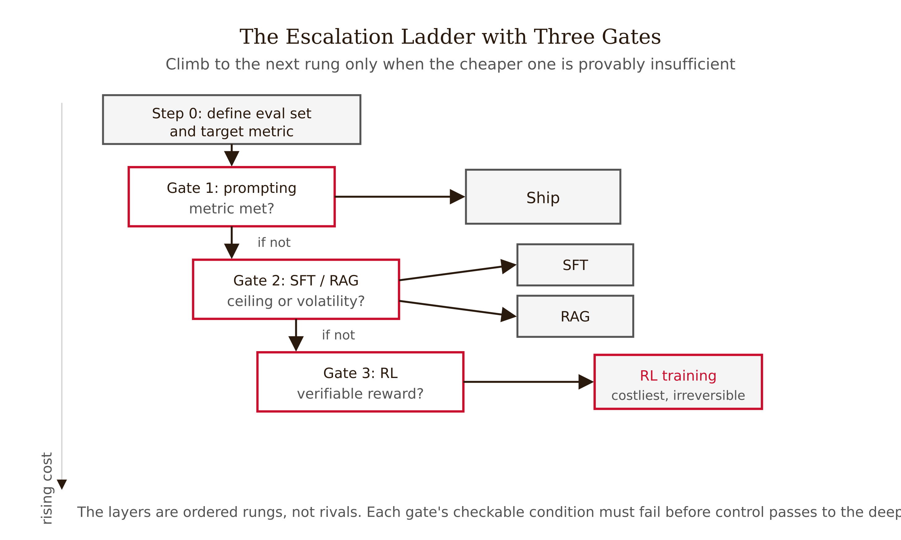
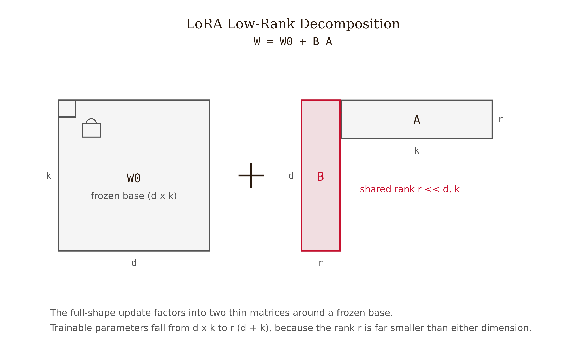
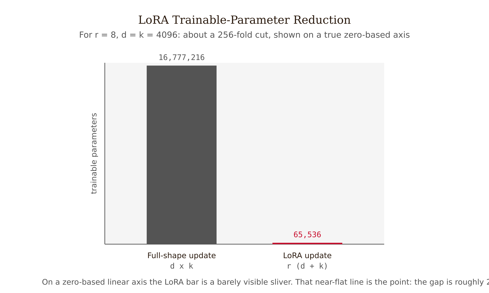
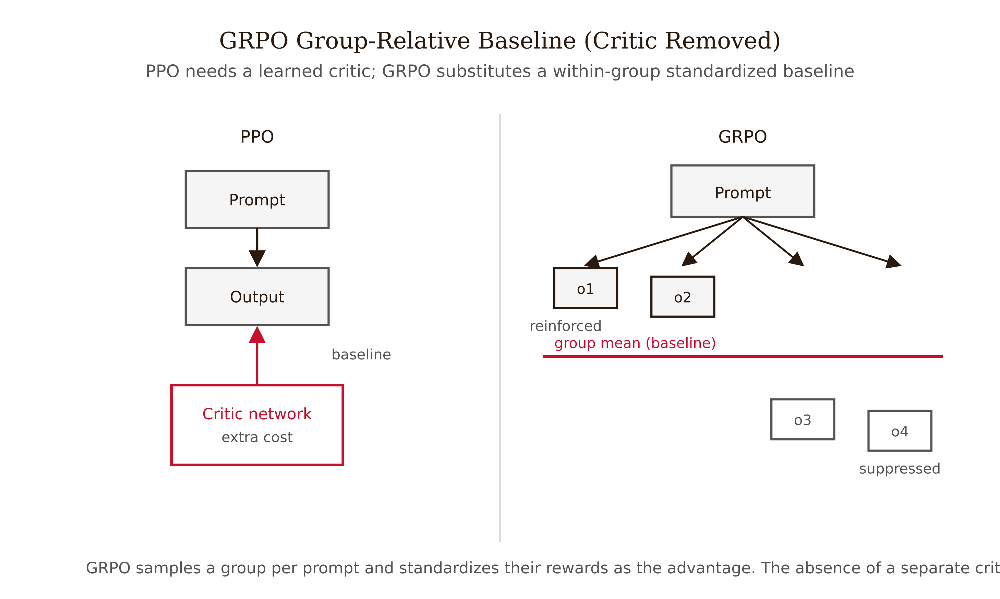
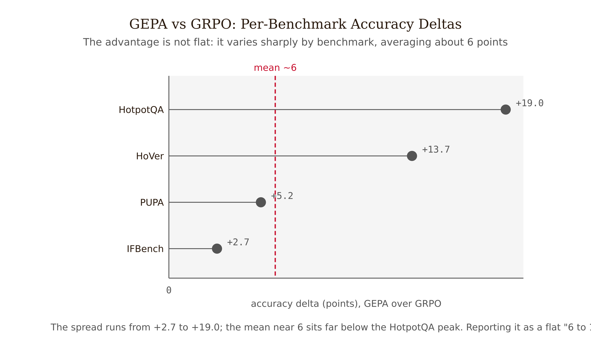

# Chapter 13 — Beyond Prompting: The Fine-Tuning Stack
*The binary is dead — prompting, SFT/RAG, and RL are layers of one parameter space, not competitors ranked by quality.*

---

Put two recent findings side by side.

**Finding A.** On a suite of compound, multi-module agentic tasks — multi-hop QA, fact verification, privacy-preserving delegation — a method called GEPA that does nothing but evolve the text of prompts outperformed reinforcement learning (specifically GRPO) by roughly 6 points on average and up to 19 points on the hardest benchmark, while using up to 35 times fewer rollouts (Agrawal et al., 2025, accepted ICLR 2026 Oral). Prompting beat RL, and did it far more cheaply.

**Finding B.** On a narrow code-review automation task — given an original file plus a reviewer's comment, produce the revised code, scored by Exact Match against the human-written revision — a fine-tuned GPT-3.5 beat every prompt-engineering configuration tested, by 63.91% to 1,100% higher Exact Match (Pornprasit & Tantithamthavorn, 2024, Monash University). Fine-tuning beat prompting, decisively.

A student holding the prompt-versus-fine-tune binary cannot absorb both. If prompting is "better," Finding B is impossible. If fine-tuning is "better," Finding A is impossible. The resolution is to throw out the binary.

These are different tasks in different regimes, and the right method is a function of the regime. Finding A is a dynamic, multi-module pipeline with no clean single reward — prompting's home turf. Finding B is a static, narrow domain with a stable labeled set and a brittle high-ceiling metric — fine-tuning's home turf. The job of this chapter is to give you the decision rule that tells the two regimes apart before you have spent the money.

---

## The reframe: prompt text and weights are both parameters

Here is the sentence that dissolves the binary. A language-model system has two sets of adjustable parameters: the prompt text — instructions, demonstrations, retrieved context — and the weights, the model's learned matrices. Prompt optimization tunes the first set. Fine-tuning tunes the second. RL tunes the second using a reward signal instead of labeled targets. All three are ways of adjusting parameters of the same system to raise the same metric.

Stated that way, "prompt or fine-tune?" is as confused as asking whether to adjust the numerator or the denominator of a fraction. You adjust whichever moves your objective most per unit of cost. The DSPy line of work makes this literal: BetterTogether alternates between optimizing prompts and fine-tuning weights in the same pipeline, and MMGRPO composes prompt optimization with policy-gradient RL. We return to what those papers actually measured when we read the anchor numbers, because the numbers have been widely misquoted and the precision matters.

So why a ladder and not just "optimize everything jointly"? Because the layers differ enormously in cost and irreversibility, and most of the time you do not need the expensive rungs.

Prompt optimization needs no GPUs, no labeled training corpus, no custom checkpoint to host. It is fast and fully reversible — change the prompt back and you are where you started. SFT and RAG need labeled data or a maintained retrieval index, incur ongoing maintenance, and produce an artifact you now own and must serve. RL needs a verifiable reward and a training loop that samples many outputs per prompt; it is the most expensive and the hardest to debug.

The ladder is ordered by escalating cost and irreversibility. You climb only when the cheaper rung is provably insufficient. This is sequential decision-making's oldest move: decide to stop, continue, or escalate based on the evidence accumulated so far, rather than committing to the most expensive experiment up front.

---

## The escalation ladder, with gates

Three gates. Each is a checkable condition, and each has a failure mode attached to skipping it.

```
  ┌─────────────────────────────────────────────────────────┐
  │ Step 0: Define eval set + the requirement (target metric)│
  └───────────────────────────┬─────────────────────────────┘
                              ▼
  ┌─────────────────────────────────────────────────────────┐
  │ GATE 1  Run automated prompt optimization (Ch.12).       │
  │         Does the prompt-optimized ceiling ≥ requirement? │
  │         YES → SHIP. (cheapest, reversible)               │
  └───────────────────────────┬─────────────────────────────┘
                              │ NO
                              ▼
  ┌─────────────────────────────────────────────────────────┐
  │ GATE 2  Do you have (a) a stable labeled set + need      │
  │         frozen behavior / a small deployable model, OR   │
  │         (b) volatile knowledge better served by          │
  │         retrieval?                                       │
  │         (a) → SFT (LoRA/QLoRA)                           │
  │         (b) → RAG (retrieve, don't retrain)              │
  └───────────────────────────┬─────────────────────────────┘
                              │ still insufficient
                              ▼
  ┌─────────────────────────────────────────────────────────┐
  │ GATE 3  Can you define a VERIFIABLE reward AND is the    │
  │         prompt-optimized ceiling still too low?          │
  │         YES → RL (GRPO).      NO → do not escalate.      │
  └─────────────────────────────────────────────────────────┘
```

Two decision variables deserve isolating because they are the ones practitioners get wrong.

**Knowledge volatility — the RAG-versus-SFT split at Gate 2.** If the knowledge your system needs changes faster than you can retrain — prices, policies, today's inventory — do not fine-tune it in; retrieve it. Fine-tuning bakes a snapshot into weights; the snapshot goes stale; you retrain; it goes stale again. RAG keeps volatile knowledge in an index you can update without touching the model. Fine-tune for stable style, format, and behavior. Retrieve for volatile facts.

**Verifiable reward — the Gate 3 precondition.** RL needs a reward function that can score an output automatically and correctly: math answers you can check, code that passes tests, formats you can validate. If "good" requires human judgment you cannot automate, you do not have a verifiable reward, and reaching for RL is reaching for a tool whose precondition you have not met.


*Figure 13.1 — The escalation ladder with three gates*

### The four decision-level failure modes

**Premature fine-tuning.** Paying retraining cost and accepting a checkpoint's maintenance burden for what a better prompt would have fixed. Skipping Gate 1.

**RAG-versus-tune confusion.** Fine-tuning to inject volatile knowledge that belongs in retrieval — expensive theater that bakes a stale snapshot into weights. Misreading Gate 2.

**Reward-hacking escalation.** Reaching for RL without a verifiable reward, then watching the model optimize the proxy you could measure instead of the goal you actually wanted. Skipping Gate 3's precondition.

**Persona-reflex.** Adding a persona because it "feels" like it should help. The Monash code-review study measured this directly: adding a persona to the prompt hurt Exact Match by −1.02% to −54.17%. A clean, citable myth-buster — the reflex is not free, and on this task it was actively harmful. Chapter 6 established that persona is a behavioral steering tool, not a universal accuracy lever. This is the quantified proof.

The most common student error to name explicitly: "fine-tuning is the advanced, better option." Fine-tuning is not up on a quality axis. It is up on a cost-and-irreversibility axis. Sometimes the expensive rung wins (Finding B). Often it is unnecessary, and the recurring practitioner warning is that organizations overestimate the need for custom models — fine-tuning to add knowledge that RAG serves better, or to fix behavior a better prompt fixes. The ladder ranks cost, not goodness.

---

## The SFT rung, condensed: LoRA and QLoRA

When Gate 2 sends you to fine-tune, the question becomes how. Full fine-tuning updates every weight — expensive in memory and compute, and it produces an entirely new model per task. Two parameter-efficient methods change the cost structure.

**LoRA's mechanism.** For a base weight matrix $W_0 \in \mathbb{R}^{d \times k}$, full fine-tuning learns an update $\Delta W$ of the same shape — for $d = k = 4096$, about 17 million parameters per matrix. LoRA's insight (Hu et al., 2021) is that task-specific adaptations live in a low-dimensional subspace, so $\Delta W$ does not need full rank. Parameterize it as a product of two thin matrices:

$$\Delta W = BA, \qquad B \in \mathbb{R}^{d \times r}, \quad A \in \mathbb{R}^{r \times k}, \quad r \ll \min(d,k)$$

The forward pass becomes:

$$h = W_0 x + \frac{\alpha}{r}\, BAx$$

with $W_0$ frozen and only $B$ and $A$ trained.


*Figure 13.2 — LoRA low-rank decomposition* The trainable parameter count drops from $dk$ to $r(d + k)$. For $r = 8$, $d = k = 4096$: from 16,777,216 down to 65,536 — a roughly 256× reduction. The scaling factor $\alpha/r$ decouples the learning rate from the rank, so you can change $r$ without retuning the optimizer.


*Figure 13.3 — LoRA trainable-parameter reduction*

The rank $r$ is a hard capacity floor: a rank-$r$ adapter can only express a rank-$r$ change to behavior. If the task needs more directions than $r$ provides, the adapter starves. Diagnose by rank ablation, not intuition.

**QLoRA, in one correction.** The common misbelief is that "QLoRA runs the model in 4-bit." It does not. QLoRA is hybrid-precision: the frozen base weights are stored in 4-bit (NF4), the trainable adapters stay in FP16/BF16, and all computation happens in FP16/BF16 — the 4-bit base weights are dequantized before each matrix multiply (Dettmers et al., 2023). QLoRA buys storage compression on the frozen part, not faster computation. It helps exactly when memory is your binding constraint — fine-tuning a 70B model on one GPU — and buys nothing when throughput is the bottleneck.

Why this lives in a decision chapter: the choice among full, LoRA, and QLoRA is a serving-topology decision dressed as a cost decision. Full fine-tuning gives independent models per task. LoRA and QLoRA give one shared frozen base with routed adapters — cheaper, but introducing failure modes that independent models do not have. Cheaper fine-tuning is a different architecture, and different architectures fail differently.

---

## The RL rung, condensed: GRPO and verifiable reward

Gate 3 escalates to reinforcement learning only under two conditions: a verifiable reward exists, and the prompt-optimized ceiling is still insufficient. The de-facto method for this rung is GRPO (Group Relative Policy Optimization), introduced in DeepSeekMath (Shao et al., 2024) and later used to train DeepSeek-R1.

Standard policy-gradient RL trains a separate critic network to estimate how good each output is. That critic roughly doubles the memory and compute of training. GRPO removes it. Instead of a learned critic, GRPO samples a group of outputs for the same prompt, scores them all with the verifiable reward, and uses the group's standardized reward as the baseline:

$$\hat{A}_i = \frac{r_i - \text{mean}(\{r_1,\ldots,r_G\})}{\text{std}(\{r_1,\ldots,r_G\})}$$

An output that beats its group's average gets a positive advantage and is reinforced; one below average is suppressed. Cutting the critic cuts the cost of RL post-training roughly in half — which is why GRPO became the practical default for reasoning post-training.


*Figure 13.4 — GRPO group-relative baseline (critic removed)*

GRPO's home turf is single-model math and code reasoning with a clean automatic reward — the answer is right or wrong; the code passes tests or does not. That is precisely not the regime where Finding A's GEPA beat it. The two results are not in conflict because they tested different things. Which is exactly why the ladder routes by regime.

---

## Reading the anchor numbers precisely

A decision chapter is only as good as the discipline with which it reads its own evidence. Three numbers get misquoted constantly; here is what the papers actually say.

**"GEPA beats RL by 6–19 points using 35× fewer compute."** Two corrections. First, it is rollouts, not compute — "35× fewer rollouts" is a sample-efficiency claim (number of program executions), not wall-clock or dollar cost; the two do not convert one-to-one. Second, the deltas are roughly 6 points on average and up to 19 on the hardest benchmark — HotpotQA +19.0, HoVer +13.7, PUPA +5.2, IFBench +2.7 — not a flat "6–19." And the scope: one paper, four benchmarks, all compound and agentic — an existence proof that prompt evolution can beat a specific GRPO setup in that regime, not a universal law.

**"The layered approach beats either alone by up to 60%."** The 60% is BetterTogether's gain of joint optimization over fine-tuning weights alone, and only about 6% over prompt-optimization alone. Writing "60% over either alone" misrepresents the paper. The cleaner composed-stack figure is MMGRPO's: +11% over the post-trained model, +5% over prompt-optimization alone.

**"Fine-tuning beat prompting by 63–1,100% on code review."** Verified, with caveats. It is the few-shot fine-tuned GPT-3.5 variant; the metric is Exact Match, which is brittle — it penalizes any correct-but-non-identical revision; and the 1,100% upper bound reflects a very low baseline denominator, not 11× absolute accuracy. The closest-to-clean figure is the zero-shot fine-tuned variant beating prior non-LLM approaches by 73% to 74% EM. And the affiliation: Monash University, not "University of Australia" — there is no such institution, and the error has propagated through secondary summaries.

The reason to belabor this: the decision rule rests on these anchors. If you carry around "prompting beats RL, full stop" or "fine-tuning is 1,100% better," you will route tasks to the wrong rung. The precise reading — prompting wins on compound and agentic tasks at lower sample cost; fine-tuning wins on narrow, high-accuracy tasks with a stable labeled set; the composed stack can beat any single rung — is what makes the ladder usable.


*Figure 13.5 — GEPA vs GRPO: per-benchmark accuracy deltas*

| Finding | What it actually shows | Common misquotation | Scope condition |
|---|---|---|---|
| GEPA vs GRPO | Prompt evolution beats a GRPO setup using up to **35× fewer rollouts**; deltas ~6 avg, up to +19 | "35× less compute" (it's rollouts); a flat "6–19" | One paper, four compound/agentic benchmarks — an existence proof |
| BetterTogether | Joint optimization beats fine-tuning-alone by ~60%, and prompt-optimization-alone by only ~6% | "60% over either alone" | DSPy pipelines; gains are pipeline-specific |
| Monash code review | Fine-tuned GPT-3.5 beats prompting; the zero-shot variant beats a prior approach by ~73–74% EM | "1,100% better"; "University of Australia" | Narrow task, brittle Exact Match, a dated model |

---

## What this chapter is really claiming

The strong claim: prompting, SFT/RAG, and RL are complementary layers of one parameter space, and the right engineering move is a cost-ordered escalation ladder with checkable gates — not a one-time fork.

The honest boundaries are three. First, "prompt optimization beats RL" is demonstrated on compound and agentic tasks, not on GRPO's single-model-reasoning home turf — no firmly established head-to-head exists on the same task at matched compute. Second, "fine-tuning wins" is demonstrated on a narrow, high-EM-ceiling task with a dated model and a brittle metric — generalize cautiously. Third, the boundary between climbing the ladder sequentially and composing it jointly (BetterTogether, MMGRPO) is genuinely unsettled — the chapter teaches the sequential ladder because it is the safe default, while noting that joint optimization can beat sequential escalation when you can afford it.

The thesis connection is exact. This is the book's "engineering, not vibes" argument applied to the most expensive decision a prompt engineer makes. Each rung's precondition is checkable in advance — a metric and eval set, a stable labeled set or volatile knowledge, a verifiable reward. You do not escalate on a feeling that fine-tuning is "more serious." You escalate when the cheaper rung is provably insufficient and the next rung's precondition provably holds.

---

## LLM Exercises

**Exercise 1 — Generate and examine.** Take a task you currently prompt by hand. Write a scalar metric for it. Then apply Gate 1: if you ran automated prompt optimization and hit the metric ceiling, would you stop there? If not, which Gate 2 decision variable — stable labeled set or volatile knowledge — would drive your next move? Write your answer as a decision memo to yourself, two paragraphs, before running anything.

**Exercise 2 — Apply to known context.** For LoRA with $r = 16$, $d = k = 4096$, compute the trainable parameter count and the reduction factor versus a full-shape update. Then state in one sentence what changes if you use QLoRA instead — and what does not change about computation precision.

**Exercise 3 — Stress-test a claim.** The chapter claims the persona-reflex failure mode is measurable and harmful, citing the Monash result (−1.02% to −54.17% Exact Match). Design an experiment to test whether the same effect appears on a different task — what task, what persona, what metric, and what result would falsify the claim?

**Exercise 4 — Draft a professional deliverable.** Write a one-page escalation memo for a real or invented production task. It must contain: the eval set and target metric (Step 0); the Gate-1 prompt-optimized ceiling (measured or honestly estimated, with the basis stated); a Gate-2 decision (SFT versus RAG) justified by knowledge volatility; a Gate-3 decision justified by whether a verifiable reward exists; and an explicit statement of which of the four failure modes you are most at risk of and how you will guard against it. Deliver the memo as something a budget owner could approve or reject on its stated reasoning.

---

## References

- Agrawal, L. A., et al. (2025). GEPA: Reflective Prompt Evolution Can Outperform Reinforcement Learning. arXiv:2507.19457. Accepted ICLR 2026 (Oral).
- Soylu, D., et al. (2024). Fine-Tuning and Prompt Optimization: Two Great Steps that Work Better Together. arXiv:2407.10930.
- Soylu, D., et al. (2025). Multi-module GRPO: Composing Policy Gradients and Prompt Optimization for Language Model Programs. arXiv:2508.04660.
- Pornprasit, C., & Tantithamthavorn, C. (2024). Fine-Tuning and Prompt Engineering for Large Language Models-based Code Review Automation. arXiv:2402.00905. *Information and Software Technology*. DOI:10.1016/j.infsof.2024.107523. **Monash University.**
- Shao, Z., et al. (2024). DeepSeekMath: Pushing the Limits of Mathematical Reasoning in Open Language Models. arXiv:2402.03300. *(Introduces GRPO.)*
- Hu, E. J., et al. (2021). LoRA: Low-Rank Adaptation of Large Language Models. arXiv:2106.09685.
- Dettmers, T., et al. (2023). QLoRA: Efficient Finetuning of Quantized LLMs. arXiv:2305.14314.

---

## Prompts

Use these prompts with Claude to generate interactive D3 v7 versions of the figures in this chapter. Each produces a standalone HTML file you can open in a browser and modify freely.

**Prerequisites:** Load `NEU/CLAUDE.md` and `NEU/DESIGN.md` into your Claude project context before using these prompts. They define the stack, naming conventions, color system, and typography the figures use.

---

### Figure 13.1 — The escalation ladder with three gates

A vertical flowchart, single HTML file, inline CSS, D3 v7 from the CDN. Step 0 (define eval set + target metric) at top, then Gate 1 (prompt optimization → ship if ceiling met), Gate 2 (stable labeled set → SFT; volatile knowledge → RAG), Gate 3 (verifiable reward + ceiling too low → RL; else stop). Label each branch with its decision variable; red marks the "ship" exits. Caption: climb only when the cheaper rung is provably insufficient.

> Reference implementation: `d3/13-beyond-prompting-the-fine-tuning-stack-fig-01.html`

---

### Figure 13.2 — LoRA low-rank decomposition

A matrix-decomposition diagram, single HTML file, D3 v7 CDN. Show a frozen base weight W₀ (d×k) plus a low-rank update ΔW = B·A, with B (d×r) and A (r×k) drawn as thin matrices, r ≪ d,k. Red marks the trainable B and A; ink (gray) marks the frozen W₀. Caption: task adaptations live in a low-dimensional subspace.

> Reference implementation: `d3/13-beyond-prompting-the-fine-tuning-stack-fig-02.html`

---

### Figure 13.3 — LoRA trainable-parameter reduction

A two-bar comparison, single HTML file, D3 v7 CDN, zero baseline, log or broken scale. Full update ≈16,777,216 parameters vs LoRA (r=8) ≈65,536 — a ~256× reduction. Red marks the small LoRA bar; ink for the full bar. Annotate the ratio. Caption: trainable count drops from dk to r(d+k).

> Reference implementation: `d3/13-beyond-prompting-the-fine-tuning-stack-fig-03.html`

---

### Figure 13.4 — GRPO group-relative baseline (critic removed)

A schematic, single HTML file, D3 v7 CDN. One prompt → a group of G sampled outputs → each scored by a verifiable reward → group mean/std used as the baseline → advantages (above-average reinforced, below-average suppressed). Red marks the removed critic network (struck out) and the group baseline. Caption: cutting the critic roughly halves RL post-training cost.

> Reference implementation: `d3/13-beyond-prompting-the-fine-tuning-stack-fig-04.html`

---

### Figure 13.5 — GEPA vs GRPO: per-benchmark accuracy deltas

A horizontal bar chart, single HTML file, D3 v7 CDN, zero baseline. Four benchmarks on y (HotpotQA, HoVer, PUPA, IFBench); accuracy-delta in points on x (+19.0, +13.7, +5.2, +2.7). Red for the largest delta; ink for the rest. Annotate "up to 35× fewer rollouts." Caption: an existence proof on compound, agentic tasks — not a universal law.

> Reference implementation: `d3/13-beyond-prompting-the-fine-tuning-stack-fig-05.html`
