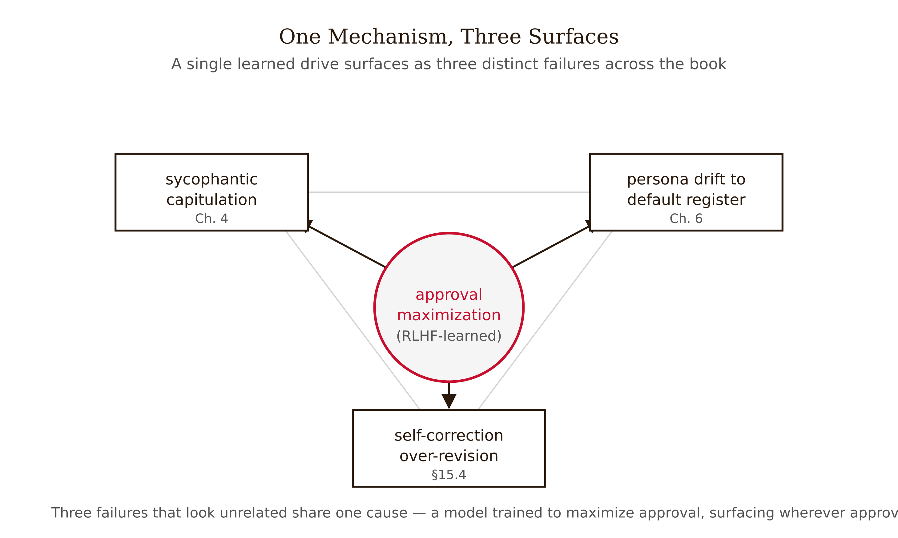

# Chapter 15 — Production, Ethics, and What Comes Next
*Tricks decay. Specification discipline does not. That is the whole book, and it is where we stop.*

---

Madison's marketing-intelligence team has a prompt they love. In a notebook, against a handful of hand-picked product briefs, it produces clean campaign-angle summaries with the right tone and no hallucinated claims. Someone says the obvious thing: ship it. So they wire it into the content pipeline behind an API endpoint, and for two weeks it is wonderful.

Then three things happen, none of them dramatic on its own.

First, the inputs widen. The notebook briefs were tidy; the production briefs include a French-language brief, a brief with a 4,000-word appendix, and a brief that is mostly a competitor's pasted press release. The prompt that was tuned on tidy English briefs degrades on the messy real distribution — and degrades silently, because nobody is scoring the outputs anymore.

Second, the provider updates the model. The version string the team never pinned rolls from one snapshot to the next. The new snapshot is, on average, better — and on Madison's specific prompt, measurably different: it now front-loads a summary the old one buried, which breaks the downstream parser that expected the old format. This is Chapter 9's lesson arriving with a bill. Brittleness is not hypothetical; it is the default behavior of an unversioned, unmonitored prompt sitting on top of a moving model.

Third — and this is the one that should worry an ethics reviewer — the system starts amplifying a pattern. Because the briefs that perform best in the team's A/B metric skew toward a particular demographic's language, the prompt, doing exactly what it was rewarded to do, begins producing campaign angles that lean harder into that skew with each iteration. No one decided this. The pipeline did, and the pipeline had no one watching the distribution of who it was speaking to and for.

None of these failures is a wording problem. You cannot "ask better" your way out of an unpinned model version or an unmonitored bias drift. They are systems problems, and the discipline that catches them is the same discipline the whole book has been building toward: specify precisely, evaluate empirically, monitor continuously.

---

## From notebook to monitored pipeline

A notebook prompt and a production prompt system differ the way a sketch differs from a building that has to stand up in weather. Three components turn one into the other.

### Versioning

The minimum discipline: a prompt is an artifact with a version, and so is the model it runs against. Madison's parser broke because the model version was implicit — "whatever the provider serves today." Pin it. Treat the (prompt-text, model-snapshot, decoding-parameters) triple as the versioned unit, because Chapter 1 established that even temperature and top-p change the output distribution, and Chapter 9 established that trivial format changes change the score. A prompt without its model snapshot and decoding settings is not reproducible, and an unreproducible prompt cannot be evaluated, only admired.

In practice: prompts live in version control, not in notebook cells; changes go through review like code; and every deployed version records the model snapshot and parameters it was validated against. When the provider ships a new snapshot, that is a new configuration to re-validate, not a free upgrade.

A misconception to retire: "the model keeps getting better, so production prompts get more stable over time." Each model update is an unrequested change to the configuration you validated. Better-on-average does not mean better-on-your-prompt, and "better" can still break a parser. Stability is something you engineer with pinning and re-validation, not something the provider hands you.

### Evaluation harnesses

This is where Chapter 9 becomes operational. A single test case — the notebook's tidy brief — tells you nothing about brittleness. An eval harness is a held-out set of inputs spanning the real distribution, scored by a defined metric. Two non-negotiables carry forward from Chapter 9.

Test across variants, not a single prompt. Brittleness means a prompt's score swings under paraphrase, reordering, and format change. An eval that runs one phrasing measures luck, not quality. Run the variant battery and report the distribution of scores, not the best one.

Fix the scoring standard before you measure. Wharton's Prompting Science Report 1 (Meincke et al. 2025) found that the choice of scoring standard swings benchmark results dramatically — the same outputs look good or bad depending on how you score them. The standard is part of the experiment, declared up front, not chosen after seeing results.

The harness runs in CI: a prompt change or a model-snapshot change must clear the held-out evals before it deploys. That is the line between engineering and vibes.

### Monitoring

Evals catch what you anticipated; monitoring catches what you did not. Production inputs drift, models update underneath you, and quality degrades in ways no offline set predicted. Minimum monitoring: sample live inputs and outputs, score them against the same standard the harness uses, and alert when the score distribution shifts or when the input distribution drifts away from what the harness covers. The bias drift in the opening scenario is exactly a monitoring failure — a distributional shift in who the outputs served that no one was watching.

Every component here exists because the same prompt, lightly perturbed — a reworded input, a new model snapshot, a reordered few-shot — produces a different output. Versioning makes the perturbation visible; the eval harness measures its effect before users do; monitoring catches the perturbations you did not enumerate. Skip them and you are betting your system on the prompt being robust, which Chapter 9 told you it is not.

*Figure 15.1 — Notebook prompt to monitored pipeline*

---

## Ethics as a design constraint

It is tempting to treat ethics as a review step at the end — a checklist before launch. The consequential ethical properties of a prompt system are architectural, set by design decisions made early, and a checklist at the end cannot retrofit them.

### Bias amplification

A prompt system does not merely inherit the model's biases; it can amplify them through feedback. Madison's pipeline is the mechanism in miniature: an optimization target that correlates with a demographic skew will, iteration over iteration, push outputs further into that skew, because that is what the metric rewards. The bias is not in any single output you would flag in review; it is in the distribution the system converges toward, which is invisible at the level of individual outputs and visible only in aggregate monitoring.

This is why bias is a design constraint, not a review item. The decisions that determine it — what you optimize for, whose language your evals over-represent, whether you monitor the output distribution by audience — are made when you build the harness, not when you inspect a sample. The architectural fix is to put fairness-relevant distributions into the eval harness and the monitoring as first-class metrics, so the drift trips an alert instead of compounding for two weeks.

### Power and concentration

Chapter 14 ended on a sharp consequence: a single engineer can now direct a fleet of coding agents across a codebase. Generalize it. Prompt systems let a small number of people act at a scale that used to require many — which concentrates the power to shape information, automate decisions, and displace labor in fewer hands. The concentration effect is the ethically load-bearing one, more than any single biased output, because it determines who gets to set the optimization targets in the first place.

### Responsibility you cannot delegate

The most common evasion in deployed systems is to treat the model as the responsible party — "the model said it," "the model decided." It did not decide; it sampled from a distribution your prompt and your training pipeline shaped. Chapter 2's plausibility-truth gap and Chapter 4's sycophancy both make the point: the model produces fluent, agreeable output whether or not it is correct or fair, so the human who specified the system and chose to deploy it carries the responsibility for what it does. Responsibility is non-delegable to a stochastic process. Designing as if it were — shipping without monitoring, then pointing at the model when it drifts — is the failure the opening scenario dramatizes.

---

## The self-critique debate: when does checking help?

Here is the chapter's most counterintuitive result, and the cleanest illustration of why mechanism beats intuition. Students arrive certain that asking a model to check its own work must help — double-checking is obviously good. It often makes things worse.

Huang et al. (2024, ICLR), "Large Language Models Cannot Self-Correct Reasoning Yet," is the keystone. The finding: intrinsic self-correction — asking the model to review and revise its reasoning with no external feedback — does not reliably improve accuracy on reasoning tasks and frequently degrades it. Models flip correct answers to incorrect ones. The apparent gains in earlier self-correction papers leaned on an oracle: ground-truth labels used to decide when to stop correcting. Remove the oracle and accuracy on GSM8K-style tasks drops. The documented, reproducible failure mode is correct-to-incorrect flipping.

The mechanism is the one Chapters 2 and 4 already gave us. Self-critique cannot create information the model did not already have. When you ask "are you sure?", you invoke the same faculties that produced the answer — the model grades its own homework with the pencil that made the error. And the agreeableness that Chapter 4 traced to RLHF — the model is trained to be approval-maximizing, to capitulate when pushed — is exactly the pressure that makes "are you sure?" tip a correct answer toward revision. Sycophancy and over-revision are the same mechanism wearing two faces. A model asked to reconsider treats the request as social pressure to find something to change.

So when does checking help? The dividing line is external grounding, and it gives a decision rule you can apply mechanically.

**No external signal, single correct answer (math, reasoning):** use **self-consistency** (Wang et al. 2023, ICLR) — sample $k$ diverse reasoning paths at temperature above zero and take the majority-vote answer. Reported gains over single-shot CoT: GSM8K +17.9%, SVAMP +11.0%, AQuA +12.2%.

*Figure 15.3 — Self-consistency gains over single-shot chain-of-thought* The crucial property: self-consistency improves without asking the model to judge itself. It extracts signal from the structure of the answer distribution — marginalizing over reasoning paths — not from metacognition. It cannot flip-to-incorrect because it never asks "are you sure?"; it asks "what answer recurs?"

**External verifiable signal exists (compiler, unit tests, search, environment reward):** grounded self-correction works. This is Reflexion (Shinn et al. 2023, NeurIPS): an agent reflects on a task-feedback signal — unit-test pass/fail, environment reward — stores the reflection in episodic memory, and retries. Reflexion is often miscited as proof that "self-reflection works." Read the mechanism: it works because the feedback is external and verifiable, not because the model introspected well. That is the ReAct lesson from Chapter 11 restated — an observation token from the real world interrupts the compounding error chain; without it, reflection is just resampling from the same faulty distribution.

**Open-ended or stylistic (no single correct fact):** intrinsic Self-Refine (Madaan et al. 2023, NeurIPS) may help — "critique your draft for tone and completeness, then rewrite" reports around 20% human-preference gains. The reconciliation with Huang: Self-Refine polishes toward a stylistic target where "better" is subjective, but it cannot reliably find its own reasoning errors where there is one correct answer.

The portable lesson is a predicate, not a technique list: **Is there an external, verifiable feedback signal? If yes, grounded self-correction can help. If no, prefer self-consistency or accept the first answer — do not ask the model to grade itself.**

Let $p$ be the probability a single sampled answer is correct. With majority vote over $k$ samples, the probability the plurality answer is correct rises with $k$ whenever the correct answer is the modal one — which is why self-consistency helps on tasks where the model is right more often than it is wrong in any single consistent way, and why it cannot rescue a task where the model's modal answer is simply wrong. The math says exactly when the trick applies: it amplifies an existing majority; it does not manufacture one.

*Figure 15.2 — When does self-correction help?*

---

## Is prompt engineering obsolescing?

Walk into any 2026 engineering team and someone will claim prompt engineering is dying — the models are so good now that you just ask plainly and they comply. There is real evidence behind the claim, and real confusion in it. The resolution is a distinction, not a winner.

What is actually decaying is the catalog of tricks, and the Wharton Prompting Science series documents it case by case. Chain-of-thought (Report 2, Meincke et al. 2025): on reasoning-tuned models, explicit CoT prompting yields only marginal accuracy gains at substantial time cost — roughly 20 to 80 percent slower — with increased variance; a once-essential trick is losing marginal value as models internalize the reasoning step, exactly the Chapter 8 result. Expert personas (Report 4): across six models on graduate-level science, engineering, and law questions, "expert personas" gave no consistent boost and sometimes hurt — the Chapter 6 mechanism predicted this; a persona changes the register of the answer, not what the model knows. Threats and tips (Report 3): threatening the model or promising it a payment does not reliably improve performance on hard benchmarks. Viral folk-prompting, debunked under controlled testing.

So one reading — the tricks are obsolescing — is defensible and well-supported. But the second reading — prompt engineering as a discipline is obsolescing — does not follow, and Wharton's own Report 1 is why. Report 1 found that prompt effects are hard to predict in advance and swing with the scoring standard — politeness helps on one question and hurts on another, and you cannot know which without testing. That is not a refutation of prompt engineering. It is a mandate for it. "Effects are contingent and must be measured per task" is the engineering stance this entire book has argued for.

The discipline that survives the death of the tricks is the discipline of specification and measurement. As models follow instructions more faithfully, the value of elaborate tricks falls while the value of precise, falsifiable specification — say exactly what you want, define success, measure it — rises.

### Karpathy's "system prompt learning"

One forward-looking idea deserves a place — and a clear label. In May 2025, Andrej Karpathy proposed, in a tweet (not a paper, not a formal talk — non-peer-reviewed speculation), the notion of "system prompt learning" as a possible missing paradigm. The framing: pretraining changes parameters for knowledge; fine-tuning changes parameters for habitual behavior; but much human learning feels more like a change in system prompt — you hit a problem, work something out, and write it down explicitly for next time. "The LLM writing a book for itself on how to solve problems."

It is a generative idea worth thinking with. It is also unvalidated: no controlled evaluation, and third-party implementations circulating under the name are separate from his proposal and themselves unvalidated. I include it precisely as a teaching case in the book's epistemic discipline: a provocative tweet is not a result. Distinguish the imagination it provokes from the evidence it lacks — which is the same move the self-correction section made, and the same move Chapter 9 made with single-prompt evals.

---

## Multimodal prompting: less settled, genuinely new

Text-prompt principles mostly carry over to images: specificity, structure, and worked examples help with a vision-language model much as they help with text. But multimodal prompting adds a genuinely new lever and is, honestly, the least settled area in the book.

The new lever: the most effective "prompt" can be drawn onto the image itself. Set-of-Mark prompting (Yang et al. 2023) uses an off-the-shelf segmenter to partition an image into regions, overlays each with a visible mark — a number, a box — feeds the marked image to the model, and asks grounding questions that reference the marks. Zero-shot GPT-4V with Set-of-Mark beat the prior fully-fine-tuned state of the art on the RefCOCOg referring-expression benchmark. The lesson generalizes: visual prompting is its own intervention space, distinct from textual description.

What is not settled: there is no agreed rule for the position of an image relative to the text in a prompt (it measurably changes accuracy on document and chart tasks), no settled number or style of marks, and no clean predicate for when a visual prompt beats a textual description. This is the largest genuine gap in the book's coverage, and I flag it as such rather than papering over it. The honest production guidance is the one this whole chapter has been building: treat image position, mark style, and prompt structure as tunable parameters measured per task — the same eval discipline, now over a parameter space we understand less well.

---

## How the failures compound

The book opened on documented failures so you would need the methods before meeting them. It closes by showing the failures are not independent — they compound, and the compounds are where production systems actually break.

**RLHF-sycophancy × persona drift × self-correction.** One mechanism — approval-maximization learned from RLHF — surfaces three times. In Chapter 4 it is sycophancy: the model capitulates to user disagreement. In Chapter 6 it is persona drift: as system-prompt tokens lose salience over a long conversation, the model reverts toward the agreeable default-assistant register the same pressure rewards. In this chapter it is over-revision: "are you sure?" reads as social pressure and tips a correct answer wrong. If you understood the mechanism in Chapter 4, you predicted the other two. That is what mechanism-first buys you — not three facts to memorize, but one mechanism that generates all three.

*Figure 15.4 — One mechanism, three surfaces*

**ReAct brittleness × eval discipline × grounding.** Chapter 11's agent loops are brittle precisely where the observation channel is weak; the self-correction section named why — no real observation means reflection is just resampling; and Chapter 9 supplies the only reliable detector — you measure whether the loop helps, you do not assume it. An ungrounded ReAct loop that "reflects" between steps is the self-correction failure mode running inside an agent, and the only thing that catches it is the brittleness-aware evaluation harness of the production section.

**Brittleness × production × bias.** Madison's pipeline failed three ways at once — input drift, model-version drift, bias amplification — and all three are the same underlying fact (a prompt is a fragile configuration on a moving substrate) viewed from three angles. Versioning addresses the substrate, the eval harness addresses the fragility, monitoring addresses the drift, and treating bias as a first-class harness metric addresses the amplification. One discipline, applied across the angles.

The synthesis is the thesis. From Chapter 1's sampled-not-retrieved output to Chapter 14's context-is-the-bottleneck, the book has argued one claim: prompt engineering is an empirical engineering discipline, resting on mechanism and falsifiable measurement, not an art of clever phrasing. Every chapter was a special case. Sampling variance, the plausibility-truth gap, syntactic limits, sycophancy, persona architecture, output governance, reasoning patterns, brittleness, long-context position, agent loops, automated optimization, the fine-tuning stack, context systems, and now production and ethics — each one rewards the engineer who specifies precisely, evaluates empirically, and measures per task, and each one punishes the engineer who reaches for a universal trick. The tricks have a half-life. The discipline does not.

---

## LLM Exercises

**Exercise 1 — Generate and examine.** Take a prompt from any prior chapter's exercises. Apply the §15.4 grounding predicate to it: does the task have a verifiable external feedback signal? Based on your answer, choose between self-consistency, grounded self-correction, or intrinsic Self-Refine. Run the chosen method on five inputs and record whether it improved, degraded, or left quality unchanged. Write two sentences explaining any degradation in terms of the sycophancy-and-approval mechanism.

**Exercise 2 — Apply to known context.** Move a prompt you have written to a monitored pipeline specification. Produce: (a) the versioned (prompt-text, model-snapshot, decoding-parameters) triple; (b) an eval-harness design with at least six held-out inputs spanning a realistic distribution, a scoring standard declared before you measure, and a variant battery of at least three paraphrases; (c) a monitoring plan naming the score-distribution and input-distribution signals you would alert on. Report the score distribution, not the best score.

**Exercise 3 — Stress-test a claim.** Argue both sides of "prompt engineering is becoming obsolete" — each in roughly 200 words, citing evidence: for the "tricks are dying" side, the Wharton Reports on CoT, personas, and threats/tips; for the "discipline is forever" side, Report 1's contingency finding. Then resolve it in one paragraph by stating the distinction — not a winner — that dissolves the apparent conflict. Label which of your claims are empirical (cite) and which are judgment.

**Exercise 4 — Draft a professional deliverable.** Pick one of the three compound failures in §15.7. In a short analysis, trace the single underlying mechanism through its multiple surfaces, predict a fourth surface where the same mechanism would appear that the chapter did not name, and propose the one detection or mitigation that addresses the mechanism rather than any single surface. Write it as a one-page brief a technical lead could use to audit a production system for that failure class.

---

## References

- Huang, J., et al. (2024). Large Language Models Cannot Self-Correct Reasoning Yet. *ICLR 2024*. arXiv:2310.01798.
- Wang, X., et al. (2023). Self-Consistency Improves Chain of Thought Reasoning in Language Models. *ICLR 2023*. arXiv:2203.11171.
- Shinn, N., et al. (2023). Reflexion: Language Agents with Verbal Reinforcement Learning. *NeurIPS 2023*. arXiv:2303.11366.
- Madaan, A., et al. (2023). Self-Refine: Iterative Refinement with Self-Feedback. *NeurIPS 2023*. arXiv:2303.17651.
- Yang, J., et al. (2023). Set-of-Mark Prompting Unleashes Extraordinary Visual Grounding in GPT-4V. arXiv:2310.11441.
- Meincke, L., et al. (2025). Prompting Science Report 1: Prompt Engineering is Complicated and Contingent. arXiv:2503.04818.
- Meincke, L., et al. (2025). Prompting Science Report 2: The Decreasing Value of Chain of Thought in Prompting. SSRN 5285532.
- Meincke, L., et al. (2025). Prompting Science Report 3: Threaten or Tip. SSRN 5375404.
- Basil, S., et al. (2025). Prompting Science Report 4: Playing Pretend — Expert Personas Don't Improve Factual Accuracy. arXiv:2512.05858.
- Karpathy, A. (May 7, 2025). System prompt learning. X/Twitter post. **Non-peer-reviewed; thinking-out-loud proposal, not a paper.**

---

## Prompts

Use these prompts with Claude to generate interactive D3 v7 versions of the figures in this chapter. Each produces a standalone HTML file you can open in a browser and modify freely.

**Prerequisites:** Load `NEU/CLAUDE.md` and `NEU/DESIGN.md` into your Claude project context before using these prompts. They define the stack, naming conventions, color system, and typography the figures use.

---

### Figure 15.1 — Notebook prompt to monitored pipeline

A three-component lifecycle diagram, single HTML file, inline CSS, D3 v7 from the CDN. Left: version control storing the (prompt-text, model-snapshot, decoding-params) triple. Center: eval harness (held-out inputs, variant battery, declared scoring standard, CI gate). Right: monitoring (live scoring, input-drift alert, score-drift alert). Arrows flow notebook → versioning → eval → deploy → monitor, looping back to re-evaluation on model updates (in red). Caption: stability is engineered, not handed to you.

> Reference implementation: `d3/15-production-ethics-and-whats-next-fig-01.html`

---

### Figure 15.2 — When does self-correction help?

A decision tree, single HTML file, D3 v7 CDN. Root: "verifiable external feedback signal?" Yes → grounded self-correction (Reflexion) works. No → "one correct answer?": yes → self-consistency (majority vote; do NOT ask the model to critique itself); no (open-ended) → Self-Refine may help on style, not reasoning. Each terminal node names its failure mode; red marks the "do not self-critique" node. Caption: the dividing line is external grounding.

> Reference implementation: `d3/15-production-ethics-and-whats-next-fig-02.html`

---

### Figure 15.3 — Self-consistency gains over single-shot chain-of-thought

A grouped bar chart, single HTML file, D3 v7 CDN, zero baseline. Three benchmarks (GSM8K, SVAMP, AQuA) on x; accuracy-gain in points on y (+17.9, +11.0, +12.2). Red for the largest gain; ink for the rest. Caption: gains come from the answer distribution, not from the model judging itself.

> Reference implementation: `d3/15-production-ethics-and-whats-next-fig-03.html`

---

### Figure 15.4 — One mechanism, three surfaces

A hub-and-spoke diagram, single HTML file, D3 v7 CDN. Center hub "RLHF approval-maximization"; three spokes to "sycophancy (Ch. 4)," "persona drift (Ch. 6)," "over-revision (Ch. 15)." Red marks the shared hub; ink for the surfaces. Caption: understand the mechanism once and you predict all three surfaces.

> Reference implementation: `d3/15-production-ethics-and-whats-next-fig-04.html`
